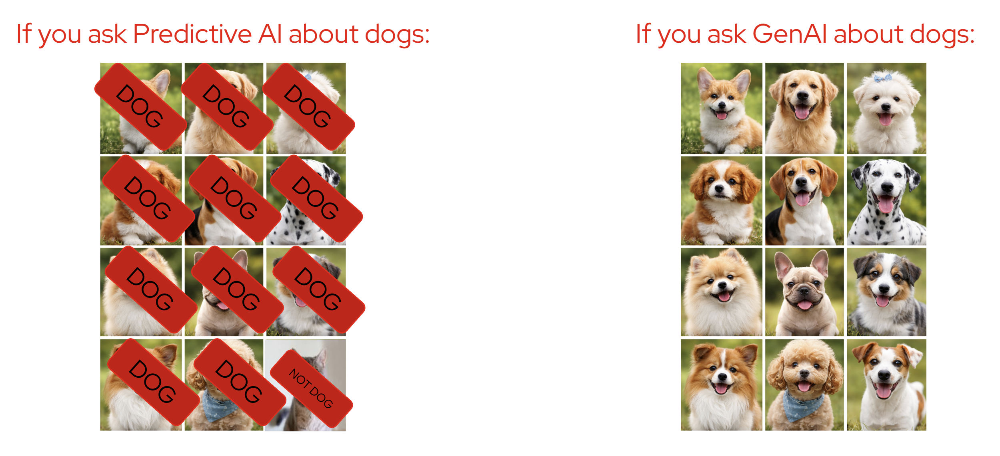
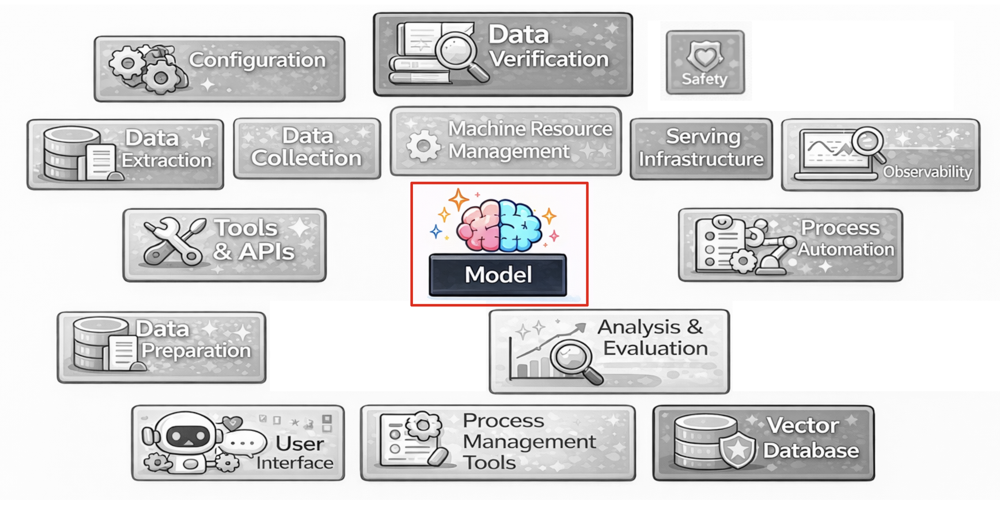

# 🎓 GenAI 101: Model Mannerisms

## 📚 Contents
- [🎓 GenAI 101: Model Mannerisms](#-genai-101-model-mannerisms)
  - [📚 Contents](#-contents)
  - [🧠 There is a lot of different AI out there :id=there-is-a-lot-of-different-ai-out-there](#-there-is-a-lot-of-different-ai-out-there-idthere-is-a-lot-of-different-ai-out-there)
  - [🤖 Generative AI Models :id=generative-ai-models](#-generative-ai-models-idgenerative-ai-models)
  - [📜 4 Truths about GenAI Models :id=4-truths-about-genai-models](#-4-truths-about-genai-models-id4-truths-about-genai-models)
  - [🔍 Truth 1: They only speak when spoken to :id=truth-1-they-only-speak-when-spoken-to](#-truth-1-they-only-speak-when-spoken-to-idtruth-1-they-only-speak-when-spoken-to)
    - [🔍 Hands-on: Let's play!](#-hands-on-lets-play)
  - [🎲 Truth 2: They are non-deterministic :id=truth-2-they-are-non-deterministic](#-truth-2-they-are-non-deterministic-idtruth-2-they-are-non-deterministic)
    - [🔍 Hands-on: Test it yourself](#-hands-on-test-it-yourself)
  - [🤥 Truth 3: They don't speak the truth, they speak the probable :id=truth-3-they-dont-speak-the-truth-they-speak-the-probable](#-truth-3-they-dont-speak-the-truth-they-speak-the-probable-idtruth-3-they-dont-speak-the-truth-they-speak-the-probable)
    - [🔍 Hands-on: Can the model lie?](#-hands-on-can-the-model-lie)
  - [🧠 Truth 4: They have no memory :id=truth-4-they-have-no-memory](#-truth-4-they-have-no-memory-idtruth-4-they-have-no-memory)
    - [🔍 Hands-on: Does the model remember you?](#-hands-on-does-the-model-remember-you)
  - [✅ Recap :id=recap](#-recap-idrecap)

## 🧠 There is a lot of different AI out there :id=there-is-a-lot-of-different-ai-out-there

Before we dive in, let's clarify an important distinction:

- **Generative AI** tries to **generate** something, which often includes a lot of variance
- **Predictive AI** only tries to **predict** the most likely answer

For example, if you ask **Predictive AI** about dogs, it will classify images — labeling each one as "DOG" or "NOT DOG."

If you ask **Generative AI** about dogs, it will *create* entirely new dog images that never existed before.



> In this enablement, we will focus on **Generative AI (GenAI)**.

There are many types of data GenAI models can generate:

| Type | Examples |
|------|----------|
| 📷 Images | DALL-E, Stable Diffusion |
| 📝 Text | LLaMA, GPT, Granite |
| 🔊 Audio | Whisper, Bark |
| 🎬 Video | Sora, Runway |

We will focus on **text generation** — specifically **Large Language Models (LLMs)**.

<!--  -->


<!-- 📝 Pop Quiz – What do LLMs generate? -->
<div style="background:linear-gradient(135deg,#e8f2ff 0%,#f5e6ff 100%);padding:20px;border-radius:10px;margin:20px 0;border:1px solid #d1e7dd;">

<h3 style="margin:0 0 8px;color:#5a5a5a;">🍿 Pop Quiz</h3>
<p style="color:#495057; font-weight:500;">What type of data does Large Language Models (LLMs) generate?</p>

<style>
.quiz-container-llm-type{position:relative}
.quiz-option-llm-type{display:block;margin:4px 0;padding:8px 16px;background:#f8f9fa;border-radius:6px;cursor:pointer;transition:.2s;border:2px solid #e9ecef;color:#495057}
.quiz-option-llm-type:hover{background:#fff;transform:translateY(-1px);border-color:#dee2e6}
.quiz-radio-llm-type{display:none}
.quiz-radio-llm-type:checked+.quiz-option-llm-type[data-correct="true"]{background:#d4edda;color:#155724;border-color:#c3e6cb}
.quiz-radio-llm-type:checked+.quiz-option-llm-type:not([data-correct="true"]){background:#f8d7da;color:#721c24;border-color:#f5c6cb}
.feedback-llm-type{display:none;margin:4px 0;padding:8px 16px;border-radius:6px}
#llm-type-correct:checked~.feedback-llm-type[data-feedback="correct"],
#llm-type-wrong1:checked~.feedback-llm-type[data-feedback="wrong1"],
#llm-type-wrong2:checked~.feedback-llm-type[data-feedback="wrong2"],
#llm-type-wrong3:checked~.feedback-llm-type[data-feedback="wrong3"]{display:block}
.feedback-llm-type[data-feedback="correct"]{background:#d1f2eb;color:#0c5d56;border:1px solid #a3d9cc}
.feedback-llm-type[data-feedback="wrong1"], .feedback-llm-type[data-feedback="wrong2"], .feedback-llm-type[data-feedback="wrong3"]{background:#fce8e6;color:#58151c;border:1px solid #f5b7b1}
</style>

<div class="quiz-container-llm-type">
  <input type="radio" name="quiz-llm-type" id="llm-type-wrong1" class="quiz-radio-llm-type">
  <label for="llm-type-wrong1" class="quiz-option-llm-type" data-correct="false">📷 Images</label>

  <input type="radio" name="quiz-llm-type" id="llm-type-correct" class="quiz-radio-llm-type">
  <label for="llm-type-correct" class="quiz-option-llm-type" data-correct="true">📝 Text</label>

  <input type="radio" name="quiz-llm-type" id="llm-type-wrong2" class="quiz-radio-llm-type">
  <label for="llm-type-wrong2" class="quiz-option-llm-type" data-correct="false">🔊 Audio</label>

  <input type="radio" name="quiz-llm-type" id="llm-type-wrong3" class="quiz-radio-llm-type">
  <label for="llm-type-wrong3" class="quiz-option-llm-type" data-correct="false">🎬 Video</label>

  <div class="feedback-llm-type" data-feedback="correct">✅ Correct! The second "L" in LLM stands for Language — they take text in and produce text out. If there is anything to internalize from these 5 days, this is it!</div>
  <div class="feedback-llm-type" data-feedback="wrong1">❌ Image generation models exist, but LLMs specifically work with text. The "Language" in Large Language Model is the clue!</div>
  <div class="feedback-llm-type" data-feedback="wrong2">❌ Audio models exist (like Whisper), but LLMs are all about text. The second "L" stands for Language!</div>
  <div class="feedback-llm-type" data-feedback="wrong3">❌ Video generation is a thing, but LLMs specifically generate text. Think: Large *Language* Model.</div>
</div>
</div>

> **Key takeaway:** LLMs take **text** as input, and produce **text** as output. That's it.
>
> `Text → LLM → Text`


## 🤖 Generative AI Models :id=generative-ai-models

There are a lot of things surrounding the model: configuration, data verification, safety, serving infrastructure, observability, tools & APIs, process automation, data preparation, analysis & evaluation, user interface, process management tools, vector databases, and more.


All of these extend the model's capabilities. But let's start with focusing on **just the model**.




## 📜 4 Truths about GenAI Models :id=4-truths-about-genai-models

There are **4 fundamental truths** about how GenAI models behave. Let's explore each one through hands-on exercises:

1. **They only speak when spoken to**
2. **They are non-deterministic** (random)
3. **They don't speak the truth, they speak the probable**
4. **They have no memory**

Let's see them in action!


## 🔍 Truth 1: They only speak when spoken to :id=truth-1-they-only-speak-when-spoken-to

The model itself doesn't do anything unless we **prompt** it.

Unless prompted (i.e. an input is sent), the model won't output anything. Imagine it as a coffee machine; unless you ask for a coffee, it won't produce anything.


### 🔍 Hands-on: Let's play!

Go ahead and use the chat interface below. Ask the model anything — try something simple like:

```
Hi, how are you feeling today?
```

<iframe
	src="https://ai-orientation-app-ai501.<CLUSTER_DOMAIN>/chat?embed"
	frameborder="0"
	width="500"
	height="600"
	style="border: 1px solid #ccc; border-radius: 8px;"
	loading="lazy">
</iframe>

Notice how the model only responds **after** you send it something. It never initiates a conversation on its own.


## 🎲 Truth 2: They are non-deterministic :id=truth-2-they-are-non-deterministic

Do you always get the same answer back from an LLM?

### 🔍 Hands-on: Test it yourself

Ask the model the **exact same question twice**:

```
Hi, how are you feeling today?
```

Compare the two responses. Did you get the same answer?

<iframe
	src="https://ai-orientation-app-ai501.<CLUSTER_DOMAIN>/chat?embed"
	frameborder="0"
	width="500"
	height="600"
	style="border: 1px solid #ccc; border-radius: 8px;"
	loading="lazy">
</iframe>

<!-- 🍿 Pop Quiz – Same answer? -->
<div style="background:linear-gradient(135deg,#e8f2ff 0%,#f5e6ff 100%);padding:20px;border-radius:10px;margin:20px 0;border:1px solid #d1e7dd;">

<h3 style="margin:0 0 8px;color:#5a5a5a;">🍿 Pop Quiz</h3>
<p style="color:#495057; font-weight:500;">Do you always get the same answer back from an LLM?</p>

<style>
.quiz-container-deterministic{position:relative}
.quiz-option-deterministic{display:block;margin:4px 0;padding:8px 16px;background:#f8f9fa;border-radius:6px;cursor:pointer;transition:.2s;border:2px solid #e9ecef;color:#495057}
.quiz-option-deterministic:hover{background:#fff;transform:translateY(-1px);border-color:#dee2e6}
.quiz-radio-deterministic{display:none}
.quiz-radio-deterministic:checked+.quiz-option-deterministic[data-correct="true"]{background:#d4edda;color:#155724;border-color:#c3e6cb}
.quiz-radio-deterministic:checked+.quiz-option-deterministic:not([data-correct="true"]){background:#f8d7da;color:#721c24;border-color:#f5c6cb}
.feedback-deterministic{display:none;margin:4px 0;padding:8px 16px;border-radius:6px}
#deterministic-correct:checked~.feedback-deterministic[data-feedback="correct"],
#deterministic-wrong1:checked~.feedback-deterministic[data-feedback="wrong1"]{display:block}
.feedback-deterministic[data-feedback="correct"]{background:#d1f2eb;color:#0c5d56;border:1px solid #a3d9cc}
.feedback-deterministic[data-feedback="wrong1"]{background:#fce8e6;color:#58151c;border:1px solid #f5b7b1}
</style>

<div class="quiz-container-deterministic">
  <input type="radio" name="quiz-deterministic" id="deterministic-wrong1" class="quiz-radio-deterministic">
  <label for="deterministic-wrong1" class="quiz-option-deterministic" data-correct="false">✅ TRUE — Yes, always the same answer</label>

  <input type="radio" name="quiz-deterministic" id="deterministic-correct" class="quiz-radio-deterministic">
  <label for="deterministic-correct" class="quiz-option-deterministic" data-correct="true">❌ FALSE — No, the answer varies</label>

  <div class="feedback-deterministic" data-feedback="correct">✅ Correct! LLMs are non-deterministic — they use randomness when generating answers, so you'll get different responses each time. This also means it never tires of your question!</div>
  <div class="feedback-deterministic" data-feedback="wrong1">❌ Nope! As you just saw, the same question gives different answers. LLMs include a degree of randomness in their generation process.</div>
</div>
</div>


## 🤥 Truth 3: They don't speak the truth, they speak the probable :id=truth-3-they-dont-speak-the-truth-they-speak-the-probable

LLMs don't actually "know" anything! They produce the **most probable** next words based on patterns they've seen during training.

### 🔍 Hands-on: Can the model lie?

Try asking the model:

```
What are the last two digits of pi?
```

<iframe
	src="https://ai-orientation-app-ai501.<CLUSTER_DOMAIN>/chat?embed"
	frameborder="0"
	width="500"
	height="600"
	style="border: 1px solid #ccc; border-radius: 8px;"
	loading="lazy">
</iframe>

Did the model give you an answer? Pi is an **irrational number** — it has no "last two digits." Yet the model will confidently produce an answer anyway!


> It's kind of like a parrot repeating something it has heard before, without knowing if it's true or not. And it replies to you **confidently!**


## 🧠 Truth 4: They have no memory :id=truth-4-they-have-no-memory

Can LLMs learn from what you write to them?

### 🔍 Hands-on: Does the model remember you?

Try this in two steps:

1. **Tell your name to the model** (e.g., "Hi, my name is Robert")
2. **Start a new conversation** and ask: "What is my name?"

<iframe
	src="https://ai-orientation-app-ai501.<CLUSTER_DOMAIN>/chat?embed"
	frameborder="0"
	width="500"
	height="600"
	style="border: 1px solid #ccc; border-radius: 8px;"
	loading="lazy">
</iframe>

Did the model remember your name? Probably not!

<!-- 🍿 Pop Quiz – Memory -->
<div style="background:linear-gradient(135deg,#e8f2ff 0%,#f5e6ff 100%);padding:20px;border-radius:10px;margin:20px 0;border:1px solid #d1e7dd;">

<h3 style="margin:0 0 8px;color:#5a5a5a;">🍿 Pop Quiz</h3>
<p style="color:#495057; font-weight:500;">The model learned your name.</p>

<style>
.quiz-container-memory{position:relative}
.quiz-option-memory{display:block;margin:4px 0;padding:8px 16px;background:#f8f9fa;border-radius:6px;cursor:pointer;transition:.2s;border:2px solid #e9ecef;color:#495057}
.quiz-option-memory:hover{background:#fff;transform:translateY(-1px);border-color:#dee2e6}
.quiz-radio-memory{display:none}
.quiz-radio-memory:checked+.quiz-option-memory[data-correct="true"]{background:#d4edda;color:#155724;border-color:#c3e6cb}
.quiz-radio-memory:checked+.quiz-option-memory:not([data-correct="true"]){background:#f8d7da;color:#721c24;border-color:#f5c6cb}
.feedback-memory{display:none;margin:4px 0;padding:8px 16px;border-radius:6px}
#memory-correct:checked~.feedback-memory[data-feedback="correct"],
#memory-wrong1:checked~.feedback-memory[data-feedback="wrong1"]{display:block}
.feedback-memory[data-feedback="correct"]{background:#d1f2eb;color:#0c5d56;border:1px solid #a3d9cc}
.feedback-memory[data-feedback="wrong1"]{background:#fce8e6;color:#58151c;border:1px solid #f5b7b1}
</style>

<div class="quiz-container-memory">
  <input type="radio" name="quiz-memory" id="memory-wrong1" class="quiz-radio-memory">
  <label for="memory-wrong1" class="quiz-option-memory" data-correct="false">✅ TRUE</label>

  <input type="radio" name="quiz-memory" id="memory-correct" class="quiz-radio-memory">
  <label for="memory-correct" class="quiz-option-memory" data-correct="true">❌ FALSE</label>

  <div class="feedback-memory" data-feedback="correct">✅ Correct! The model didn't *learn* your name — it has no persistent memory. Each new conversation starts completely fresh. It never learned our name :'(</div>
  <div class="feedback-memory" data-feedback="wrong1">❌ The model does NOT learn from your conversations. If you told it your name in one session and started a new one, it has absolutely no idea who you are. Each conversation starts from scratch.</div>
</div>
</div>

> This also means it **never tires of your question!** You can ask it the same thing a million times and it will happily answer each time as if it's the first 🙈


## ✅ Recap :id=recap

We've now demystified the **4 truths about GenAI models**:

| Truth | What it means in practice |
|-------|--------------------------|
| They only speak when spoken to | It didn't do anything unless we sent it something |
| They are non-deterministic | It replies differently each time |
| They don't speak the truth, they speak the probable | It can straight up lie to us, **confidently** |
| They have no memory | It never learned our name :'( |

Now that we understand *how* models behave, let's learn how to **control** that behavior through prompting.
