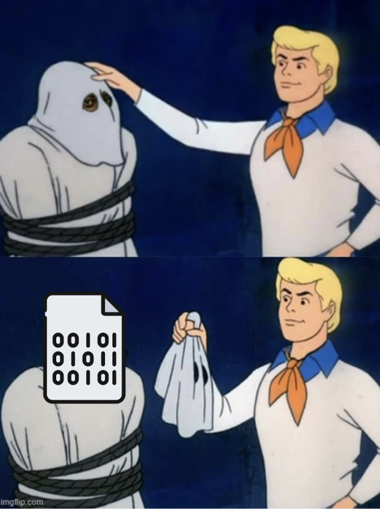

# 🔬 GenAI 103: Model Mechanics

## 📚 Contents
- [🔍 What is a model, actually?](#what-is-a-model-actually)
- [⚙️ How do we use the model?](#how-do-we-use-the-model)
- [📏 All models are smart, but some are smarter](#all-models-are-smart-but-some-are-smarter)
- [🖥️ Hardware matters](#hardware-matters)
- [🏋️ Training vs Fine-tuning](#training-vs-fine-tuning)
- [🎯 How does the model generate text?](#how-does-the-model-generate-text)
- [👻 Where hallucinations hide](#where-hallucinations-hide)
- [✅ What we have learned](#what-we-have-learned)

## 🔍 What is a model, actually? :id=what-is-a-model-actually

Let's take a closer look at the model. What is it actually?

Ultimately, a model is just a **binary file** that describes the internal workings of the model.

The model binary is just a bunch of **parameters** that say how input maps to output.

- We can treat it as a **blackbox** for now
- The more parameters, the bigger the box (model)

## ⚙️ How do we use the model? :id=how-do-we-use-the-model

To pass text through a model, we need to **execute** the model.

This is usually done with a **runtime** that automatically executes the model when it gets an input.

You can think of it as serving an HTML file so everyone can reach your webpage, except instead of HTML, you're serving a model that responds to text prompts.

## 📏 All models are smart, but some are smarter :id=all-models-are-smart-but-some-are-smarter

Generally:
- **Bigger model** = more parameters
- **More parameters** = smarter model
- But also, **more parameters** = slower to answer

<!-- 🍿 Pop Quiz – Bigger = slower? -->

<h3 style="margin:0 0 8px;color:#5a5a5a;">🍿 Pop Quiz</h3>

The bigger the model, the slower it is.

  <input type="radio" name="quiz-bigger-slower" id="bigger-slower-correct" class="quiz-radio-bigger-slower">
  <label for="bigger-slower-correct" class="quiz-option-bigger-slower" data-correct="true">✅ TRUE</label>

  <input type="radio" name="quiz-bigger-slower" id="bigger-slower-wrong1" class="quiz-radio-bigger-slower">
  <label for="bigger-slower-wrong1" class="quiz-option-bigger-slower" data-correct="false">❌ FALSE</label>

  
✅ Correct! More parameters means more computation needed for each word generated. It's the classic tradeoff — smarter but slower.

  
❌ Actually, bigger models ARE slower. More parameters means more computation per generated word. That's the tradeoff you make for a smarter model.

## 🖥️ Hardware matters :id=hardware-matters

### 🔍 Hands-on: CPU vs GPU

Try running the model on **CPU** and see how it feels:

1. Change the model to CPU
2. Ask: `"Hi, how are you feeling today?"`

<iframe
	src="https://ai-orientation-app-ai501.<CLUSTER_DOMAIN>/chat?embed"
	frameborder="0"
	width="500"
	height="600"
	style="border: 1px solid #ccc; border-radius: 8px;"
	loading="lazy">
</iframe>

Notice the difference in speed?

<!-- 🍿 Pop Quiz – GPU vs CPU -->

<h3 style="margin:0 0 8px;color:#5a5a5a;">🍿 Pop Quiz</h3>

GenAI Models run much faster on GPUs than CPUs.

  <input type="radio" name="quiz-gpu-cpu" id="gpu-cpu-correct" class="quiz-radio-gpu-cpu">
  <label for="gpu-cpu-correct" class="quiz-option-gpu-cpu" data-correct="true">✅ TRUE</label>

  <input type="radio" name="quiz-gpu-cpu" id="gpu-cpu-wrong1" class="quiz-radio-gpu-cpu">
  <label for="gpu-cpu-wrong1" class="quiz-option-gpu-cpu" data-correct="false">❌ FALSE</label>

  
✅ Correct! GenAI models run **much** faster on GPUs than on CPUs because of the kind of computations they need to execute. Generally: the more GPU, the faster they run.

  
❌ Actually, GPUs are significantly faster for GenAI workloads. The type of math involved (matrix operations) is exactly what GPUs are designed for.

### The Tradeoff Triangle

The bigger the model, it will:
- **Be smarter**
- **Be slower**
- **Require more hardware**

It's the classic tradeoff triangle: **fast, cheap, good** — pick 2.

## 🏋️ Training vs Fine-tuning :id=training-vs-fine-tuning

**Training** a model from scratch requires a lot of data, hardware, and skill. Very few organizations in the world can do this successfully.

However, you can **fine-tune** an existing model so that it behaves more the way you want. This is feasible for most organizations to do.

| | Training | Fine-tuning |
|--|----------|-------------|
| **What** | Build a model from scratch | Adjust an existing model |
| **Data needed** | Massive (terabytes) | Relatively small |
| **Cost** | Extremely expensive | Affordable |
| **Who can do it** | Very few organizations | Most organizations |

## 🎯 How does the model generate text? :id=how-does-the-model-generate-text

Let's try a fun exercise. What would you choose here?

> **Never gonna...**
>
> - give you up
> - let you down
> - run around and desert you
> - make you cry
> - say goodbye
> - tell a lie and hurt you

If you said **"give you up"** — congratulations, you just acted like an LLM!

The model simply **chooses the next word based on frequency**. It looks at all the text it was trained on, sees what word most commonly follows "Never gonna," and picks the most probable one.

The model doesn't create the entire sentence at once. It chooses **one word at a time**, then looks back at what it just said to decide what comes next.

Each generated word becomes part of the input for the next prediction:

1. Input: `"Never gonna"` → Output: `"give"`
2. Input: `"Never gonna give"` → Output: `"you"`
3. Input: `"Never gonna give you"` → Output: `"up"`
4. And so on...

<!-- 🍿 Pop Quiz – Output becomes input -->

<h3 style="margin:0 0 8px;color:#5a5a5a;">🍿 Pop Quiz</h3>

While the answer is being generated, each new word becomes part of the input to the model.

  <input type="radio" name="quiz-autoregressive" id="autoregressive-correct" class="quiz-radio-autoregressive">
  <label for="autoregressive-correct" class="quiz-option-autoregressive" data-correct="true">✅ TRUE</label>

  <input type="radio" name="quiz-autoregressive" id="autoregressive-wrong1" class="quiz-radio-autoregressive">
  <label for="autoregressive-wrong1" class="quiz-option-autoregressive" data-correct="false">❌ FALSE</label>

  
✅ Correct! This is called autoregressive generation. Each new word is added to the context, and the model uses the full context to predict the next word. This also means the maximum context length includes both the original prompt AND the generated output.

  
❌ Actually, this IS true! The model generates one word at a time and adds each word to its context before predicting the next one. This is called autoregressive generation.

> **Important quirk:** Since output words become part of the input, the **maximum context length includes both the original prompt AND the generated output**. Keep this in mind when working with large prompts!

## 👻 Where hallucinations hide :id=where-hallucinations-hide

Now here's where it gets interesting. Let's go back to our "Never gonna" example, but this time with a twist.

What if the context changes slightly? Instead of the Rick Astley song, imagine the model's training data also included other songs with "Never gonna":

> **Never gonna...**
>
> - give you up
> - leave this bed
> - not dance again
> - fall in love again
> - be alone
> - change

Without enough context, the model might pick **"leave this bed"** (from another song) instead of **"give you up."** The answer is still *plausible* — it completes the sentence grammatically — but it's the **wrong** song!

**This is exactly how hallucinations happen.** The model picks a probable-but-wrong continuation because it lacks the right context.

### How can we combat hallucinations? The answer is...MORE CONTEXT!

If we provide the first part of the song as context:

> *"We're no strangers to love..."*
> *...*
> **Never gonna...**

Now the model has much more context to work with, and it will correctly choose **"give you up"** because the surrounding words clearly point to the Rick Astley song.

> **Key insight:** The more relevant context you provide, the less likely the model is to hallucinate. This is why techniques like RAG (Retrieval-Augmented Generation) are so powerful — they inject the right context into the prompt.

---

## ✅ What we have learned :id=what-we-have-learned

The 4 truths — anyone remember?

| Truth | What we saw |
|-------|-------------|
| They only speak when spoken to | It didn't do anything unless we sent it something |
| They are non-deterministic | It replies differently each time |
| They don't speak the truth, they speak the probable | It can straight up lie to us, confidently |
| They have no memory | It never learned our name :'( |

**Plus** we now understand:

| Concept | Key takeaway |
|---------|-------------|
| **Model** | A binary file with parameters — a blackbox that maps input to output |
| **Runtime** | Executes the model and serves it so it can receive prompts |
| **Parameters** | More = smarter but slower, and needs more hardware |
| **GPUs** | Run GenAI models much faster than CPUs |
| **Training vs Fine-tuning** | Training from scratch is hard; fine-tuning is feasible |
| **Text generation** | Next-word prediction, one word at a time (autoregressive) |
| **Hallucinations** | Happen when the model lacks context; combat with more context |
| **Context length** | Includes both prompt AND generated output |
