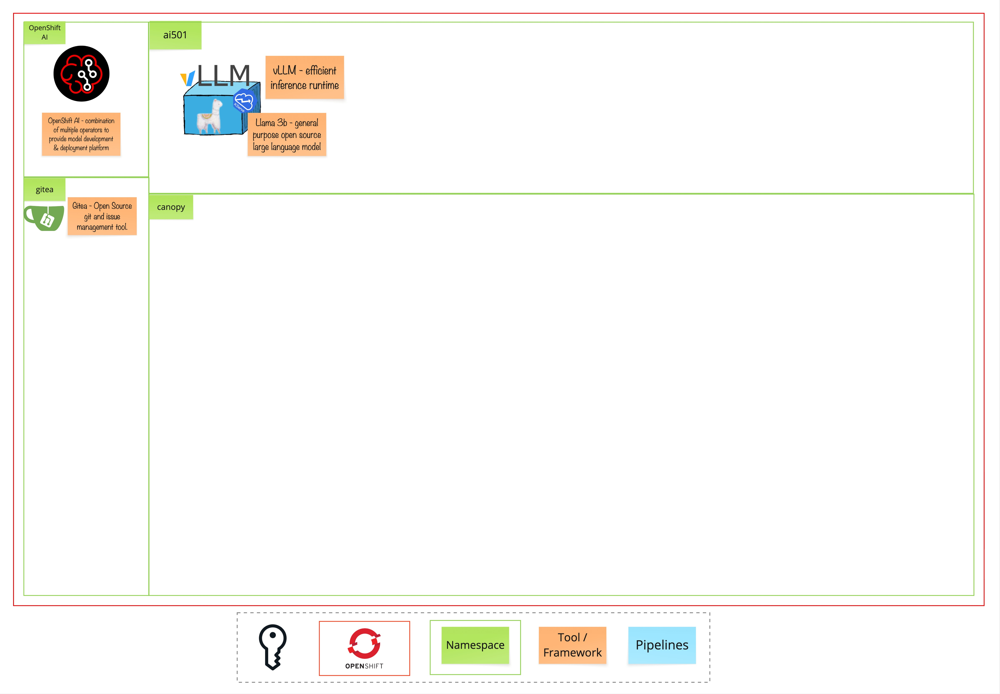

# Module 1 - The AI Orientation

> Welcome to the AI Orientation! 

# 🧑‍🍳 Module Intro
In this section, we'll cover the fundamentals of Generative AI and Large Language Models (LLMs) through interactive exercises and quizzes.

# 🖼️ Big Picture

# 🔮 Learning Outcomes
* Understand difference between Generative AI and Predictive AI
* How prompting works and why it matters
* What a model actually is and how they generate text
* Where hallucinations come from and how to reduce them

# 🔨 Tools used in this module

* LLM - Llama 3.2, a large language model from Meta, designed to understand and generate human-like text.
* Chat Interface — available at `https://ai-orientation-app-ai501.<CLUSTER_DOMAIN>`