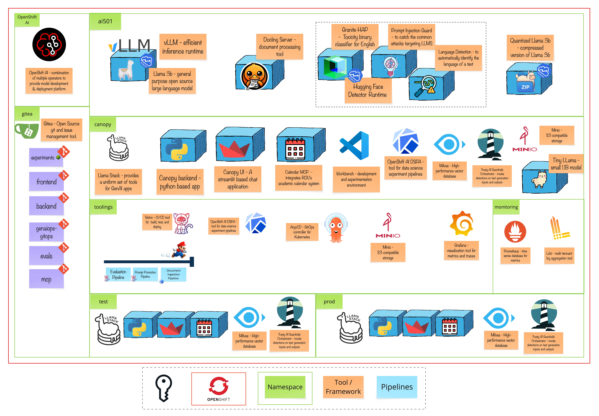

# Module 10 - The Fitness Program

> Your 70B model is brilliant. It's also eating $500/day in GPU costs and making students wait 10 seconds for answers. Time to put it on a diet. 🏋️

# 🧑‍🍳 Module Intro

This module is about making models smaller, faster, and cheaper—without making them dumber. We'll compress LLMs using quantization, test that they still work, and deploy them through your GitOps pipeline.

**The big question:** *How much can we compress before students are impacted?*

# 🖼️ Big Picture

# 🔮 Learning Outcomes

By the end of this module, you'll be able to:

* **Speak the language** — FP16, INT8, INT4, W8A16... you'll know what these mean and when to use them
* **Pick your weapon** — GPTQ, AWQ, SmoothQuant—different tools for different jobs
* **Compress a model** — Hands-on with llm-compressor to shrink models for production
* **Know if it worked** — Evaluate quantized models to catch quality regressions
* **Ship it** — Deploy optimized models through your GenAIOps pipeline

# 🔨 Tools used in this module

| Tool | What It Does |
|------|--------------|
| **llm-compressor** | The quantization toolkit from vLLM—this does the actual compression |
| **lm-evaluation-harness** | Industry-standard benchmarking to verify you didn't break anything |
| **GuideLLM** | Performance testing—measure latency, throughput, time-to-first-token |
| **vLLM/KServe** | Serve your compressed models to production |
| **Argo CD** | GitOps deployment—promote models through test → prod |
