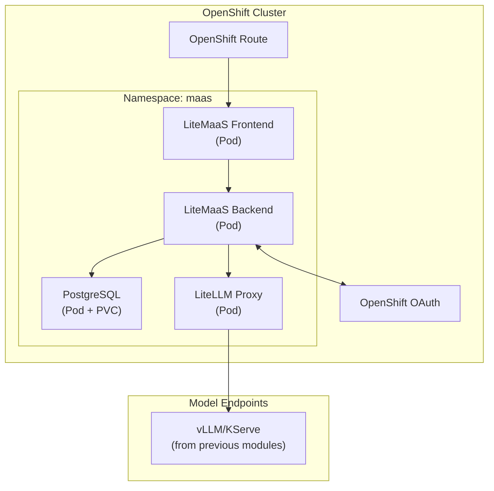

# 🚀 Deploy LiteMaaS

> 🔧 **Persona Focus: The AI Engineer** — Time to put on your infrastructure hat! You're the expert who deploys models once so everyone else can benefit. Think of yourself as the person who builds the water treatment plant while everyone else just turns on their faucets.

---

## 🎯 What You'll Build

By the end of this lesson, you'll have a fully functional LiteMaaS deployment on OpenShift:



---

## ✅ Prerequisites Check

Before we begin, let's make sure everything is in place. Go back to your workspace and run the below commands in the terminal.

### 1. OpenShift Access

Make sure you can access the cluster:

  ```bash
  export CLUSTER_DOMAIN=<CLUSTER_DOMAIN>
  oc login --server=https://api.${CLUSTER_DOMAIN##apps.}:6443 -u <USER_NAME> -p <PASSWORD>
  ```

### 2. Existing Model Endpoints

LiteMaaS is a *gateway* to models. It doesn't deploy models itself. We are going to put the models we've been using behind the gateway:

  ```bash
  # Check if you have model inference services running
  oc get inferenceservices -n ai501
  ```

You should see your Llama-3.2 3b (the cloud model) and quantized Llama, alongside with the guardrail models. And if you check your own experiment environment, you should see Tiny Llama:

  ```bash
  # Check if you have model inference services running
  oc get inferenceservices -n <USER_NAME>-canopy
  ```

### 3. Namespace Preparation

For this exercise, we'll deploy LiteMaaS in a dedicated project:

```bash
# Create the maas project 
oc new-project <USER_NAME>-maas
```

---

## 📦 Step 1: Clone the LiteMaaS Repository

Let's get the LiteMaaS code:

  ```bash
  cd /opt/app-root/src
  git clone https://github.com/rh-aiservices-bu/litemaas.git
  cd litemaas
  ```

Take a moment to explore the structure:

```bash
litemaas/
├── frontend/         # React + PatternFly UI
├── backend/          # Fastify API server
├── deployment/       # Deployment recipes
│   ├── helm/         # Helm recipe
│   └── kustomize/    # Kustomize recipe
├── docker/           # Container build files
└── docs/             # Additional documentation
```

---

## ⚙️ Step 2: Configure the Deployment

We are going to use the Helm recipe to deploy LiteMaaS, with a few configuration values.

Under `litemaas/deployment/helm/litemaas` folder, create a copy of the file `values.yaml`:

```bash
cd deployment/helm/litemaas
cp values.yaml my-values.yaml
```

Edit the file and modify all the `changeme` field for more robust passwords.

> ⚠️ **Note:** In a real deployment, you'd use proper secrets management (e.g., External Secrets Operator, Vault). For now, we're keeping it simple.

---

## 🚀 Step 3: Deploy to OpenShift

Now the fun part — let's deploy!

1. Still in the `litemaas/deployment/helm/litemaas` folder.
2. Run the deployment command to kick off the deployment:

```bash
helm install litemaas . \
-n <USER_NAME>-maas \
-f my-values.yaml \
--set route.enabled=true
```

You should get this output after a few seconds:

```bash
I0212 10:22:02.565638   55774 request.go:655] Throttling request took 1.087707749s, request: GET:https://...:6443/apis/export.kubevirt.io/v1alpha1?timeout=32s
I0212 10:22:12.765641   55774 request.go:655] Throttling request took 11.287628662s, request: GET:https://...:6443/apis/kyverno.io/v2beta1?timeout=32s
I0212 10:22:22.765647   55774 request.go:655] Throttling request took 21.287555267s, request: GET:https://...:6443/apis/odf.openshift.io/v1alpha1?timeout=32s
NAME: litemaas
LAST DEPLOYED: Thu Feb 12 10:22:30 2026
NAMESPACE: <USER_NAME>-maas
STATUS: deployed
REVISION: 1
TEST SUITE: None
NOTES:
LiteMaaS has been deployed successfully!

Components:
  - PostgreSQL:  litemaas-postgresql:5432
  - LiteLLM:     litemaas-litellm:4000
  - Backend:     litemaas-backend:8080
  - Frontend:    litemaas:8080

OAuth mode: serviceaccount
  Client ID:  system:serviceaccount:<USER_NAME>-maas:litemaas
  Token secret: litemaas-oauth-token
  NOTE: No OAuthClient CR needed — the ServiceAccount acts as the OAuth client.
  A post-install hook will auto-configure the OAuth redirect URI and backend
  secrets from the Route hostname. The backend may restart once after install.

Initial admin users: <USER_NAME>
  (Auto-detected from deploying user)

Access the application via OpenShift Routes:
  kubectl get routes -n <USER_NAME>-maas
  LiteLLM:  kubectl get route litemaas-litellm -n <USER_NAME>-maas -o jsonpath='{.spec.host}'

Post-deployment:
  1. Configure AI models via LiteMaaS or LiteLLM admin UI
  2. Wait for backend to sync models, or restart the backend deployment
```

2. Watch the deployment till all four pods become up and running (`1/1` under Ready column)

```bash
# Watch pods come up
oc get pods -n <USER_NAME>-maas -w
```

You should see:

- `postgresql-*` — Database pod
- `litemaas-backend-*` — API server
- `litemaas-frontend-*` — React UI
- `litellm-*` — OpenAI-compatible proxy


Do `Ctrl + C` to break the watch.

---

## ✨ Step 4: Access the LiteMaaS UI

1. Open your browser and navigate to:

```
https://litemaas-<USER_NAME>-maas.<CLUSTER_DOMAIN>
```

You should see the LiteMaaS login page! Use your OpenShift credentials to login!


By default you have admin privileges. That's why you have the `Administrator` section on the left, but other users won't be able to see that. However, you can still consume LiteMaaS as a regular user too. But first, we need to add some models!

---

## 🔗 Step 5: Configure Model Connections

LiteMaaS uses [LiteLLM](https://github.com/BerriAI/litellm) as its backend proxy. We need to tell LiteLLM about our available models.

1. Let's add our initial cloud model as our first. Go to `Administator` > `Model Management` and click `Create Model`.

  

2. Fill out the form as below:

  **Model Name:** `Llama-3.2-3B`

  **Description:** `Meta Llama 3.2 3B is a lightweight 3B-parameter, multilingual text-only LLM`

  **API Base URL:** `http://llama-32-predictor.ai501.svc.cluster.local:8080/v1`

  **Backend Model Name:** `llama32`  

  **API Key:** `fakekey`

  **Input Cost per Million Tokens:** `0,1`

  **Output Cost per Million Tokens:** `0,5` (or you can use your imagination for cost values 💸💸💸)

  **Features:** You can select `Supports Function Calling` and `Supports Tool Choice`


  

  Leave the others default and hit `Create`

  

3. Let's also add your `TinyLlama` and quantized `llama32-fp8` to your MaaS to make them available via MaaS. 

  You can use the below options to add them:

  <details>
  <summary>TinyLLama 🦙</summary>

    **Model Name:** `TinyLlama-1.1B`

    **Description:** `TinyLlama is a compact 1.1B parameter language model`

    **API Base URL:** `http://tinyllama-predictor.<USER_NAME>-canopy.svc.cluster.local:8080/v1`

    **Backend Model Name:** `tinyllama`  

    **API Key:** `fakekey`

    **Input Cost per Million Tokens:** `0,001`

    **Output Cost per Million Tokens:** `0,005`

    _should we even charge for this?_ 🫣🫣🫣

  </details>

  <details>
  <summary>Llama-3.2-3B-Instruct-FP8 🦙🦙</summary>

    **Model Name:** `Llama-3.2-3B-Instruct-FP8`

    **Description:** `Meta Llama 3.2 3B Instruct quantized to FP8 for efficient inference`

    **API Base URL:** `http://llama-32-fp8-predictor.ai501.svc.cluster.local:8080/v1`

    **Backend Model Name:** `llama32-fp8`  

    **API Key:** `fakekey`

    **Input Cost per Million Tokens:** `0,01`

    **Output Cost per Million Tokens:** `0,05`

    **Features:** You can select `Supports Function Calling` and `Supports Tool Choice`
  </details>

  

Your infrastructure is ready! Now let's make Canopy to consume models from this MaaS instance!
