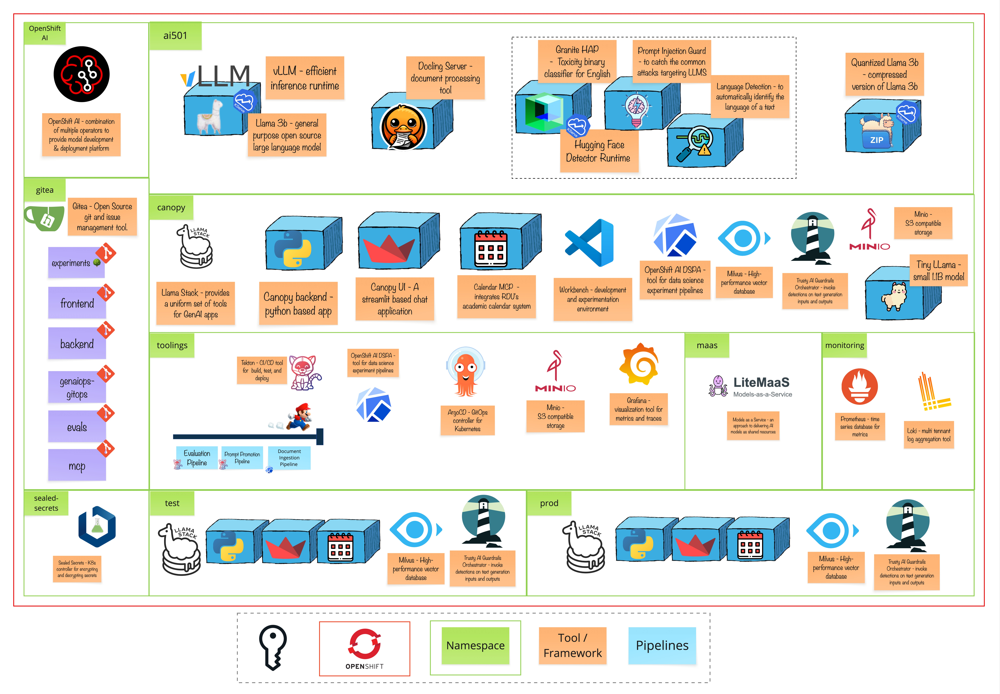

# Module 11 - Supply & Demand 101

> Giving everyone a GPU is like giving everyone their own power plant. What if we just... shared the electricity instead? ⚡

# 🧑‍🍳 Module Intro

Remember how Canopy started? A simple chatbot experiment in Module 2. Fast forward through GitOps deployments, RAG-powered document intelligence, guardrails for academic integrity, and agentic capabilities... and now everyone at Redwood Digital University wants Canopy-like applications.

---

# 👥 Meet the Personas

This module is unique because different people care about different aspects of MaaS. We'll explore it through four lenses:

| Persona | Emoji | They Care About... | Primary Lessons |
|---------|-------|-------------------|-----------------|
| **The Owner** | 🎩 | Cost, efficiency, ROI, "Why are we spending so much on GPUs?" | 1, 5 |
| **The AI Engineer** | 🔧 | Infrastructure, deployment, "How do we set this up right?" | 2 |
| **The Service Admin** | 👩‍💼 | User management, configuration, "Who needs access to what?" | 3, 5 |
| **The Consumer** | 👤 | API access, building apps, "Just give me an endpoint!" | 4, 6 |

As you go through each lesson, you'll "wear different hats" to understand MaaS from multiple perspectives. By the end, you'll appreciate why each role matters — and maybe even realize which hat fits you best! 🎭

---

# 🖼️ Big Picture

The goal is:

---

# 🔮 Learning Outcomes

By the end of this module, you will be able to:

* **Explain** why MaaS is essential for scaling AI adoption in organizations
* **Deploy** LiteMaaS on OpenShift using GitOps principles
* **Configure** user roles, model access, and budgets as a service administrator
* **Consume** AI models through API keys and the OpenAI-compatible interface
* **Monitor** usage, track costs, and implement chargeback models
* **Integrate** existing applications (like Canopy!) with a MaaS backend

---

# 🔨 Tools Used in This Module

* **LiteMaaS** — A lightweight, Open Source, Models-as-a-Service proof-of-concept application 
  * React + PatternFly 6 frontend for beautiful, accessible UIs
  * Fastify + PostgreSQL backend for robust API management
  * LiteLLM integration for OpenAI-compatible API proxy
  * OAuth2/JWT authentication with OpenShift integration

* **LiteLLM** — An OpenAI-compatible proxy that provides a unified API across different model backends

* **PostgreSQL** — Database for storing users, API keys, usage data, and audit logs

* **OpenShift OAuth** — Enterprise authentication integration for seamless user onboarding

* **Your favorite HTTP client** — curl, Postman, or Python requests to make API calls
