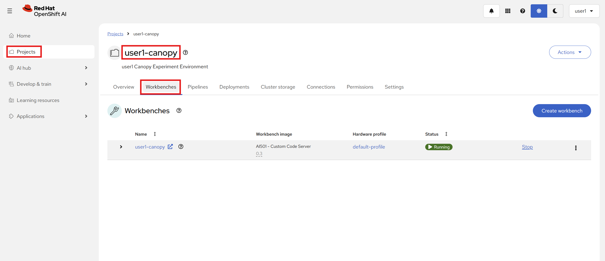
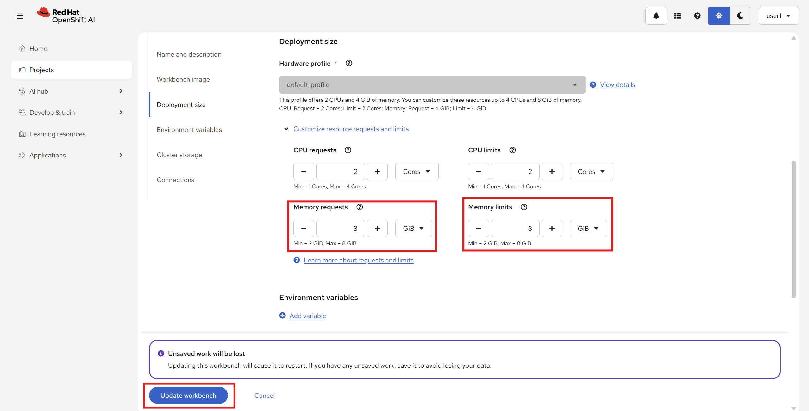

# 🎯 Fine-tuning

You've got three tools in your AI customization toolkit: **prompt engineering**, **context engineering** (like RAG), and **fine-tuning**.  
We have seen how we can use prompt engineering and context to enhance the model responses, grounding them amongst other things.

So where does fine-tuning come in?  
There are a few things that fine-tuning does better than just improved prompts or added context:  

- Model needs consistent *behavior*
- Model needs domain terminology
- Prompts are getting too long

## Use Case

So why do we want to fine-tune?  
To improve Canopy, we want a feature where Canopy acts as a Socratic tutor, leading the students towards the right answers with clever follow-up questions rather than straight up giving the answers.  
This requires quite a long prompt and becomes fragile, so we instead decide to fine-tune this behaviour into our model.

## Preliminary setup

Before we can start, we need to give our workbenches some more memory.

1. Go to OpenShift AI Dashboard -> <USER_NAME>-canopy project -> Workbenches

2. Edit your workbench by clicking on the ⋮ and then `Edit workbench`

3. Finally, scroll down to `Deployment size` and change `Memory requests` and `Memory limits` to 8GB each, then click `Update workbench`

Now you are ready to start running the notebooks!

## Tuning eats data 🐟

Before we can start tuning our model, we need data (at least 500-1000+ examples for our Socratic tutor).  
Unfortunately, good data is quite difficult to come by and is often a very manual job.  
Luckily, there are now techniques for generating synthetic data that we can use to compliment our existing data.

These approaches are called **Synthetic Data Generation**.

To try it out, go to your workbench, open up **`experiments/12-fine-tuning/1-synthetic-data-generation.ipynb`** and follow the instructions.

## Let's Fine-Tune!

You've seen how synthetic data generation works. Now let's actually train the model to be a Socratic tutor.

We will use LoRA (Low Rank Adaptation) to fine-tune our model. It cleverly updates only a small part of the model, making it much faster and cost efficient than a full training, while still giving good results.

Go back to your workbench and run **`experiments/12-fine-tuning/2-lora-training.ipynb`** to fine-tune our small model!

## Evaluate

We will have our standard online evaluations that we will use when updaing Canopy, but here we also do some offline evaluations before the model gets deployed just to have a sanity check that it's better than our existing one.  

To evaluate the new model, go to **`experiments/12-fine-tuning/3-evaluation.ipynb`** and run through that notebook.