# 🚀 Deploy to Canopy

Time to deploy and use this new model in Canopy!  
First we need to deploy it, we will deploy it here to our experimentation namespace and then pull it in through MaaS and Llamastack.  
For a more rigerous process you 

## Deploy from Model Registry

In the previous notebook you just pushed your model to the Model Registry, let's go and take a look at how it looks like!

1. Go to OpenShift AI Dashboard -> AI hub -> Registry

  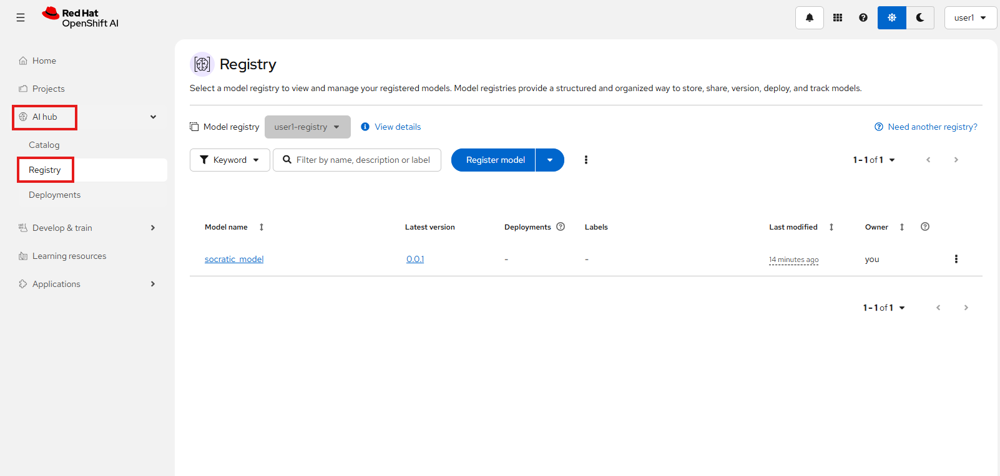

2. In here you can see the model you just created a modelcar🚗 for your newly fine tuned model!

  Go to the `Latest version` (0.0.1) and then copy the `Model location URI`, we will need it when deploying.  
  
  You can also see any metadata or details about the model in here 🤩

  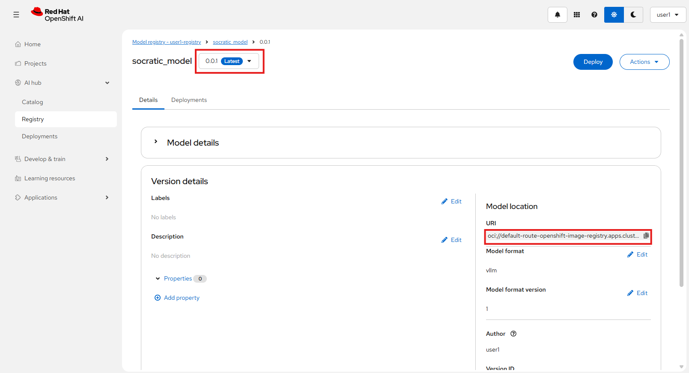

3. Now just click `Deploy` in the top right corner and choose `<USER_NAME>-canopy` as the project and press Deploy.
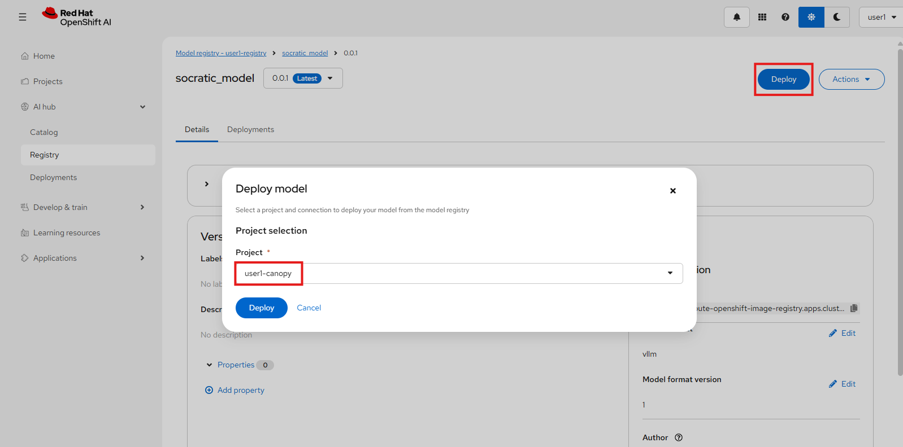

4. In the Model details page, select these options:
- Model location: **URI**
- URI: **oci://default-route-openshift-image-registry.<CLUSTER_DOMAIN>/<USER_NAME>-canopy/socratic-model:0.0.1**
- Create a connection to this location: **Unchecked**
- Model type: **Generative AI model (Example, LLM)**

    Then press Next
    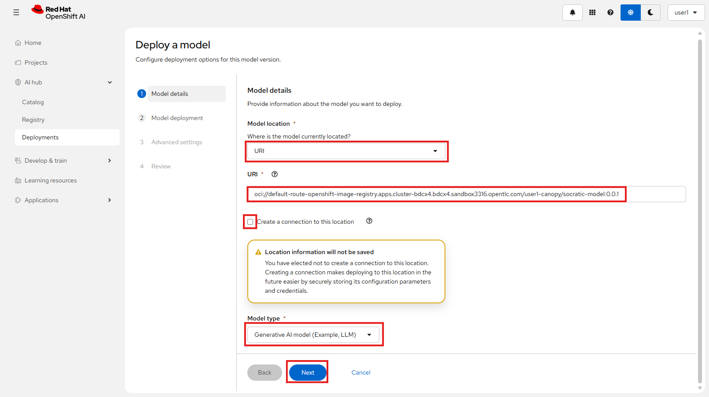

5. In the Model deployment page, select these options:

- Name: **socratic-model**

- Click on `Customize resource request and limits` and set `Memory requests` and `Memory limits` both to **8 GiB**

- Serving runtime: `CUSTOM - vLLM Serving Runtime for CPU`  

Leave the rest as is and press Next.

  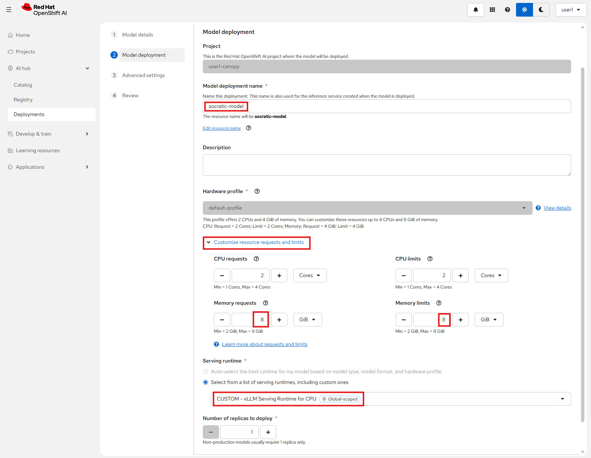

6. In the `Advanced settings` page, leave all as is and just press Next, then press `Deploy model` in the Review page after making sure all the details look correct.

  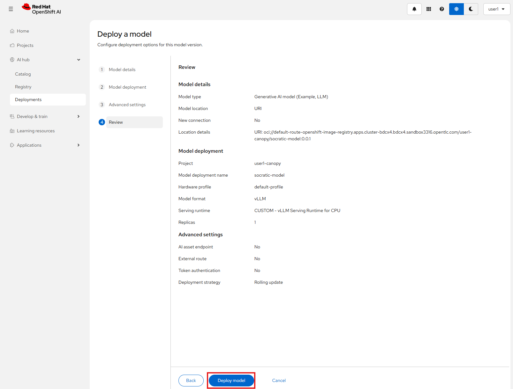

7. To see your model being deployed, go to `AI hub` -> `Deployments` and wait for the model to be deployed.  

  If it doesn't update automatically, try refreshing the page.
  
  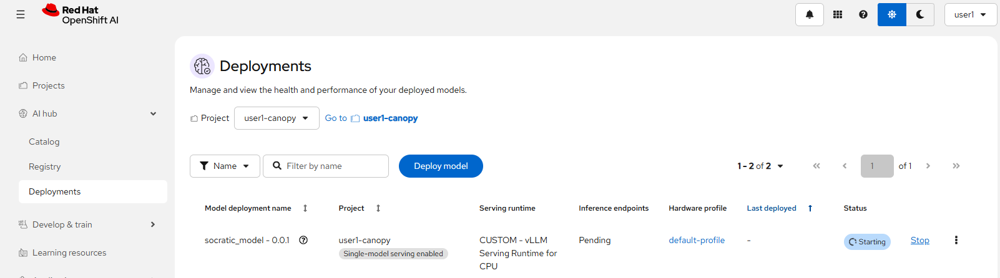

## Add the model to MaaS

Now that we have a new model deployed, let's add it to our MaaS so anyone who needs it can use it 🚀

1. Go to your MaaS dashboard (https://litemaas-<USER_NAME>-maas.<CLUSTER_DOMAIN> if you closed it) and add a new model.

  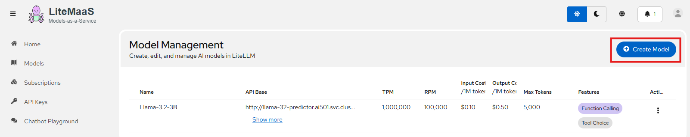

2. Enter these details:
- **Model name:** socratic-model
- **Description:** A fine-tuned Qwen2-0.5B-Instruct model to act as a socratic tutor
- **API Base URL:** http://socratic-model-predictor.<USER_NAME>-canopy.svc.cluster.local/v1
- **Backend Model Name:** socratic-model
- **API Key:** fakekey
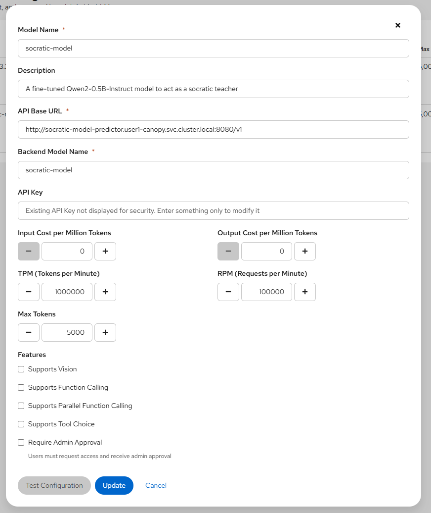

3. Go to `Models`, click on your new `socratic-model` and click Subscribe
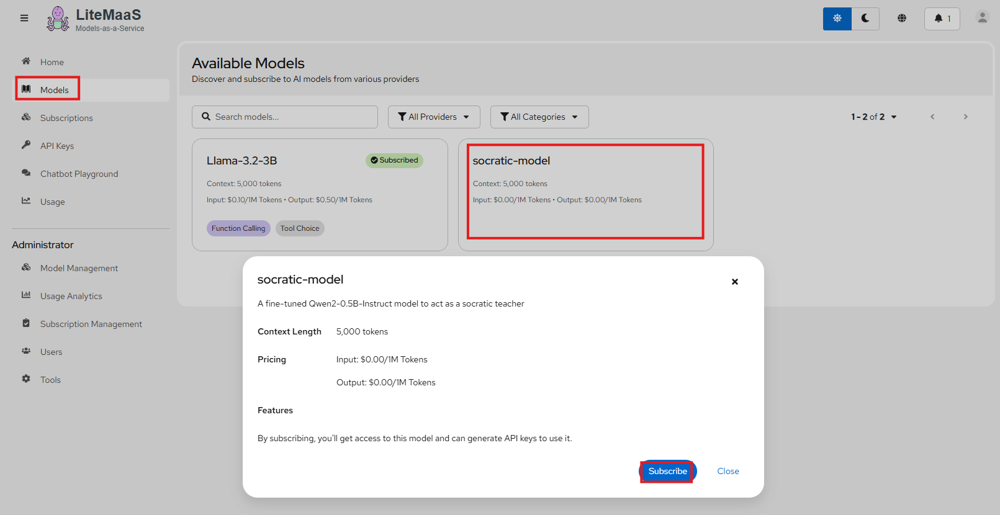

4. Go to `API Keys`, click `Create API Key`, call it `socratic-model`, choose your `socratic-model`, and press Create API Key
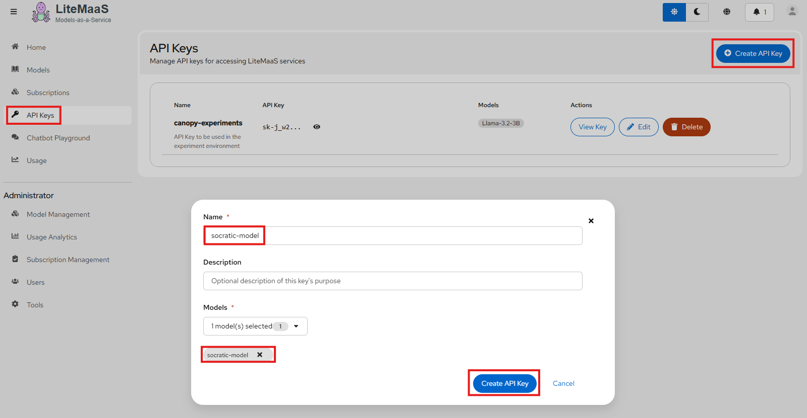

5. Make sure to copy the API key, we will use it in the next section 🤭

## Add the new model to Llama Stack

Now that we have the new model in MaaS, let's add it to our test Llama Stack so we can test it in Canopy! 🙌

1. Go into your workbench and open `genaiops/test/llama-stack/config.yaml`

2. Add a new model in the yaml to reflect the socratic-model:

```yaml
  ---
  chart_path: charts/llama-stack-operator-instance
  models:
    - name: "llama32"
      url: "http://llama-32-predictor.ai501.svc.cluster.local:8080/v1"
    - name: "llama32-fp8"   
      url: "http://llama-32-fp8-predictor.ai501.svc.cluster.local:8080/v1" 
    - name: "Llama-3.2-3B-Instruct-FP8"
      url: "https://litellm-<USER_NAME>-maas.<CLUSTER_DOMAIN>/v1"
    - name: "socratic-model"    # 👈 Add this ❗︎❗︎
      url: "https://litellm-<USER_NAME>-maas.<CLUSTER_DOMAIN>/v1"   # 👈 Add this ❗︎❗︎
      token: "<YOUR-COPIED-API-KEY>"    # 👈 Add this ❗︎❗︎
  eval:
    enabled: true
  rag:                  
    enabled: true
  mcp:                
    enabled: true 
  sealed_secrets:
    enabled: true
    secretName: llama-fp8-maas-token 
```

  (Yes I know we are pushing a key to git, which is not secure... Feel free to go through seeled secret with this one as well, but in favor of time we'll take the easy path this once 🙈)

  3. Commit this to git:
```bash
cd /opt/app-root/src/genaiops-gitops
git pull
git add .
git commit -m "💭 Add Socratic Model from MaaS 💭"
git push
```

And now we have the new model in Llama Stack ready to use!  

Just make sure that LlamaStack starts properly after this (check Topology view in the `<USER_NAME>-test` namespace and verify 🔵 circle for Llama Stack for), and we are ready to add the new model into a new Canopy feature 😁

## Socratic Canopy


Let's get this Socratic tutor fully set up in Canopy!

1. Go to `backend/chart/values-test.yaml` and add the new feature flag

  ```yaml
  LLAMA_STACK_URL: "http://llama-stack-service:8321"
  summarize:
    enabled: true
    model: vllm-Llama-3.2-3B-Instruct-FP8/Llama-3.2-3B-Instruct-FP8
    temperature: 0.9
    max_tokens: 4096
    prompt: |
      You are a helpful assistant. Summarize the given text please.
  information-search:
    enabled: true
    vector_db_id: latest
    model: vllm-Llama-3.2-3B-Instruct-FP8/Llama-3.2-3B-Instruct-FP8
    prompt: |
      You are a helpful assistant specializing in document intelligence and academic content analysis.
  student-assistant:         
    enabled: true
    model: vllm-Llama-3.2-3B-Instruct-FP8/Llama-3.2-3B-Instruct-FP8
    temperature: 0.1
    vector_db_id: latest
    mcp_calendar_url: "http://canopy-mcp-calendar-mcp-server:8080/sse"
    prompt: |
      You are ...
  socratic-tutor:    # 👈 Add this ❗︎❗︎
    enabled: true    # 👈 Add this ❗︎❗︎
    model: vllm-socratic-model/socratic-model    # 👈 Add this ❗︎❗︎
    prompt: |    # 👈 Add this ❗︎❗︎
      You are a Socratic tutor. Your role is to guide students to discover answers themselves through thoughtful questions rather than providing direct answers. Ask clarifying questions, prompt critical thinking, and help students explore different angles of their question.
    temperature: 0.9    # 👈 Add this ❗︎❗︎
    max_tokens: 1500    # 👈 Add this ❗︎❗︎
  ```

2. Commit to git:

  ```bash
  cd /opt/app-root/src/backend
  git pull
  git add .
  git commit -m "🤔 Add the Socratic Tutor feature 🤔"
  git push
  ```

3. Open up Canopy, select Socratic Tutor in the left menu and try asking some questions, for example `What is 1+1?`.  

_(Note that the tutor might be a bit slow, this is because it's running on CPU 🙈)_

  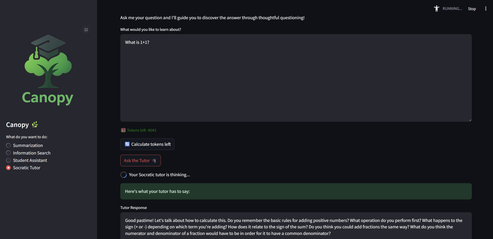

Congratulations! 🎉  

You have now gone through the full flow of tuning and onboarding a model, not a small feat. 

Next step is to automate all of this so that your model gets updated with the click of a button (or merge of a PR).  

That would be something we call a Continous Training (CT) pipeline and is covered extensively in [**AI500 MLOps Enablement with Red Hat AI Enterprise**](https://www.redhat.com/en/services/training/ai500-mlops-practices-with-red-hat-openshift-ai) if you are interested.