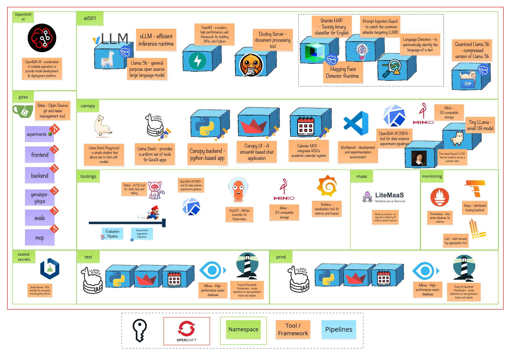

# Module 12 - The Tuning Room

> Your prompt is 800 tokens long and gets sent with every single message. That's 8 million tokens a day just for instructions. What if you could bake those instructions into the model itself? 🎓

# 🧑‍🍳 Module Intro

You've optimized Canopy's model for speed and cost. But there's one efficiency you haven't tackled yet: **the prompt itself**.

Every time a student asks a question, you send the same massive system prompt explaining how to be a Socratic tutor. Don't give answers directly. Ask guiding questions. Praise effort. Handle frustration. The prompt works—but it's expensive, slow, and students have figured out how to jailbreak it.

This module is about teaching the model to *be* a Socratic tutor, not just *pretend* to be one. You'll learn about synthetic data generation, LoRA adapters, and the fine-tuning workflow.

**The big question:** *Can we bake behavior into the model instead of describing it every time?*

# 🖼️ Big Picture

# 🔮 Learning Outcomes

By the end of this module, you'll be able to:

* **Understand when to fine-tune** — Know when prompt engineering hits its limits
* **Explain synthetic data generation** — How SDG Hub creates training examples from documents
* **Describe training datasets** — What format models expect and why
* **Understand LoRA** — How adapters enable efficient fine-tuning
* **Know evaluation approaches** — How to verify a fine-tuned model learned the behavior
* **Plan production deployment** — How to serve LoRA adapters alongside base models

# 🔨 Tools used in this module

| Tool | What It Does |
|------|--------------|
| **Docling** | Converts PDFs, slides, and documents into clean markdown for processing |
| **SDG Hub** | Generates synthetic training data using LLM-powered pipelines |
| **Training Hub** | Runs LoRA fine-tuning with optimized backends (Unsloth) |
| **lm-evaluation-harness** | Benchmarks your fine-tuned model against the baseline |
| **vLLM** | Serves LoRA adapters dynamically alongside base models |
| **Argo CD** | Deploys your fine-tuned model through GitOps |
