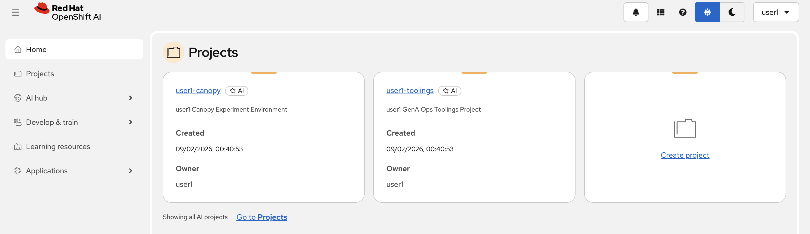
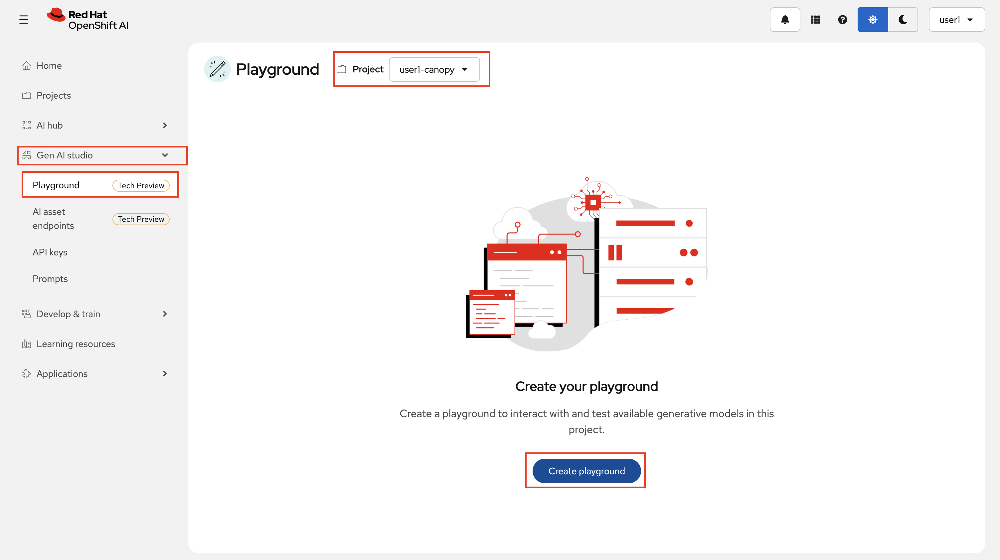
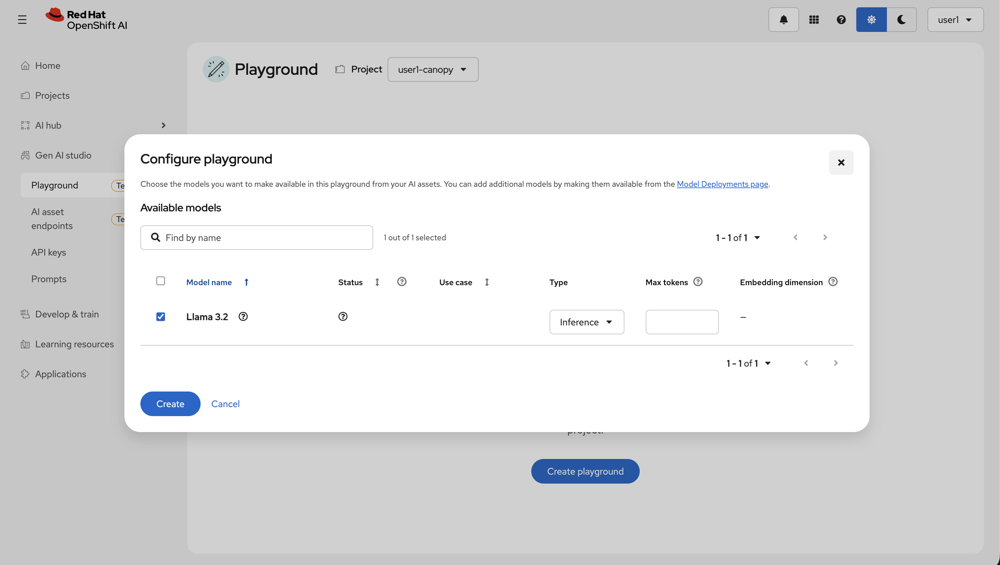
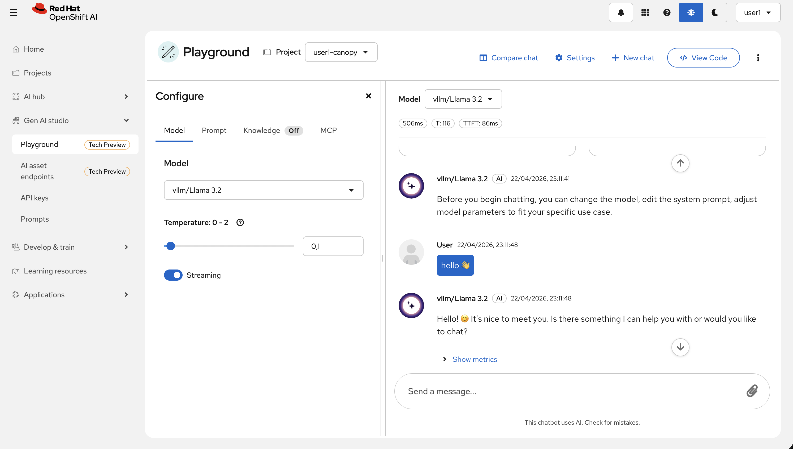

# 🧠 What is Prompt Engineering?

<div class="terminal-curl"></div>

Prompt engineering is the practice of designing effective inputs (prompts) to elicit useful, relevant, and accurate outputs from a language model.

You can think of it like writing instructions for a very smart but very literal assistant. The way you phrase a prompt can drastically affect the tone, format, depth, or even the correctness of the model’s response.

There are typically two key parts to prompting:

* **System Prompt**: This sets the context or behavior for the model. It defines *how* the model should act (e.g., “You are a helpful teaching assistant for computer science students.”).
* **User Prompt**: This is the actual question or task you’re giving to the model (e.g., “Explain recursion to a beginner.”).

Together, they guide the model’s behavior and shape its response.

> ℹ️ **Reminder:** The System Prompt and User Prompt are not sent in separately to the LLM, they are combined into a single prompt.  

## 🎯 Why Prompt Engineering Matters for RDU’s Canopy

At Redwood Digital University, we’re building **Canopy**, a platform designed to adapt to diverse student needs and teaching styles. That means that we not only need a good LLM, but also need to refine our prompts.

Let's explore how our LLM behaves under different prompting conditions.


## 🧪 Hands-On: Gen AI Playground

Red Hat OpenShift AI provides the ability to create a playground where you can experiment with different prompting strategies, alongside other experimentation capabilities. We are going to focus on `Prompt` part of it at the moment.

Let's create a Playground!

1. Login to [OpenShift AI](https://data-science-gateway.<CLUSTER_DOMAIN>/). You’ll see some `Projects`. The one that is called `<USER_NAME>-canopy` is your experimentation environment! This is where we validate ideas before going to test and production stages 💪

    User: `<USER_NAME>`

    Password: `<PASSWORD>`

   

   Welcome to OpenShift AI! 👋🤖

2. From the left menu, select `Gen AI studio` > `Playground`. Make sure you select `<USER_NAME>-canopy` namespace from the dropdown menu. Click `Create playground`.

	

3. Select the prompted model and click `Create`.

	

4. When the playground is ready, send a message to verify that is working 😊

	

5. Your goal is to find the best system prompt and configuration to **summarize** a given text. 

	Here’s what you can configure in the playground:

	| Setting          | What it Does                                | Example                       |
	| ---------------- | ------------------------------------------- | ----------------------------- |
	| 🧾 System Prompt | Sets the AI’s role or behavior              | “You are a helpful tutor."     |
	| 💬 User Prompt   | The task you give                           | “This text is about...”        |
	| 🔥 Temperature   | How creative/varied the output will be (0 = serious and deterministic, 1 = creative and random) | “0.2 = strict, 0.8 = creative”  |

	You can see the Temperature setting on the `Model` tab, and System Prompt on the `Prompt` tab. And User Prompt is what you send to the model :)

	Start thinking about a good summarization prompt. And here is the text we ask you to summarize (in another word; the text you send into the User Prompt):

	```
	Tea preparation involves the controlled extraction of bioactive compounds from processed Camellia sinensis leaves. Begin by heating water to near 100°C to optimize solubility. Introduce a tea bag to a ceramic vessel, then infuse with hot water to initiate steeping—typically 3–5 minutes to allow for the diffusion of polyphenols and caffeine. Upon removal of the bag, optional additives like sucrose or lipid-based emulsions may be introduced to alter flavor profiles. The infusion is then ready for consumption.
	```

	

	Use the Gen AI Playground to:

	* Compare how different **system prompts** change the behavior of the same model.
	* Adjust **temperature** to explore how output varies.
	* Decide on a system prompt template that will work well for Canopy’s Summarization feature.

	📌 **Tip**: Try changing the tone, specificity, or format of your system prompt to see how much it shapes the output. Don’t be afraid to get creative!


6. What is the best system prompt and settings you can find to summarize the above text?

	Here are a few example System Prompts you can try.

	```
	Write a short version of this.
	```

	```
	Summarize the text in a few sentences.
	```

	```
	Explain the given text as if I’m a 5-year-old.
	```

	```
	Explain the given text using only emojis.
	```

	Can you come up with something that explains the text even better without losing important info?


_Want more information about `Temperature`? You have access to a Large Language Model that is quite knowledgeable, right? Feel free to ask 🙃_