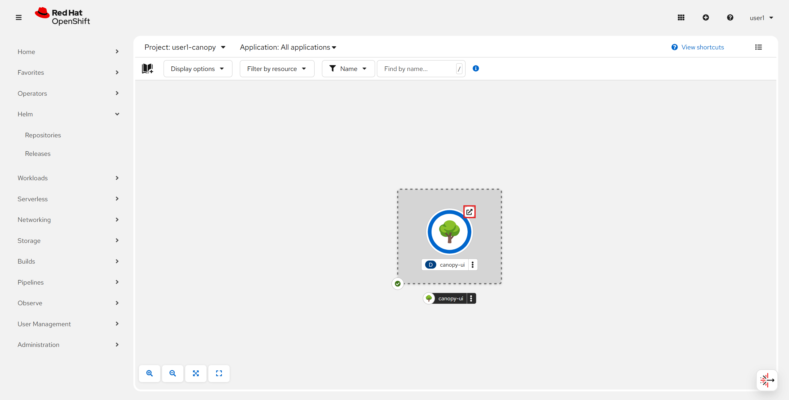

# 🌿 What is Canopy?

<div class="terminal-curl"></div>

**Canopy** is an intelligent, leafy little assistant designed to support teaching and learning at **Redwood Digital University**. From summarizing texts to generating quizzes and scoring assignments — it’s your educational AI lab in action.

This frontend gives you a clean, playful UI built in Streamlit, powered by your choice of LLMs. Whether hosted in OpenShift or running locally, it’s built for experimentation and enablement.

## 🎯 Why This Frontend Matters for Prompt Engineering

Just like a good prompt shapes a great model response, **a good user interface shapes great exploration**.

In GenAI applications, **how people interact with the model often matters more than which model you use**.

You can have the smartest LLM in the world, but if the UI doesn’t help users guide or understand it — the value is lost.

This first iteration of **Canopy** is built to support:

- System prompts 🧠 to define model behavior.

- User prompts 💬 to define what you ask.

- Live streaming output 🌱 so you see each token bloom.

In future modules, this same interface will evolve to handle content creation, grading, and personalized feedback.

## 🚀 Getting Started with Canopy on OpenShift

Follow these instructions to get your own instance of Canopy up and running in just a few minutes.

### 📦 1. Deploy the Frontend to OpenShift

In OpenShift, you have an experimentation environment which is called `<USER_NAME>-canopy`. You'll use this environment to iterate over Canopy, bring in new features, update the frontend when new capabilities arrive, and so on. 

1. Go to [OpenShift Console](https://console-openshift-console.<CLUSTER_DOMAIN>) and use `Students` login. You'll find yourself in the Developer view of Openshift Console.

    

2. Click `Add`, select `<USER_NAME>-canopy` namespace from the dropdown menu on the top, and select `Helm Charts`. 

    

3. Select `Canopy Helm Charts` and click on `Canopy UI` helm chart to deploy.

    

4. Hit `Create` and fill out the values as below:

    - SYSTEM_PROMPT: Do you remember the great prompt you came up with in the previous section. Let's paste that here!
    - MODEL_NAME: `llama32`
    - LLM_ENDPOINT: `https://llama32-ai501.<CLUSTER_DOMAIN>`
  
    Leave the rest as it is for now.

    

    ✅ This will create:

    - A UBI9-based Streamlit app
    - A service exposing port 8501
    - A secure OpenShift route (TLS termination: edge)

5. Once the application is successfully running, click on the arrow on the side of the circle to access the Canopy UI 🌳🌳🌳

    


### 🧪 2. Try the Summarization UI

1. Inside the app, you can paste the following text to let it summarize, taken from Wikipedia on Canopy: https://en.wikipedia.org/wiki/Canopy_(biology):
   
    ```
    In biology, the canopy is the aboveground portion of a plant cropping or crop, formed by the collection of individual plant crowns.[1][2][3] In forest ecology, the canopy is the upper layer or habitat zone, formed by mature tree crowns and including other biological organisms (epiphytes, lianas, arboreal animals, etc.).[4] The communities that inhabit the canopy layer are thought to be involved in maintaining forest diversity, resilience, and functioning.[5] Shade trees normally have a dense canopy that blocks light from lower growing plants.

    Early observations of canopies were made from the ground using binoculars or by examining fallen material. Researchers would sometimes erroneously rely on extrapolation by using more reachable samples taken from the understory. In some cases, they would use unconventional methods such as chairs suspended on vines or hot-air dirigibles, among others. Modern technology, including adapted mountaineering gear, has made canopy observation significantly easier and more accurate, allowed for longer and more collaborative work, and broaddened the scope of canopy study.[6]
    Structure
    A monkey-ladder vine canopy over a road

    Canopy structure is the organization or spatial arrangement (three-dimensional geometry) of a plant canopy. Leaf area index, leaf area per unit ground area, is a key measure used to understand and compare plant canopies. The canopy is taller than the understory layer. The canopy holds 90% of the animals in the rainforest. Canopies can cover vast distances and appear to be unbroken when observed from an airplane. However, despite overlapping tree branches, rainforest canopy trees rarely touch each other. Rather, they are usually separated by a few feet.[7]

    Dominant and co-dominant canopy trees form the uneven canopy layer. Canopy trees are able to photosynthesize relatively rapidly with abundant light, so it supports the majority of primary productivity in forests. The canopy layer provides protection from strong winds and storms while also intercepting sunlight and precipitation, leading to a relatively sparsely vegetated understory layer.

    Forest canopies are home to unique flora and fauna not found in other layers of forests. The highest terrestrial biodiversity resides in the canopies of tropical rainforests.[8] Many rainforest animals have evolved to live solely in the canopy and never touch the ground. The canopy of a rainforest is typically about 10 metres (33 feet) thick, and intercepts around 95% of sunlight.[9] The canopy is below the emergent layer, a sparse layer of very tall trees, typically one or two per hectare. With an abundance of water and a near ideal temperature in rainforests, light and nutrients are two factors that limit tree growth from the understory to the canopy.

    In the permaculture and forest gardening community, the canopy is the highest of seven layers.[10] 
    ```

    Press `Summarize` and then watch the model generate a summary in real-time ✨

    

---

✅ What you have accomplished

- Deployed the Canopy frontend on OpenShift

- Connected it to your own LLM endpoint

- Used the system prompt to shape the assistant's behavior

- Understood the relationship between prompting and summarization style