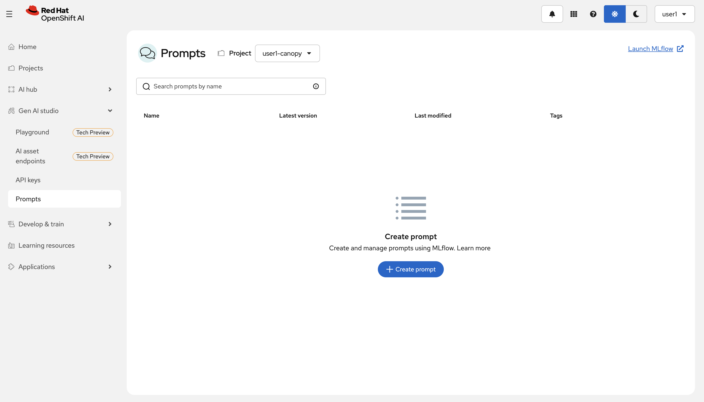
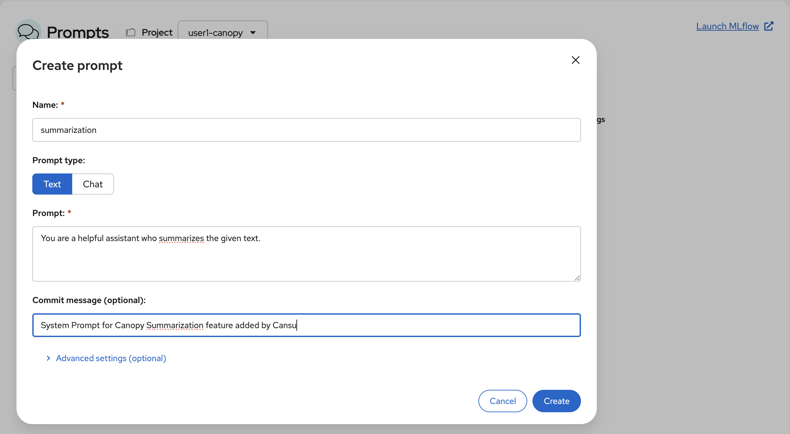
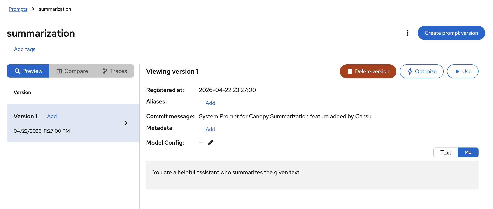

# 🗂️ Prompt Versioning

Do you remember the first System Prompt you tried? What was the first one? Why you didn't like the second one? 

There must be a better way to track these experiments you've been conducting in the playground!

This is where we introduce **prompt versioning** and a **prompt registry** concepts!

## 🎯 Why Prompt Versioning Matter

Think of good prompt like a well-written function or component. Once you get it right, you want to reuse it across different apps and users.

But in GenAI workflows, we face a big challenge: Prompt experiments are often **invisible**, **untracked**, and **not reusable**. Just like you experienced a moment ago!

This makes collaboration hard and reproducibility nearly impossible—especially at scale.

There are a variety of different strategies here on where to store your prompts and how to load them into your application. 

In our case, we are going to store the prompts in MLflow Prompt Registry! 

## Prompt Registry

We are going to store our prompts on our Prompt Registry, add notes, tags, etc when necessary and fetch these prompts from our backend during the runtime. 

1. Let's go to `Gen AI studio` > `Prompts` from the left menu. Select `<USER_NAME>-canopy` project from top and store your favourite Summarization prompt under the experiment environment. We'll get to talk about production later 🤫🤫🤫

    _Note: We will be able to store prompts directly from the Playground very soon._

    

2. Click `Create prompt` and call it: `summarization`. 

    ```bash
    summarization
    ```

    And paste your new favourite System Prompt for the task 🫶 Alternatively you can add a nice commit message there too, and hit `Create`. 

    

    This is the first version (Version 1) of your prompt and it automatically gets `latest` tag. 

    

    Now it's time to put your system prompt to work! That means, deploying Canopy to your experimentation environment on OpenShift cluster and let it fetch the prompt from your Prompt Registry.

