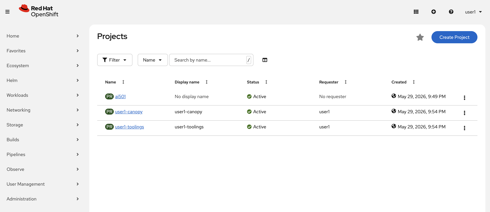
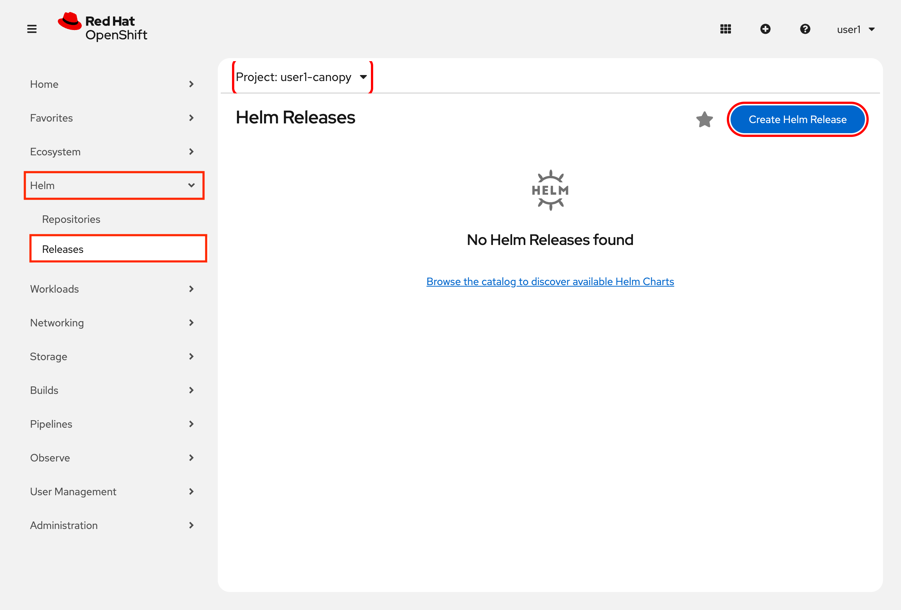
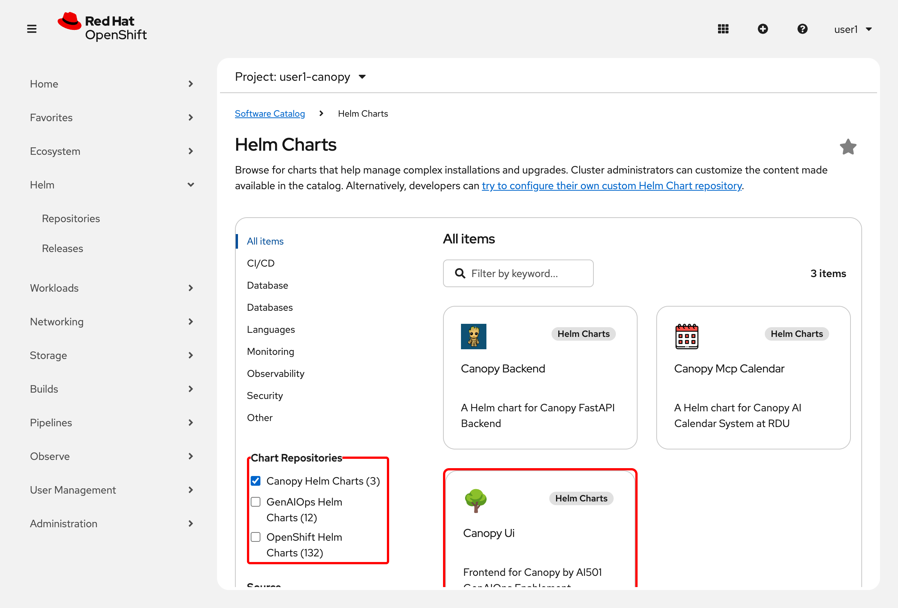
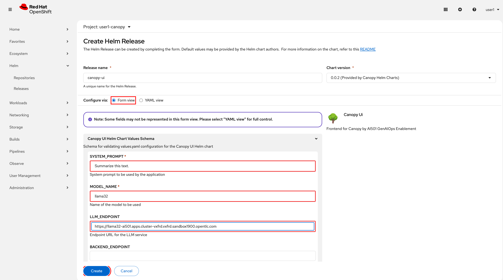
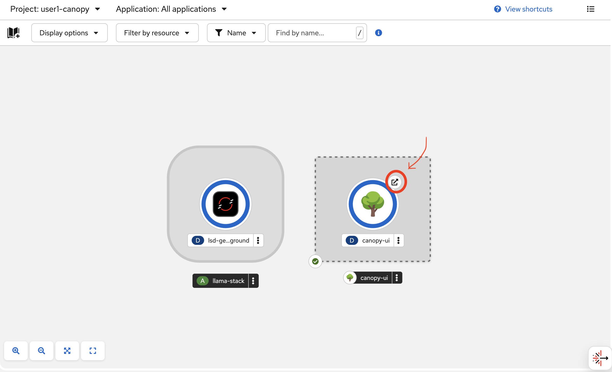
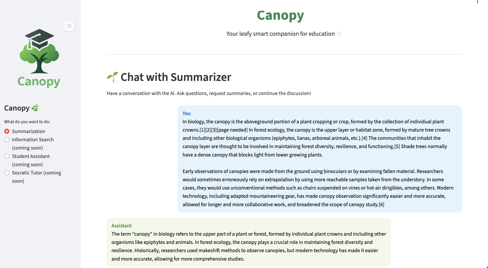

# 🌿 What is Canopy?

**Canopy** is an intelligent, leafy little assistant designed to support teaching and learning at **Redwood Digital University**. From summarizing texts to generating quizzes and scoring assignments — it will be your educational AI buddy in action.

## 🎯 Why This Frontend Matters for Prompt Engineering

Just like a good prompt shapes a great model response, a good user interface shapes great exploration.

In GenAI applications, how people interact with the model often matters more than which model you use.

You can have the smartest LLM in the world, but if the UI doesn't help users to easily interact with it — the value is lost.

This first iteration of **Canopy** is built to support:

- System prompts 🧠 to define model behavior.

- User prompts 💬 to define what you ask.

- Live streaming output 🌱 so you see each token bloom.

In future modules, this same interface will evolve to handle information search, intelligent student assistance, and more.

## 🚀 Getting Started with Canopy on OpenShift

Let's get you your own instance of Canopy up and running!

### 📦 1. Deploy the Frontend to OpenShift

In OpenShift, you have an experimentation environment which is called `<USER_NAME>-canopy`. You'll use this environment to iterate over Canopy, bring in new features, update the frontend when new capabilities arrive, and so on.

1. Go to [OpenShift Console](https://console-openshift-console.<CLUSTER_DOMAIN>) and enter your credentials:

    User: `<USER_NAME>`
    Password: `<PASSWORD>`

    After logging in, you will see the Projects page:

    

2. Expand `Helm` section from the left menu, click `Releases` and make sure you are on `<USER_NAME>-canopy` project. Then from the top right select `Create Helm Release`. 

    

3. Select `Canopy Helm Charts` and click on `Canopy UI` helm chart to deploy.

    

4. Hit `Create` , then expand `Canopy UI Helm Chart Values Schema` and fill out the values as below:

    - **MLFLOW_PROMPT_NAME:** Do you remember the great prompt you just saved up to the registry? We need to provide its name here. Let's say that you put `summarization` as the name, then put it here. 
    
    You can also go back to [MLflow](https://rh-ai.<CLUSTER_DOMAIN>/mlflow) > `<USER_NAME>-canopy` > `Prompts` and see what you chose previously.

    - **MODEL_NAME:** `llama32`
    - **LLM_ENDPOINT:** `https://llama32-ai501.<CLUSTER_DOMAIN>`
  
    Leave the rest as it is for now.

    

    ✅ This will create:

      - A UBI9-based Streamlit application that sends your chat requests to the LLM
      - A secure OpenShift route for us to access the app outside of the cluster

5. Once the application is successfully running, click the external link icon (↗) in the top-right corner of the pod to access the Canopy UI 🌳🌳🌳

    

### 🧪 2. Try the Summarization UI

1. You can copy the text about Canopy from Wikipedia: https://en.wikipedia.org/wiki/Canopy_(biology). And paste it to the application to summarize. So paste the content to the text box, press `Send 💬` and then watch the model generate a summary in real-time ✨

    

### ✨ 3. Update the System Prompt

We know that you just put your best system prompt to the registry but let's see how you can continue experimenting with system prompts without rebuilding your Canopy application. 

1. Go back to [MLflow](https://rh-ai.<CLUSTER_DOMAIN>/mlflow) > `<USER_NAME>-canopy` > `Prompts` > `Summarization prompt` and registry a new version by clicking `Create prompt version`. Add a change that you may recognize in the response. Something like "use bullet points" or "only respond in emojis" - just for the sake of test, you can take rollback to your initial prompt if you wish as it is stored in the registry :)

2. Then go to your [Canopy UI](https://canopy-ui-<USER_NAME>-canopy.<CLUSTER_DOMAIN>) and refresh the page. Send the same request from previous step and notice the difference!

    You didn't have to change anything because your new prompt became the `latest` prompt automatically. Of course we won't be YOLO and use `latest` prompt for the production without any testing and evaluations. But before talking about the test and prod environments, we need to introduce one more exiting piece of tool! 🦙🦙🦙

---

✅ What you have accomplished

   - Deployed the Canopy frontend on OpenShift

   - Connected it to the provided LLM endpoint

   - Fetched the latest system prompt from prompt registry which is used to shape the assistant's behavior

   - Understood the relationship between prompting and summarization style

