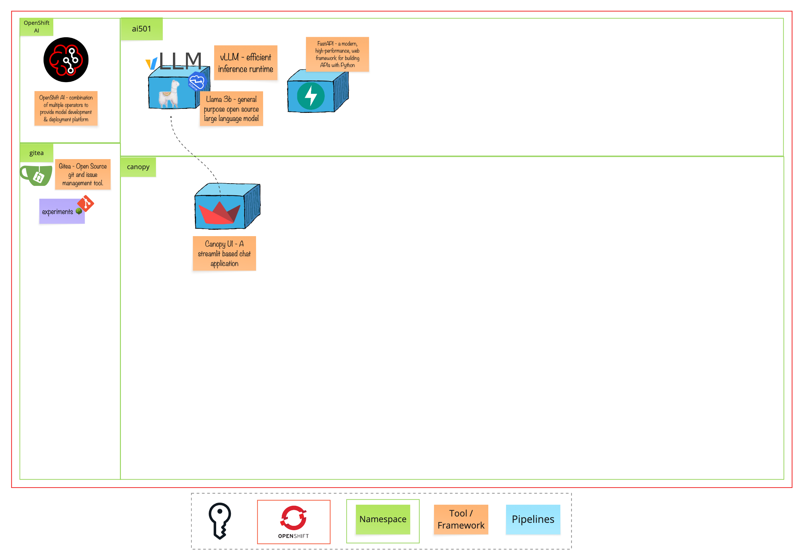

# Module 2 - Linguistics

> Prompting an AI is like giving instructions to a chef. If you just say ‘make food,’ you’ll get whatever. If you say ‘make a vegetarian pasta in under 15 minutes,’ you’re far more likely to get what you want 🍝

# 🧑‍🍳 Module Intro

This module bridges the gap between raw LLM capabilities and practical applications.

# 🖼️ Big Picture

# 🔮 Learning Outcomes

* Understand how system and user prompts shape LLM behavior and responses
* Learn prompt engineering techniques for educational use cases
* Practice deploying and configuring Canopy AI with custom prompts

# 🔨 Tools used in this module

* Prompt Playground - Interactive interface for experimenting with prompt engineering
* [MLflow](https://mlflow.org/) - Provides capabilities to debug, evaluate, monitor, and optimize AI applications
* OpenShift & Helm Charts - To deploy Canopy UI in a development environment

