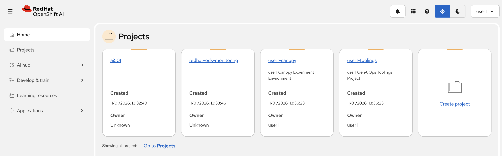
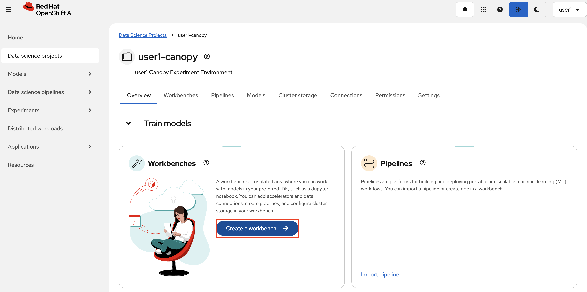
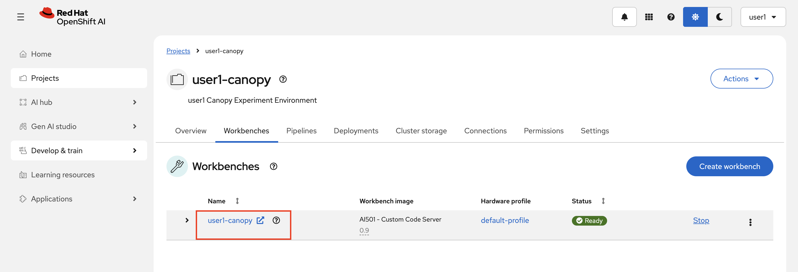
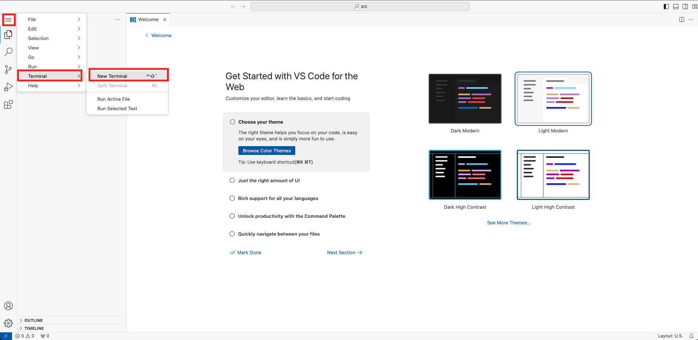
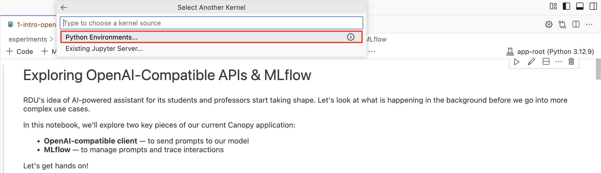
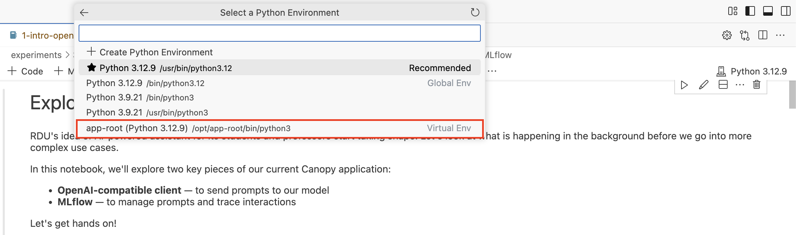

# 📘 Interacting with a Model via Workbench

Before we move forward, let's explore the main pieces that we are using in the Canopy application you just deployed:

   - **OpenAI-compatible client** — to send prompts to the model
   - **MLflow** — to manage prompts and trace interactions

In this section, we’ll launch a Workbench on Red Hat OpenShift AI to spin up a Code Server environment. This gives us a browser-based IDE where we can run Python notebooks and start interacting with the the model and MLflow programmatically.

You’ll use this environment to:

- Explore the OpenAI-compatible API
- Send test prompts directly from code
- Build a backend that connects to the model, fetches the prompt from the registry and handle requests from our frontend

By the end of this section, you'll have a better grasp of how to integrate a model into your own workflows and applications — and set the stage for more advanced use cases.

1. Login to [OpenShift AI](https://data-science-gateway.<CLUSTER_DOMAIN>/). Use the same credentials to log in.

   

2. Let's create a workbench!   

   Click on the `<USER_NAME>-canopy` project, then click `Create a Workbench`. OpenShift AI Dashboard is pretty intuitive, isn't it? :)
   
   

3. Name it as `<USER_NAME>-canopy` 🌳

    **Notebook Image:** 

    - Image selection: `AI501 - Custom Code Server` (at the end of the list😌)
  
    **Deployment size**
    - Hardware profile: `default-profile`

    **Environment variables**
    - No need to add one at the moment.

    **Cluster storage**
    - Leave it as max 20 GiB.

    **Connections**
    - Leave it as it is. We don't need any connection definition at the moment.

    And finally, hit `Create workbench`.

When it is in running state, open it by clicking its name and use your credentials to access it.

   

4. Open a new terminal by hitting the hamburger menu on top left then select `Terminal` > `New Terminal` from the menu.

   

5. Clone the Canopy experimentation repository that has some Notebooks, and let's learn more about Llama Stack!

   ```bash
   git clone https://<USER_NAME>:<PASSWORD>@gitea-gitea.<CLUSTER_DOMAIN>/<USER_NAME>/experiments.git
   ```

6. Open up the notebook called `3-ready-to-scale-101/1-intro-openai-mlflow.ipynb` and follow the instructions. When you run the first code cell, it will ask you to choose a kernel. Select the first option. That means it will run the code within this workbench locally.

   

   Then it will ask you to choose which Python environment to use. Go with the `Virtual Env` one.

   

   And now, feel free to experiment! Read and run the cells in the notebook! When you are done, come back here:)

You have now set up your wokspace for these exercises and demonstrated interacting with a model.

