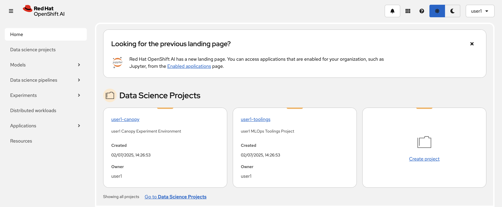

# 📘 Interacting with Llama Stack via Workbench

Now that we’ve deployed the Llama Stack and verified it’s up and running, it’s time to get hands-on.

In this section, we’ll launch a Workbench on Red Hat OpenShift AI to spin up a Code Server environment. This gives us a powerful, browser-based IDE where we can run Python notebooks and start interacting with the Llama Stack programmatically.

You’ll use this environment to:

- Explore Llama Stack’s API
- Send test prompts directly from code
- Build a backend to handle requests from our frontend

By the end of this section, you'll have a better grasp of how to integrate Llama Stack into your own workflows and applications — and set the stage for more advanced use cases.

1. Login to [OpenShift AI](https://rhods-dashboard-redhat-ods-applications.<CLUSTER_DOMAIN>/). You’ll see `<USER_NAME>-canopy` project also there. 

   

2. Let's create a workbench!   

   A workbench is your web-based development environment hosted inside OpenShift AI. Click on the `<USER_NAME>-canopy` project, then click `Create a Workbench`. OpenShift AI Dashboard is pretty intuitive, isn't it? :)
   
   

3. Select a name you want, could be something like `<USER_NAME>-canopy` 🌳

    **Notebook Image:** 

    - Image selection: `code-server`
    - Version selection: `2025.1`
  
    **Deployment size**
    - Container size: `Small`

    **Environment variables**
    - No need to add one at the moment.

    **Cluster storage**
    - Leave it as max 20 GiB.

    **Connections**
    - Leave it as it is. We don't need any connection definition at the moment.

    And finally, hit `Create workbench`.

When it is in running state, Open it and use your credentials to access it.

   

4. Open a new terminal by hitting the hamburger menu on top left then select `Terminal` > `New Terminal` from the menu.

   

5. Let's clone our Canopy repository that has some Notebooks in it and learn more about Llama Stack!

   ```bash
   git clone https://<USER_NAME>:<PASSWORD>@gitea-gitea.<CLUSTER_DOMAIN>/<USER_NAME>/canopy.git
   ```

6. Open up the notebook called `3-ready-to-scale-101/1-intro-llama-stack.ipynb` and follow the instructions. When you run the first code cell, it will ask you to choose a kernel. Select the first option. That means it will run the code in this workbench locally.

   

   Then it will ask you to choose which python environment to use and go with the `Recommended` one.

   

   And now, feel free to experiment!

   


Now that we understand why a backend is necessary to communicate with the Llama Stack, let’s implement those changes and introduce a backend into the architecture.

