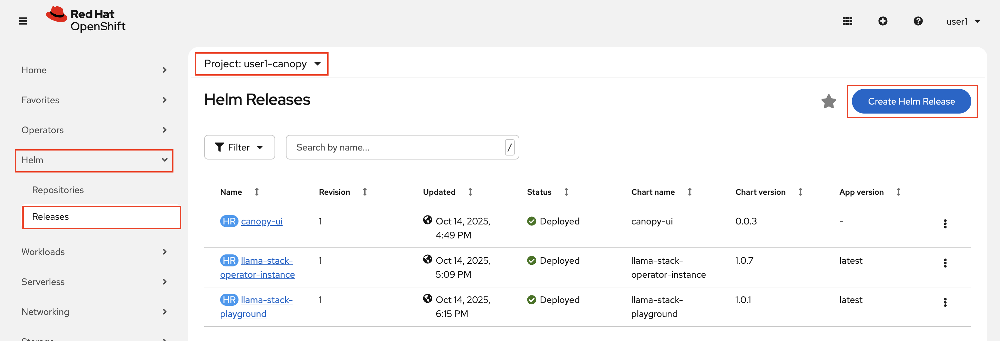
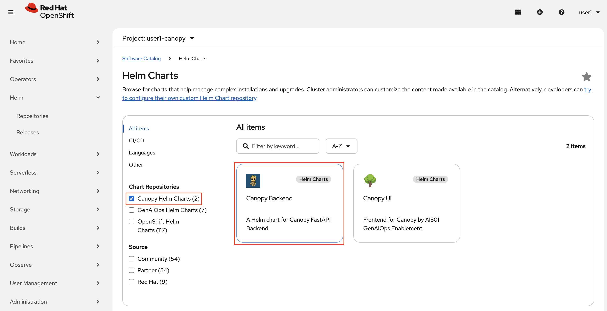
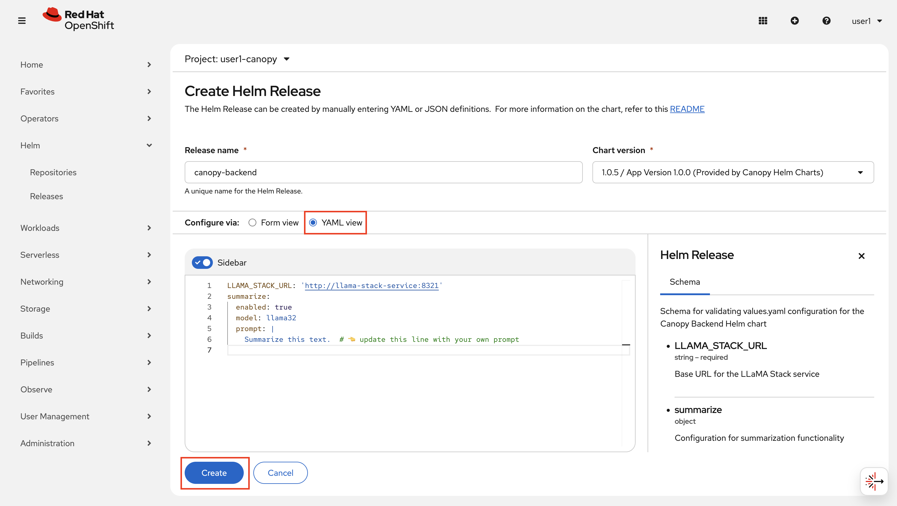
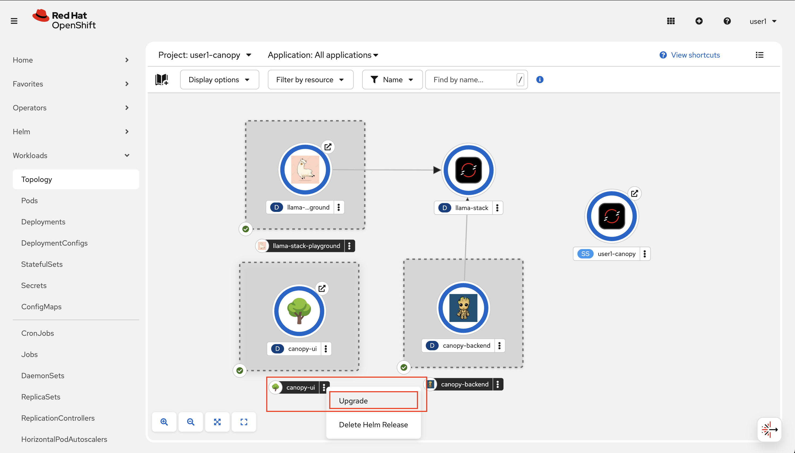
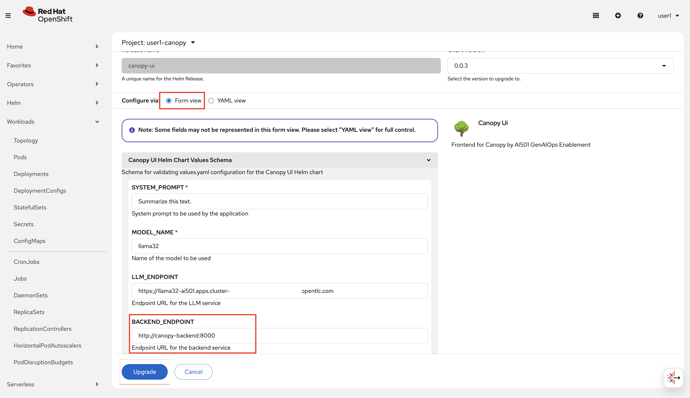
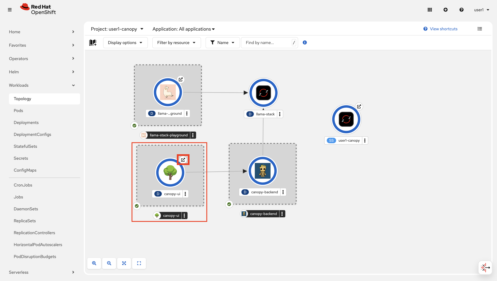
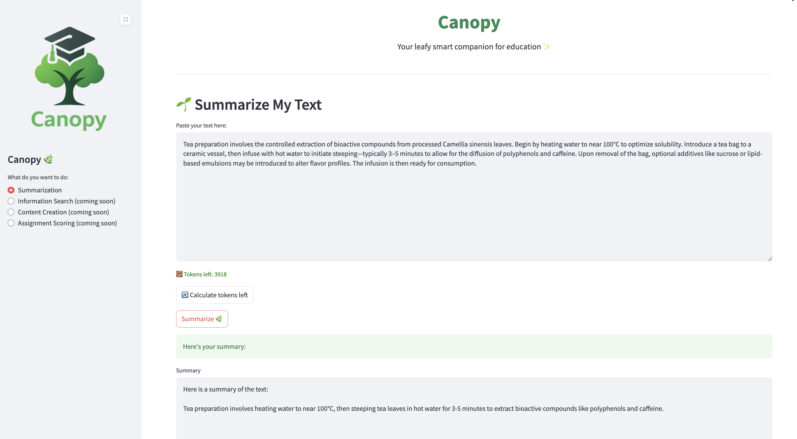

# Canopy Backend

We'll separate out the LLM business logic from the frontend into its own backend so that we can iterate on them independently.

1. We'll deploy the backend to our development environment the same way we deployed the other components. Go back to OpenShift Console > `Helm` > `Releases` in `<USER_NAME>-canopy project`.
   
   

2.  Under `Chart Repositories` select  `Canopy Helm Charts` and cclick `Canopy Backend` > `Create`.

    

3. Open up the `YAML view` to update the variables.

    As we discussed, backend will be the one talking to Llama Stack, therefore we need to make sure we provide the correct Llama Stack connection details:

    We also need to provide your chosen System Prompt. Because as we did on the Notebooks, we need to include the prompt while calling Llama Stack endpoint.

    Copy the below YAML snippet, add your own system prompt, and mind the indentation please 🙏

    ```yaml
    LLAMA_STACK_URL: 'http://llama-stack-service:8321'
    summarize:
      enabled: true
      model: llama32
      prompt: |               
        Summarize this text.  # 👈 update this line with your own prompt
    ```

    
 
    ..leave the rest default and hit `Create`.

4. Verify that it is running on the OpenShift Console.
   
   


## Update Canopy Frontend

1. Now it is time to make Canopy UI to talk with backend, instead of directly sending requests to LLM. In order to do that, we need to update some values in our helm chart. In the `Workloads` >  `Topology` view, find `canopy-ui` and click the three dots underneath > `Upgrade`

    

3. In the values, add the below backend endpoint value for `BACKEND_ENDPOINT`.
   
    ```bash
    http://canopy-backend:8000
    ```

    


4. For the image, point to a newer version:
   
   - tag: `0.3`
  
  ..and hit `Upgrade`!

    

5. Verify that Canopy UI still works as expected by clicking the little arrow and accesing the UI:
   
    

6. Ask it to summarize a text again!

    ```
    Tea preparation involves the controlled extraction of bioactive compounds from processed Camellia sinensis leaves. Begin by heating water to near 100°C to optimize solubility. Introduce a tea bag to a ceramic vessel, then infuse with hot water to initiate steeping—typically 3–5 minutes to allow for the diffusion of polyphenols and caffeine. Upon removal of the bag, optional additives like sucrose or lipid-based emulsions may be introduced to alter flavor profiles. The infusion is then ready for consumption.
    ```
   
   

Now that we're happy with the first iteration of our Canopy assistant, it’s time to put it in the hands of real users. To do that, we need to deploy everything we've built so far into a test—and eventually a production—environment. But this time, we’ll do it in a more robust, consistent, and repeatable way. That’s why we’re stepping into the world of: GitOps.