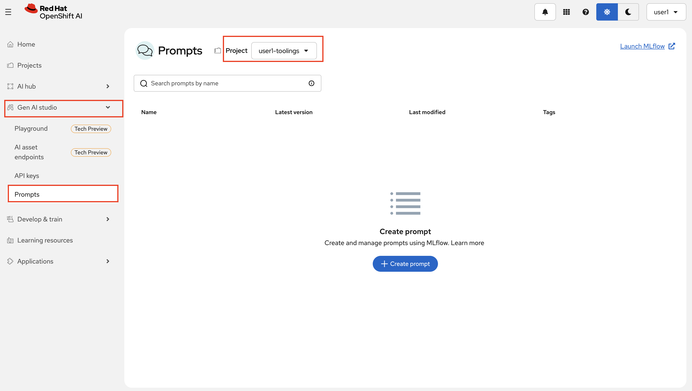
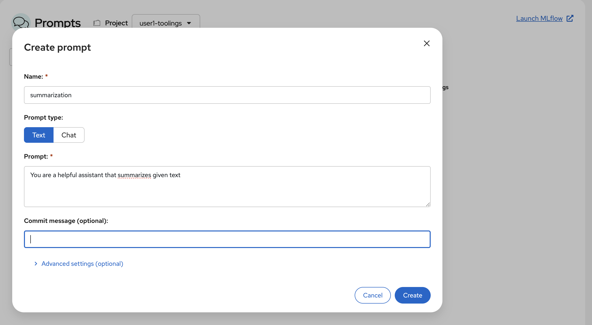
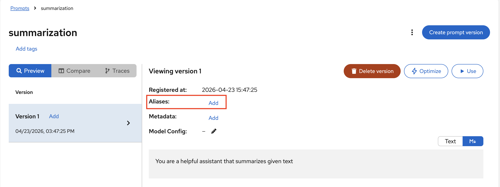
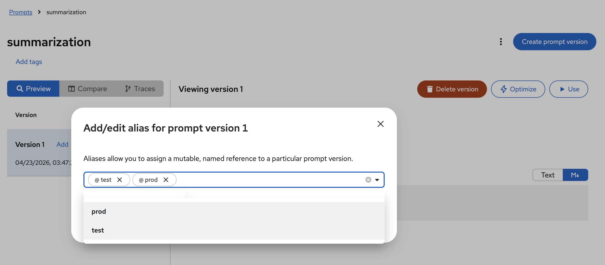
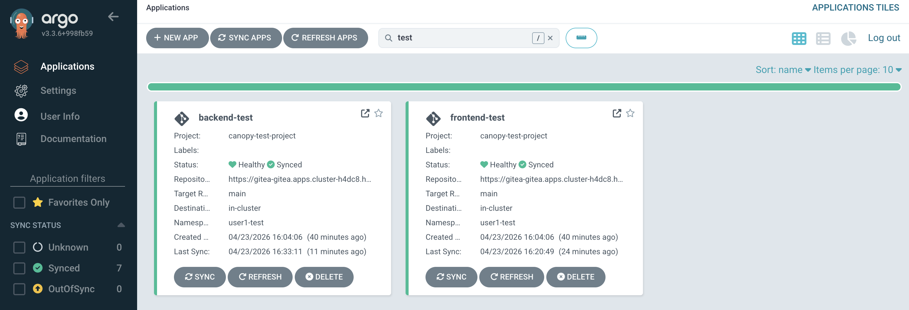
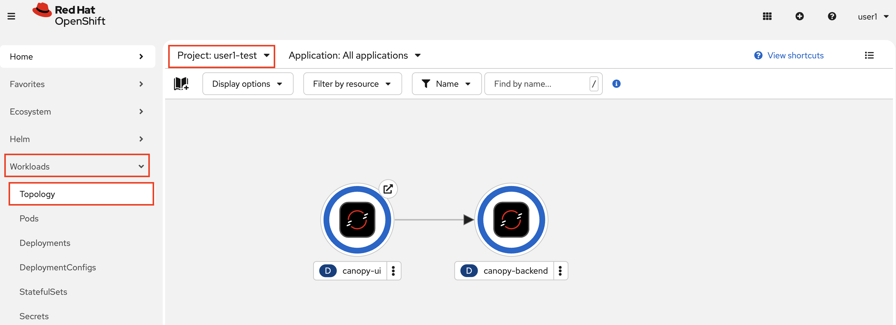
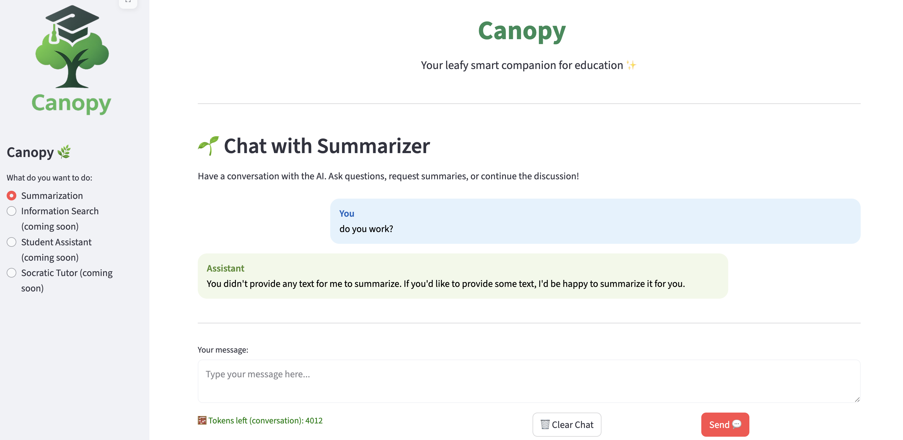

## Deploy Canopy Test & Prod

We deployed our `canopy` in experiment environment manually, but for the higher environments we need to store the definitions in Git and deploy our applications via Argo CD to get all the benefits that GitOps brings. 

But there are two things we need to do first. One is having a seperate space for production-ready prompts (the system prompts we want to "promote" to production). And secondly, we need to set up our GitOps repository to handle the GenAI application logic for test and production environments.

Let's start with the prompts.

1. Go back to OpenShift AI dashboard, go to `Gen AI studio` > `Prompts` from the left menu. This time select **`<USER_NAME>-toolings`** as the project. `<USER_NAME>-toolings` becomes this central area where we keep tools we need on the way to production!

  

2. Click `Create prompt` and call it the same name you used before; ie `summarization`. And paste the System Prompt you want to take into test environment. 

  Alternatively you can add a nice commit message there too, and hit `Create`. 

  


  We know that because this is the first version (Version 1) of your prompt, it automatically gets `latest` tag. But we are not going to use a floating tag. Let's give it a tag `test` and `prod` for the sake of example. Click `Add` button next to `Alieases` and write `test` and `prod` there. 

  

  

  Now on to the GitOps part. Head to your workbench!

### Set Up Canopy with Argo CD

1. Just like we did with our toolings, we need to generate `ApplicationSet` definition for our model deployment. We will have two separated `ApplicationSet` definition; one is for `test` and one is for `prod` environment. For the enablement simplicity reasons, we keep them in the same repository. However in the real life, you may also like to take prod definitions into another repository where you only make changes via Pull Requests with a protected `main` branch. We keep `ApplicationSet` definition separate so that it'll be easy to take the prod definition into another place later on :)

    Let's update the `ApplicationSet` definition with `CLUSTER_DOMAIN` and `USER_NAME` definition just like before. Open up the `genaiops-gitops/appset-test.yaml` and `genaiops-gitops/appset-prod.yaml` files and replace the values. For the lazy ones we also have the commands:

  ```bash
    sed -i -e 's/CLUSTER_DOMAIN/<CLUSTER_DOMAIN>/g' /opt/app-root/src/genaiops-gitops/appset-test.yaml
    sed -i -e 's/USER_NAME/<USER_NAME>/g' /opt/app-root/src/genaiops-gitops/appset-test.yaml
    sed -i -e 's/CLUSTER_DOMAIN/<CLUSTER_DOMAIN>/g' /opt/app-root/src/genaiops-gitops/appset-prod.yaml
    sed -i -e 's/USER_NAME/<USER_NAME>/g' /opt/app-root/src/genaiops-gitops/appset-prod.yaml
  ```

2. Let's add `frontend` definition. We created two files since we have two different environments; `test` and `prod`. So we have two files to update. Under `genaiops-gitops`, update both `canopy/test/frontend/config.yaml` and `canopy/prod/frontend/config.yaml` files as follow. 

    This will take UI deployment helm-chart and apply the additional configuration such as image version. Basically all the things we did manually in the experimentation environment.

    ```yaml
    repo_url: https://github.com/rhoai-genaiops/frontend.git
    chart_path: chart
    BACKEND_ENDPOINT: "http://canopy-backend:8000"
    image:
      name: "canopy-ui"
      tag: "0.7"
    ```
3. For `backend`, paste the below yaml to test and prod `config.yaml` files. Mind that they are pointing to different alieses, although for now they are the same. As we iterate over prompts, we'll see this is going to change.

    ```yaml
    repo_url: https://gitea-gitea.<CLUSTER_DOMAIN>/<USER_NAME>/backend
    chart_path: chart
    summarize:
      enabled: true
      model: llama32
      endpoint: "http://llama-32-predictor.ai501.svc.cluster.local:80/v1"
      mlflow_prompt: summarization
      mlflow_prompt_version: test # 👈 what we wrote as alias
    ```

    PROD (`genaiops-gitops/canopy/prod/backend/config.yaml`):

    ```yaml
    repo_url: https://gitea-gitea.<CLUSTER_DOMAIN>/<USER_NAME>/backend
    chart_path: chart
    summarize:
      enabled: true
      model: llama32
      endpoint: "http://llama-32-predictor.ai501.svc.cluster.local:80/v1"
      mlflow_prompt: summarization
      mlflow_prompt_version: prod # 👈 what we wrote as alias
    ```

<!-- 4. Lastly, let's setup Llama Stack to deploy via Argo CD. We just need Llama Stack Server here, Playground is something we only use in the experimentation phase. Update **both** `test/llama-stack/config.yaml` and `prod/llama-stack/config.yaml` as below:

    ```yaml
    chart_path: charts/llama-stack-operator-instance
    models:
      - name: "llama32"
        url: "http://llama-32-predictor.ai501.svc.cluster.local:8080/v1"
    ```  -->

  <!-- For now, we are happy with the default Llama Stack values. We will get some exciting updates as we continue to the other chapters :) -->

5. Let's get all of these deployed! Of course - they are not real unless they are in git!

    ```bash
    cd /opt/app-root/src/genaiops-gitops
    git add .
    git commit -m  "🌳 ADD - ApplicationSets and Canopy components to deploy 🌳"
    git push 
    ```

6. With all the application values stored in Git, let's tell Argo CD to start picking up changes to these environments. To do this, simply we need to create ApplicationSets:

    ```bash
    oc apply -f /opt/app-root/src/genaiops-gitops/appset-test.yaml -n <USER_NAME>-toolings
    oc apply -f /opt/app-root/src/genaiops-gitops/appset-prod.yaml -n <USER_NAME>-toolings
    ```

7. You should see the canopy application, if filter in the search as `test` or `prod`. 

    

8. You can also go to OpenShift Console, check `<USER_NAME>-test` namespace to see if Canopy is deployed.

    

9. Now that you have Canopy deployed in the `test` environment, open up [the Canopy UI](https://canopy-ui-<USER_NAME>-test.<CLUSTER_DOMAIN>/) and send a prompt to make sure it works! :D

    