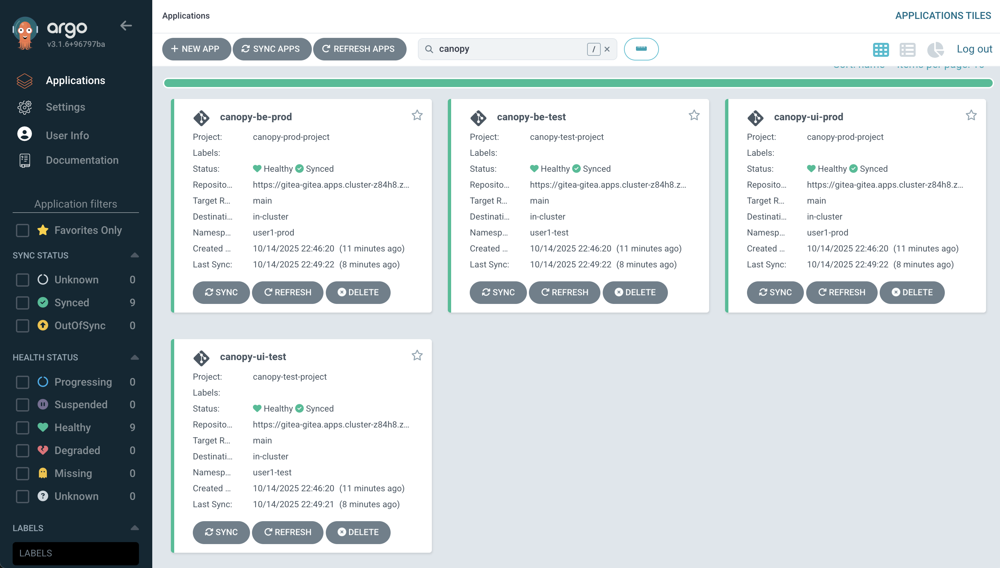
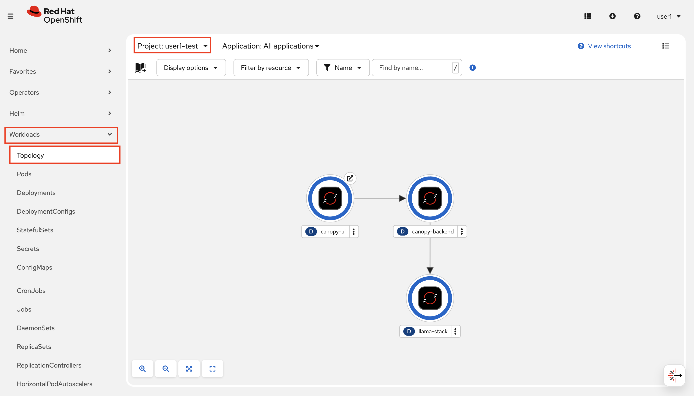

## Deploy Canopy Test & Prod

We deployed our `canopy` in experiment environment manually, but for the higher environments we need to store the definitions in Git and deploy our applications via Argo CD to get all the benefits that GitOps brings. 

But first, we need to set up our backend repository to handle the GenAI application logic for test and production environments.

1. Clone the backend repository to your workbench.

  ```bash
    cd /opt/app-root/src
    git clone https://<USER_NAME>:<PASSWORD>@gitea-gitea.<CLUSTER_DOMAIN>/<USER_NAME>/canopy-be.git
  ```
2. We will store the prompts under `chart/values-test.yaml` and `chart/values-prod.yaml`. This will give us the traceability of prompt changes. Copy the below info to both files under the `LLAMA_STACK_URL` and make sure to bring your new favourite prompt to summarize the topics along with the settings you find the best in Llama Stack Playground:

  ```yaml
  
  summarize:
    enabled: true
    model: llama32
    temperature: 0.9
    max_tokens: 4096
    prompt: |
      <Insert your prompt here>
      <And make sure you have the correct indentation 😌>
  ```

1. And let's push the changes to Git:

    ```bash
    cd /opt/app-root/src/canopy-be
    git add .
    git commit -m  "🎒 ADD - test & prod prompts 🎒 "
    git push
    ```

Now let's deploy backend using ArgoCD!

### Set Up Canopy with Argo CD

1. Just like we did with our toolings, we need to generate `ApplicationSet` definition for our model deployment. We will have two separated `ApplicationSet` definition; one is for `test` and one is for `prod` environment. For the enablement simplicity reasons, we keep them in the same repository. However in the real life, you may also like to take prod definitions into another repository where you only make changes via Pull Requests with a protected `main` branch. We keep `ApplicationSet` definition separate so that it'll be easy to take the prod definition into another place later on :)

    Let's update the `ApplicationSet` definition with `CLUSTER_DOMAIN` and `USER_NAME` definition just like before. Open up the `genaiops-gitops/appset-test.yaml` and `genaiops-gitops/appset-prod.yaml` files and replace the values. For the lazy ones we also have the commands:

  ```bash
    sed -i -e 's/CLUSTER_DOMAIN/<CLUSTER_DOMAIN>/g' /opt/app-root/src/genaiops-gitops/appset-test.yaml
    sed -i -e 's/USER_NAME/<USER_NAME>/g' /opt/app-root/src/genaiops-gitops/appset-test.yaml
    sed -i -e 's/CLUSTER_DOMAIN/<CLUSTER_DOMAIN>/g' /opt/app-root/src/genaiops-gitops/appset-prod.yaml
    sed -i -e 's/USER_NAME/<USER_NAME>/g' /opt/app-root/src/genaiops-gitops/appset-prod.yaml
  ```

2. Let's add `canopy-ui` definition. We created two files since we have two different environments; `test` and `prod`. So we have two files to update. Under `genaiops-gitops`, update both `canopy/test/canopy-ui/config.yaml` and `canopy/prod/canopy-ui/config.yaml` files as follow. 

    This will take UI deployment helm-chart and apply the additional configuration such as image version. Basically all the things we did manually in the experimentation environment.

    ```yaml
    repo_url: https://github.com/rhoai-genaiops/canopy-ui.git
    chart_path: chart
    BACKEND_ENDPOINT: "http://canopy-backend:8000"
    image:
      name: "canopy-ui"
      tag: "0.3"
    ```
3. `canopy-be` will have a different `config.yaml` as it has two different values files.

    TEST (`genaiops-gitops/canopy/test/canopy-be/config.yaml`):

    ```yaml
    repo_url: https://gitea-gitea.<CLUSTER_DOMAIN>/<USER_NAME>/canopy-be
    chart_path: chart
    values_file: values-test.yaml # ‼️‼️ this is different for PROD
    ```

    PROD (`genaiops-gitops/canopy/prod/canopy-be/config.yaml`):

    ```yaml
    repo_url: https://gitea-gitea.<CLUSTER_DOMAIN>/<USER_NAME>/canopy-be
    chart_path: chart
    values_file: values-prod.yaml # ‼️‼️
    ```

4. Lastly, let's setup Llama Stack to deploy via Argo CD. We just need Llama Stack Server here, Playground is something we only use in the experimentation phase. Update both `test/llama-stack/config.yaml` and `prod/llama-stack/config.yaml` as below:

    ```yaml
    chart_path: charts/llama-stack-operator-instance
    ```

  For now, we are happy with the default Llama Stack values. We will get some exciting updates as we continue to the other chapters :)

5. Let's get all of these deployed! Of course - they are not real unless they are in git!

    ```bash
    cd /opt/app-root/src/genaiops-gitops
    git add .
    git commit -m  "🌳 ADD - ApplicationSets and Canopy components to deploy 🌳"
    git push 
    ```

6. With all the application values stored in Git, let's tell Argo CD to start picking up changes to these environments. To do this, simply we need to create ApplicationSets:

    ```bash
    oc apply -f /opt/app-root/src/genaiops-gitops/appset-test.yaml -n <USER_NAME>-toolings
    oc apply -f /opt/app-root/src/genaiops-gitops/appset-prod.yaml -n <USER_NAME>-toolings
    ```

7. You should see the two canopy applications, one for `test` and one for `prod` each deployed in Argo CD. 

    

8. You can also go to OpenShift Console, check `<USER_NAME>-test` namespace to see if Canopy is deployed.

    

