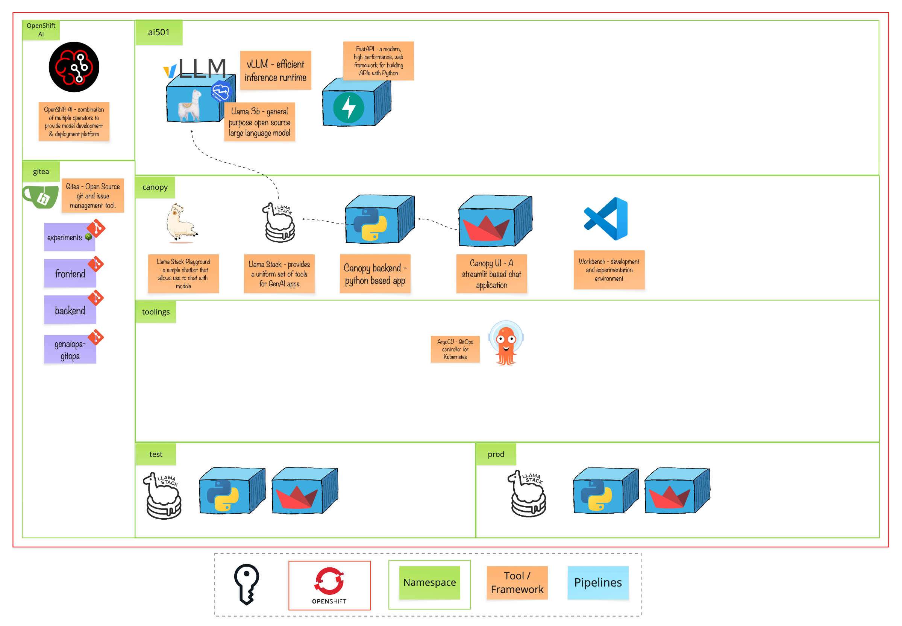

# Module 3 - Ready to Scale 101

> Get your AI assistant production-ready by introducing scalable architecture, MLflow, and GitOps practices.

# 🧑‍🍳 Module Intro

This module dives deeper into how Canopy interacts with the model using the OpenAI-compatible API and introduces MLflow for prompt management. Alongside this, we bring in a backend component and GitOps practices to ensure everything we build is reliable, repeatable, and ready for real users.

# 🖼️ Big Picture

# 🔮 Learning Outcomes
* Understand how to interact with a model using the OpenAI-compatible API
* Use MLflow to manage prompts and trace model interactions
* Add a backend component to enable structured interaction with the LLM
* Deploy the full system to test and production environments using GitOps for consistency and scalability

# 🔨 Tools used in this module
* [OpenAI Python SDK](https://github.com/openai/openai-python) - A standard client for interacting with OpenAI-compatible model endpoints
* [MLflow](https://mlflow.org/) - Provides capabilities to debug, evaluate, monitor, and optimize AI applications
* [Helm](https://helm.sh/) - Helps us to define, install, and upgrade Kubernetes applications.
* [Argo CD](https://argoproj.github.io/cd/) - A controller which continuously monitors applications and compare the current state against the desired state.