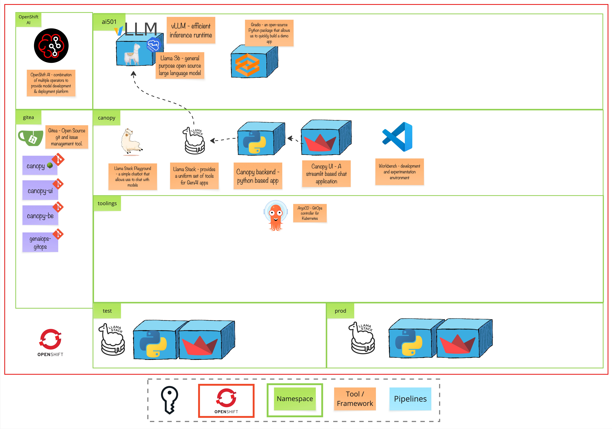

# Module 3 - Ready to Scale 101

> Get your AI assistant production-ready by introducing scalable architecture, Llama Stack, and GitOps practices.

# 🧑‍🍳 Module Intro

 This module introduces Llama Stack to establish a consistent, extensible interface for integrating new capabilities into our application. Alongside this, we bring in a backend component and GitOps practices to ensure everything we build is reliable, repeatable, and ready for real users.

# 🖼️ Big Picture

# 🔮 Learning Outcomes
* Understand the motivation behind adopting Llama Stack
* Learn how Llama Stack works and how to deploy it in a development environment
* Add a backend component to enable structured interaction with the LLM
* Deploy the full system to test and production environments using GitOps for consistency and scalability

# 🔨 Tools used in this module
* [Llama Stack](https://llama-stack.readthedocs.io/en/latest/) - An open-source framework for building generative AI applications
* [Llama Stack Playground](https://llama-stack.readthedocs.io/en/latest/playground/index.html) - A simple interface to showcase capabilities and concepts of Llama Stack in an interactive environment
* [Helm](https://helm.sh/) - Helps us to define, install, and upgrade Kubernetes applications.
* [Argo CD](https://argoproj.github.io/cd/) - A controller which continuously monitors applications and compare the current state against the desired state.