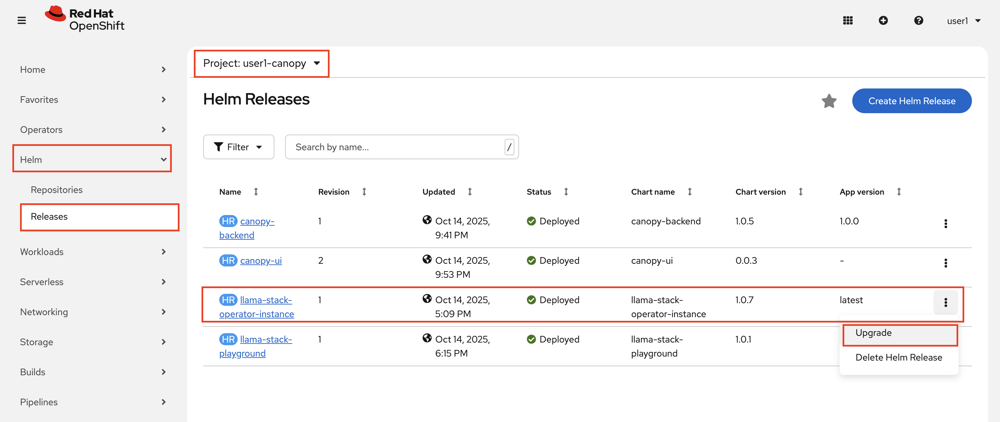
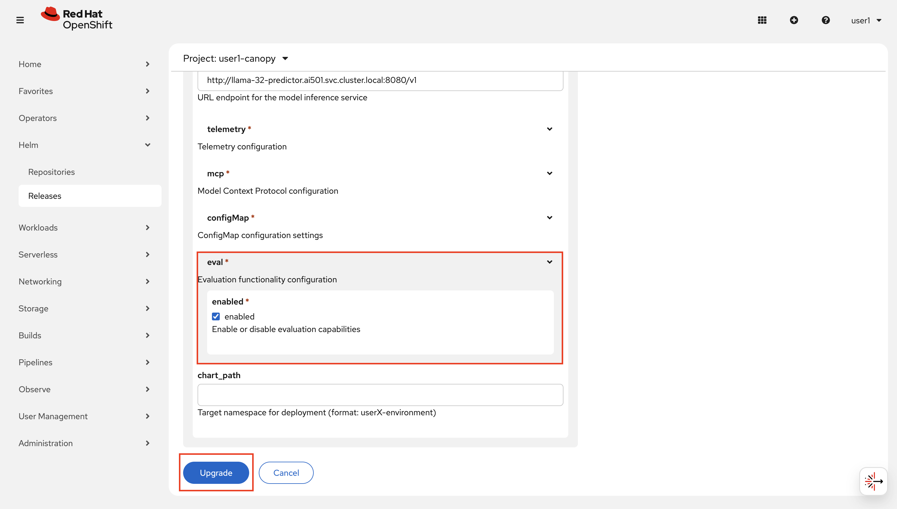
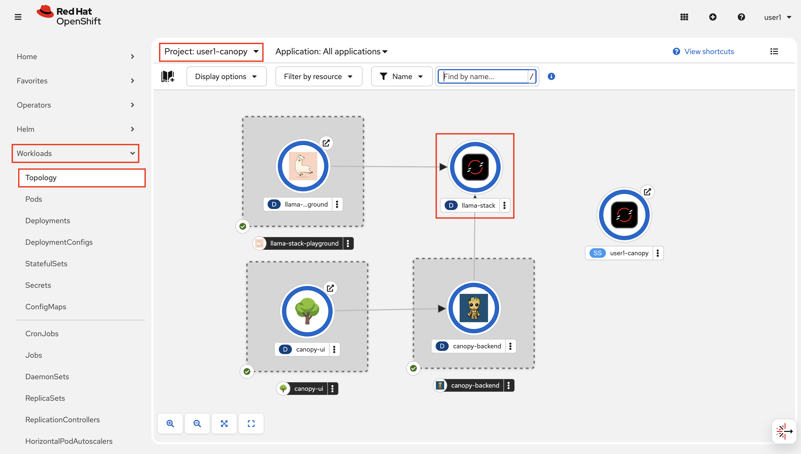

# Evaluating GenAI Applications

Now that we have a backend in production that we have manually tested works OK, we want to make sure that any changes we do to it work at least as well.  

To do this, we will set up automatic evaluations that trigger at different times 💫  

But, before we can set up any automatic evaluations, we need to understand how they work.

## How to evaluate a GenAI application?

There are a few components we can evaluate in our GenAI application:
1. **The LLM** - this would be to evaluate how competent our model is, without any bells and whistels. Great to do before you decide what model to use or upgrade to a new model.
2. **The application backend** - our backend is what implements the LLM logic. This could be simple things such as adding a system prompt (like we have done) to more complex workflows like fetching data to send to the LLM. We want to test our backend anytime our prompts, the backend code itself, or any of the workflow components change.
3. **The workflow components** - rather than just testing them through the backend as a blackbox, we also want to test these components individually to make sure that each component does as it should.

In this section, we will primarily focus on evaluating the application backend, as we have already chosen an LLM and don't have any additional components that are used from the backend.  

You will see examples of the other tests in later sections.

## Evaluating with Llama Stack

We will be using Llama Stack to evaluate our backend on how well it responds to our inputs.  
Llama Stack has three different endpoints for evaluating models:
1. **Eval** - This evaluates an LLM answer (called `generated_answer`) based on the expected answer (called `expected_answer`)
2. **Dataset** - This gives us easy access to use datasets, in this case datasets containing tests
3. **Benchmarks** - Benchmarks tie Eval and Datasets together to automatically run the dataset through the LLM and then evaluate the answers. We will be skipping these for now as we want greater control.

To be able to evaluate with Llama Stack we first need to enable it in our experiment environment.  

1. In OpenShift console, go to Helm Releases and click `Upgrade` for Llama Stack Operator Instance.

    

2. Check the box to enable evals in the values ✅ and `Upgrade`!
   
    

3. After Llama Stack server is restarted (aka the circle is blue 🔵), go to your IDE and run through the notebook `canopy/4-ready-to-scale-101/llamastack-eval-test.ipynb`.

    

    When you are done, come back here to continue with the instructions.

## Speed tests with GuideLLM

We will be using GuideLLM to test how responsive our backend is. 
This involves things such as:
- How fast it starts responding (Time To First Token)
- How fast it produces tokens (Time Per Output Token)
- How many requests the system can handle at the same time without slowing down (Throughput)

This is important to test both for your model based on the hardware you use, but also on the backend system as a whole, as when we keep adding more complex functionality it will slow down how fast the model can responde, sometimes causing it to be an unviable option for our usecase.

To try it out, head over to your workbench again and go through the notebook `canopy/4-ready-to-scale-201/2-guidellm-test.ipynb`