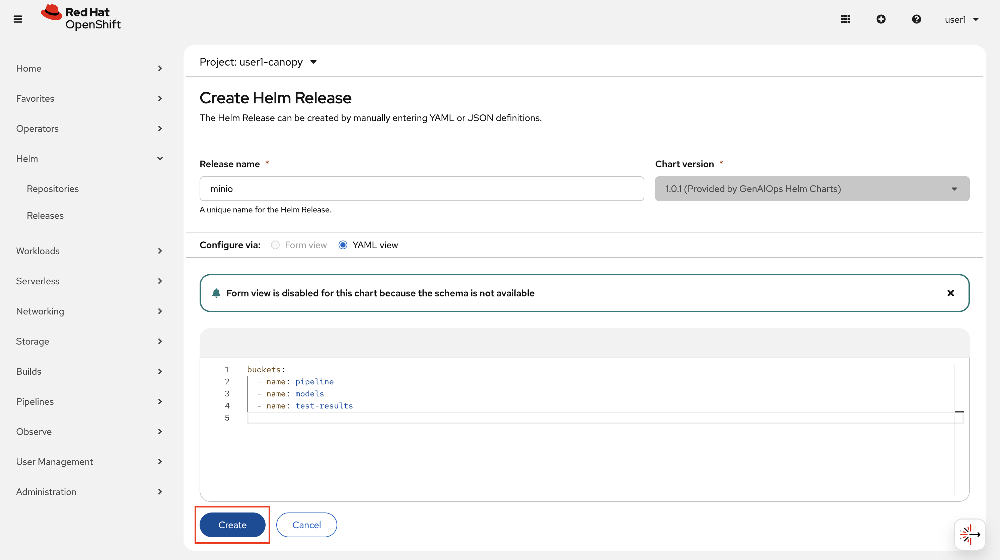
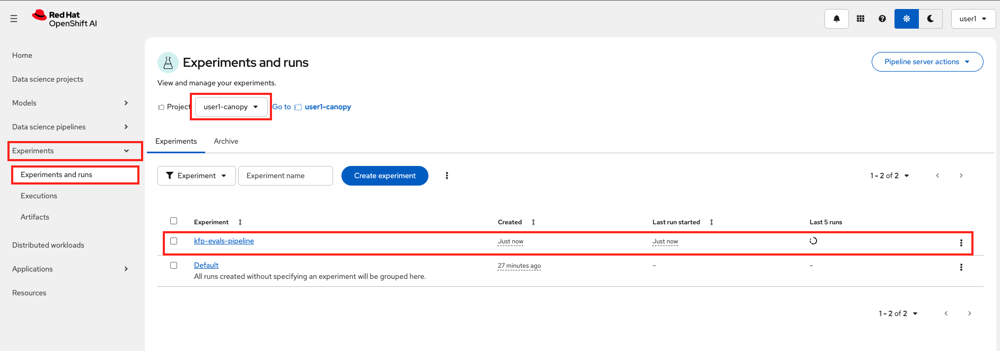

# Eval automation with pipelines

Now that we know how the evaluation works, let's automate it by using pipelines! 🎢  

## The Kubeflow pipeline

We will be using Kubeflow Pipelines as our pipeline framework of choise for running the evaluation.  
Kubeflow pipelines are handy for data science/AI engineering tasks as it is Python based and works nicely with OpenShift AI by displaying the pipeline run inside the OpenShift AI dashboard.


### Set up the environment for Kubeflow Pipelines

As always we'll start in the experimentation environment and develop this automation there. But before we can use Kubeflow Pipelines, we need to install a Data Science Pipeline Server and MinIO as lightweight storage option to store pipeline artifacts in our Canopy environment. Yet again, we will use Helm charts for them.

1. Go to the OpenShift Console > Helm > Releases > Create Helm Release.

    

2. Select `GenAIOps Helm Charts` from the repository lists and select `Minio`. 

    

3. After you click `Create`, keep the values the same and click `Create` again.

    

4. Now do the same for the helmchart `Dspa`

    

5. Just hit create and wait for the pipeline server to be ready!

    

6. Everything is blue, you are good to continue!
    

### Set up evaluation pipeline

Now that we have everything set up to be able to run our pipeline in our experimentation namespace, let's take a look at the code and run it!  
The evaluation pipeline is inside of a repository called `canopy-evals`, where both the evaluation tests and pipeline definition are stored together. 

1. To explore it, go back to your workbench and clone the repository :

   ```bash
   cd /opt/app-root/src/
   git clone https://<USER_NAME>:<PASSWORD>@gitea-gitea.<CLUSTER_DOMAIN>/<USER_NAME>/canopy-evals.git
   ```

2. Inside, you will find a few folders, one called `evals-pipeline` and one for each usecase that we are going to want to run evaluations on - `Summary` is the only one relevant for us for now, the rest are slight spoilers for the upcoming modules 🤫  

    Open up `Summary/summary_tests.yaml` to see what tests we will run. Make sure to add some of your own examples as well ✍️

    

    For example:

    ```yaml
      - prompt: "Artificial intelligence and machine learning have revolutionized numerous industries in recent years. From healthcare diagnostics that can detect diseases earlier than human doctors, to autonomous vehicles that promise safer transportation, to recommendation systems that personalize our digital experiences, AI technologies are becoming increasingly sophisticated. However, these advances also bring challenges including ethical concerns about bias in algorithms, job displacement due to automation, and the need for robust data privacy protections."
        expected_result: "AI and ML have transformed industries through healthcare diagnostics, autonomous vehicles, and recommendation systems, but also raise concerns about bias, job displacement, and privacy."
    ```


3. Let's commit your evals as well!
   
    ```bash
    cd /opt/app-root/src/canopy-evals
    git add .
    git commit -m  "🌼 New evals added 🌼"
    git push 
    ```

4. The code for the kubeflow pipeline that is running these evaluations is inside of `evals-pipeline/kfp_pipeline.py`, go ahead and open it up and take a look. It may look large, but most of it is HTML to create a nice looking output. You will recognize these lines: 

    <div class="highlight" style="background: #f7f7f7">
    <pre><code class="language-python">
    scoring_response = lls_client.scoring.score(
        input_rows=eval_rows, scoring_functions=scoring_params
    )
    </code></pre>
    </div>

5. Scroll down to near the bottom of the file (around line 830) and edit the `repo_url` argument as below:
    ```python
    arguments = {
        "repo_url": "https://<USER_NAME>:<PASSWORD>@gitea-gitea.<CLUSTER_DOMAIN>/<USER_NAME>/canopy-evals.git", # 🚨 replace with your own repo URL
        "branch": "main",
        "base_url": "http://llama-stack-service:8321",
        "backend_url": "http://canopy-backend:8000",
        "secret_name": "test-results",
        "git_hash": "test",
    }
    ```
    These arguments instruct your pipeline how to run.


6. Let's push the change:

    ```bash
    cd /opt/app-root/src/canopy-evals
    git add .
    git commit -m  "🧑‍⚖️ Update evals pipeline 🧑‍⚖️"
    git push origin main
    ```

7. Now we can run the pipeline! 🙌  

    Just execute this in your terminal:

    ```bash
    cd /opt/app-root/src/canopy-evals
    pip install kfp==2.14.6
    pip install kfp-kubernetes==2.14.6
    python evals-pipeline/kfp_pipeline.py
    ```
    You should see an output like this:

    

    And now navigate to the OpenShift AI dashboard -> Experiments -> Experiments and Runs -> kfp-training-pipeline -> canopy-testing-pipeline  

    

8.  After it has finished runnig you can go to this URL to see your results:  
    ```bash
    https://minio-ui-<USER_NAME>-canopy.<CLUSTER_DOMAIN>/browser/test-results
    ```

    

    Congratulations on running your first evaluation pipeline! 🎉


In the next section, we will see how to automatically trigger this pipeline on git changes.