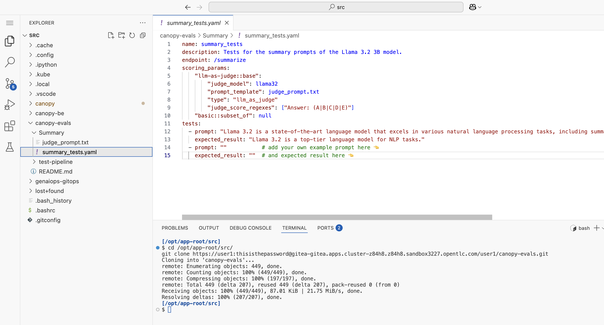

# Eval automation with pipelines

Now that we know how the evaluation works, let's automate it by using pipelines! 🎢  

## The Kubeflow pipeline

We will be using Kubeflow Pipelines as our pipeline framework of choise for running the evaluation.  
Kubeflow pipelines are handy for data science/AI engineering tasks as it is Python based and works nicely with OpenShift AI by displaying the pipeline run inside the OpenShift AI dashboard.

The evaluation pipeline is inside of a repo called `canopy-evals`, where both the evaluation tests and pipelines are stored together. 

### Set up the environment for Kubeflow Pipelines

install DSPA and MinIO helm charts in Canopy

### Set up evaluation pipeline

1. To explore it, start by going into your `<USER_NAME>-canopy` Data Science Project and open up your workbench.

2. Then, clone the repository 
   ```bash
   cd /opt/app-root/src/
   git clone https://<USER_NAME>:<PASSWORD>@<GIT_SERVER>/<USER_NAME>/canopy-evals.git
   ```
3. Inside, you will find a few folders, one called `test_pipeline` and one for each usecase that we are going to want to run evaluations on - `Summary` is the only one relevant for us for now, the rest are slight spoilers for the upcoming modules 🤫  
Open up `Summary` and then `summary_tests.yaml` to see what tests we will run. Make sure to add some of your own examples as well ✍️

    

4. Let's commit your evals as well!
   
    ```bash
    cd /opt/app-root/src/canopy-evals
    git add .
    git commit -m  "🌼 New evals added 🌼"
    git push 
    ```

5. The code for the kubeflow pipeline that is running these evaluations is inside of `test_pipeline/kfp_pipeline.py`, go ahead and open it up and take a look. It may look large, but most of it is html to create a nice looking output. You will recognize these lines: 

    <div class="highlight" style="background: #f7f7f7">
    <pre><code class="language- bash">
    scoring_response = lls_client.scoring.score(
        input_rows=eval_rows, scoring_functions=scoring_params
    )
    </code></pre>
    </div>

6. Scroll down to near the bottom of the file (around line 830) and edit the arguments to this:
    ```python
    arguments = {
        "repo_url": "https://<USER_NAME>:<PASSWORD>@<GIT_SERVER>/<USER_NAME>/canopy-evals.git", # 🚨 replace with your own repo URL
        "branch": "main",
        "base_url": "http://llama-stack-service:8321",
        "backend_url": "http://canopy-backend:8000",
        "secret_name": "test-results",
        "git_hash": "test",
    }
    ```
    These arguments instruct your pipeline how to run.


7. Now we can run the pipeline! 🙌  
    Just execute this in your terminal:
    ```bash
    cd /opt/app-root/src/canopy-evals
    python test_pipeline/kfp_pipeline.py
    ```
    **#TODO:** Create a custom image with kfp and kfp-kubernetes in it.  
    After you have started, navigate to the OpenShift AI dashboard -> Experiments -> Experiments and Runs -> kfp-training-pipeline -> canopy-testing-pipeline  

    
82. After it has finished runnig you can go to this URL to see your results:  
    ```bash
    https://minio-ui-<USER_NAME>-canopy.<CLUSTER_DOMAIN>.opentlc.com/browser/test-results
    ```

    

    Congratulations on running your first evaluation pipeline! 🎉


In the next section, we will see how to automatically trigger this pipeline on git changes.