# Automatically trigger on git changes

Now that we have successfully ran our evaluation pipeline (🎉), we would like it to run automatically everytime we make a change to our evaluation tests, prompts, or backend.  
To do this, we can create a Tekton pipeline with a git hook to the relevant endpoints. This Tekton pipeline will then trigger our evaluation kubeflow pipeline (that we just ran manually).

## Install Pipeline Server

We also need to set up our pipeline server for our `toolings` namespace, but this time we will do it with ArgoCD.

1. Like before, open your workbench in the `<USER_NAME>-canopy` namespace.

2. Let's add a DSPA (which stands for **D**ata **S**cience **P**ipeline **A**pplication, and is our pipeline server) folder and `config.yaml` under `genaiops-gitops/canopy/toolings`, you can do that by running these commands:

    ```bash
    mkdir /opt/app-root/src/genaiops-gitops/toolings/dspa
    touch /opt/app-root/src/genaiops-gitops/toolings/dspa/config.yaml
    ```
    We don't have any specific settings inside for our DSPA, let's add it to the `config.yaml` in the next step

3. Inside of `genaiops-gitops/toolings/dspa/config.yaml` add this:

    ```yaml
    ---
    chart_path: charts/dspa
    ```

4. Let's push the changes for Argo CD to pick it up.

    ```bash
    cd /opt/app-root/src/genaiops-gitops
    git add .
    git commit -m  "🪈 Set up our pipeline server 🪈"
    git push 
    ```

5. As soon as it's ready, you can go to `OpenShift AI` -> `Projects` -> `<USER_NAME>-toolings` -> `Pipelines` and see that it's available to start importing pipelines:  

    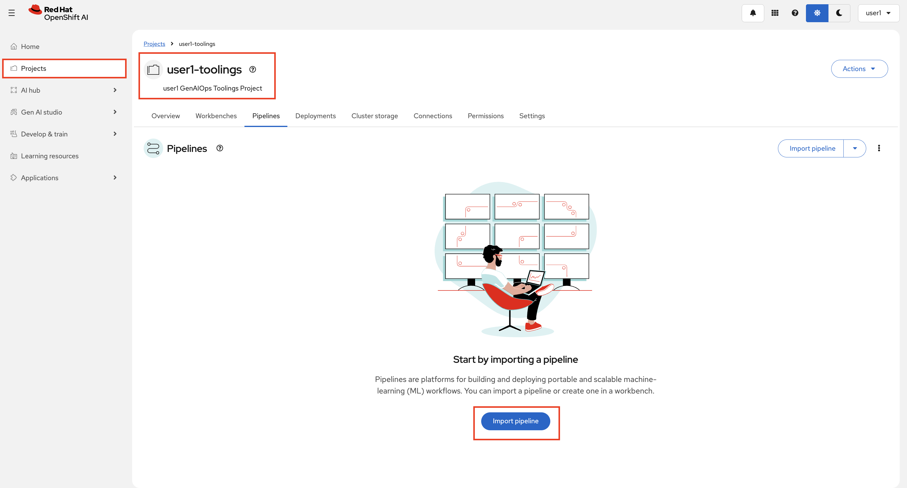

Great, now you are all set up!  

## Trigger our Kubeflow pipeline through a Tekton pipeline

Now we are ready to set up automatic runs of our Kubeflow pipeline!  
We will be triggering it from a Tekton Pipeline, where we both will have a step for our MLflow evals and for GuideLLM.  

1. Let's deploy the Tekton pipeline through ArgoCD. Start by running: 

    ```bash
    mkdir /opt/app-root/src/genaiops-gitops/toolings/evaluation-pipeline
    touch /opt/app-root/src/genaiops-gitops/toolings/evaluation-pipeline/config.yaml
    ```
    This will create a config file inside `genaiops-gitops/toolings/evaluation-pipeline`.

2. Open up the `evaluation-pipeline/config.yaml` file and paste the below yaml to config.yaml.

    ```yaml
    ---
    chart_path: charts/canopy-evals-pipeline
    USER_NAME: <USER_NAME>
    CLUSTER_DOMAIN: <CLUSTER_DOMAIN>
    kfp:
      backendUrl: http://canopy-backend.<USER_NAME>-test.svc.cluster.local:8000
      llmEndpoint: "http://llama-32-predictor.ai501.svc.cluster.local:8080"
    ```

3. And finally commit and push it to git, as it only counts if it's in git 😉

    ```bash
    cd /opt/app-root/src/genaiops-gitops
    git add .
    git commit -m "🚄 Evaluation Pipelines 🚄"
    git push
    ```

4. Now let's look at it by going to the `OpenShift Dashboard` -> `Pipelines` -> `<USER_NAME>-toolings` -> `canopy-evals-pipeline`.

    You can see that all it does is a simple `git clone` followed by starting the Kubeflow pipeline.  

    After the pipeline is complete it also raises the changes in `test` as a PR to `prod`.

    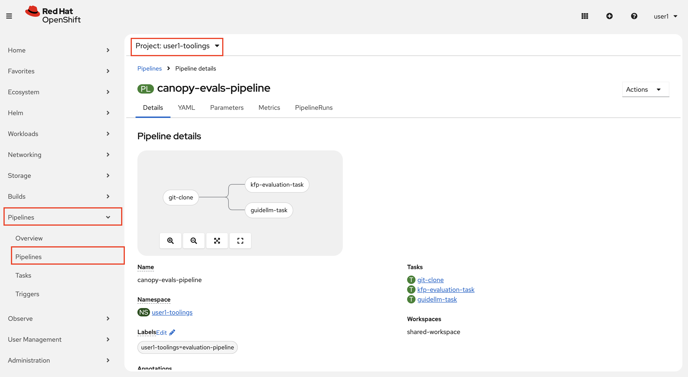

5. Great, we have our pipeline! However, so far we would still need to trigger it manually, the only difference from before is that we now trigger a Tekton pipeline that then triggers our Kubeflow pipeline and nothing more...

    

    To get some use of our Tekton pipeline, let's make it trigger automatically from git changes in our repos.  
    Start by going to Gitea.

6. Inside of Gitea, navigate to your `evals` repository. Go to Settings.

    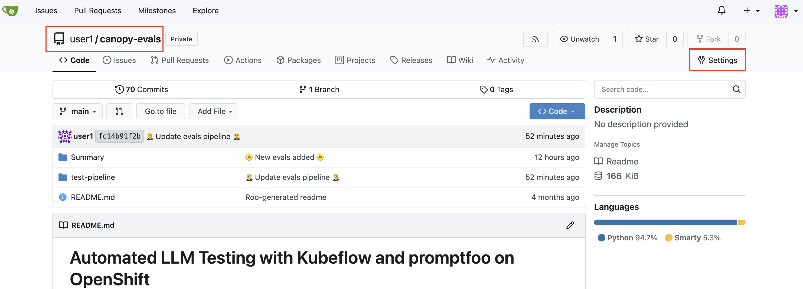

7. Click `Webhooks` > `Add` and choose Gitea.

    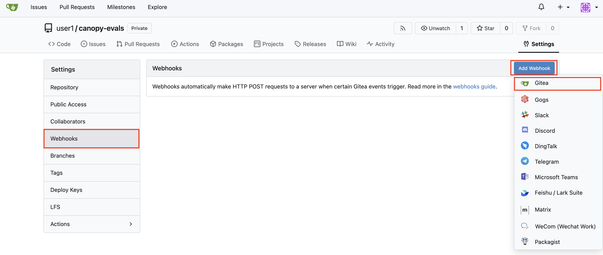

8. Enter the URL below for the Pipeline Event Listener and click `Add Webhook`

    ```bash
    http://el-canopy-evals-event-listener.<USER_NAME>-toolings.svc.cluster.local:8080
    ```

    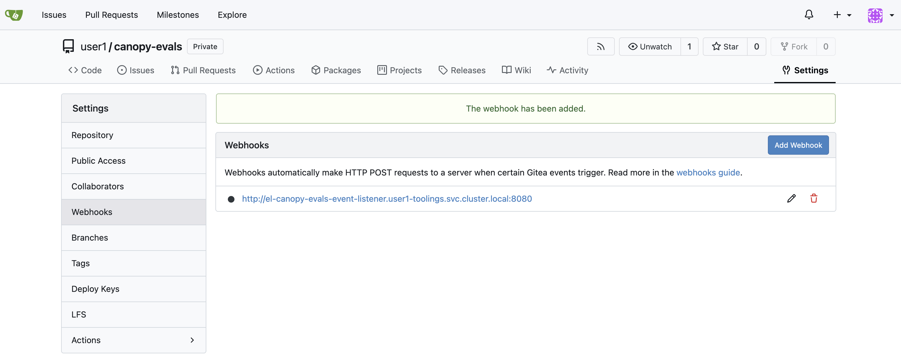

9. Now do the same for **prompts** 💥💥💥 

    Go to your code-server workbench, and open up the `experiments/4-ready-to-scale-201/3-mlflow-webhook.ipynb` and run the first cells. It will create a webhook on MLflow side, when you add a new prompt, it will trigger the Tekton pipeline.

10. After you are done running the cells, let's test it by going to OpenShift AI Dashboard > Gen AI studio > Prompts and select `<USER_NAME>-toolings`. Go to `summarization` and Create a new prompt version. 

    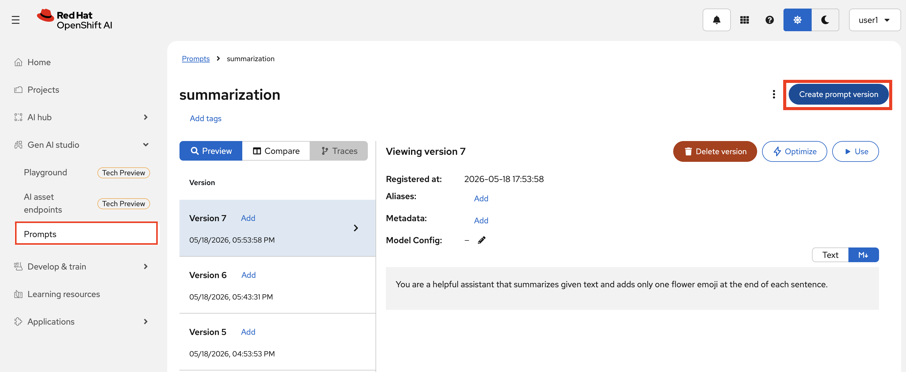

11. Observe that the Tekton pipeline has kicked off. Now, as the human in the loop, you can not just test the Canopy in the test environment, but also see the eval results and decide whether this prompt is good to go to production.

    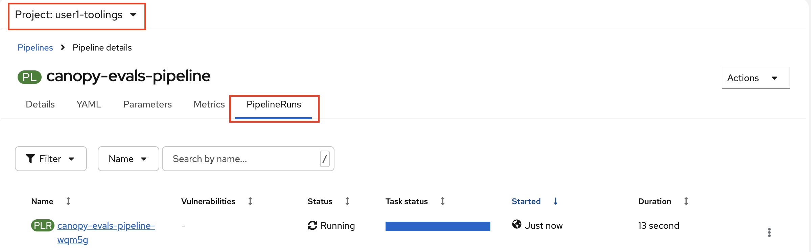

12. When the pipeline finish, in OpenShift AI Dashboard, go to `Experiments (MLFlow)` > select `<USER_NAME>-toolings` as the project > `summarization` > `Evaluation runs` and check the latest evaluation result based on your latest prompt. 

    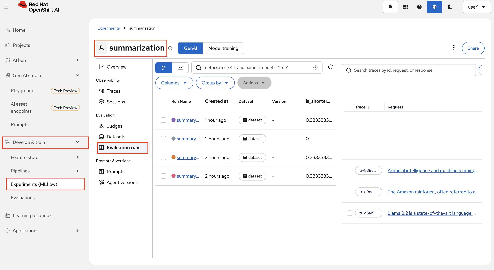

    And you can also check the GuideLLM results stored in the S3 bucket as an artifact under the `test-results` bucket. 

    Go to MinIO UI and login with your credenials: [https://minio-ui-<USER_NAME>-toolings.<CLUSTER_DOMAIN>/browser](https://minio-ui-<USER_NAME>-toolings.<CLUSTER_DOMAIN>/browser)

    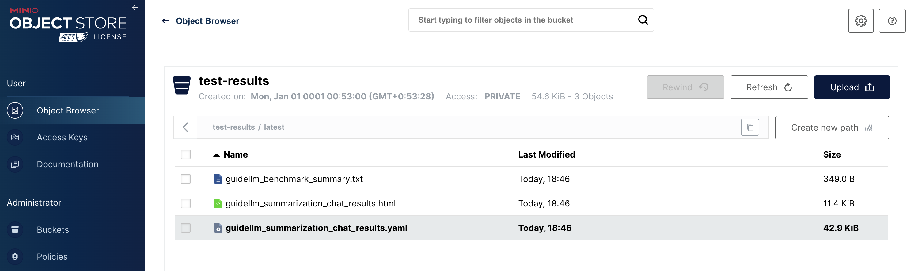

Congratulations! 🎉  

You have now added evals pipelines to your mlflow and eval repo, so whenever you update your evaluations or prompts, you will run through the tests.

_In practice we would also run the tests whenever we build a new backend, but since we are using pre-built backend images, we are skipping that for now._

Are we happy with the results? Yes? Awesome! The next question then; how are we going to production now?

## How to take the prompt changes to production?

You ran your evals, you look at the GuideLLM results, everything looks good enough for production as well. So how to we can update the system prompt in production in a way that we have visibility of what changed and easy to rollback in case of a problem.

1. You decided take your latest prompt version for `summarization`. We'll do this by moving `prod` alias to that version. Adding an alias to the prompt will trigger a pipeline to update our GitOps repository with the ID of that prompt. So we know what is on production and when. By knowing its ID, we can easily rollback to the previous ID cause it'll be stored in Git commit history.

    In order to do this, let's add another pipeline to our toolings by creating a folder called `prompt-promotion-pipeline`. 

    Let's deploy the Tekton pipeline through Argo CD. Start by running: 

    ```bash
    mkdir /opt/app-root/src/genaiops-gitops/toolings/prompt-promotion-pipeline
    touch /opt/app-root/src/genaiops-gitops/toolings/prompt-promotion-pipeline/config.yaml
    ```

    This will create a config file inside `genaiops-gitops/toolings/prompt-promotion-pipeline`.

2. Open up the `prompt-promotion-pipeline/config.yaml` file and paste the below yaml to config.yaml.

    ```yaml
    ---
    chart_path: charts/prompt-promotion-pipeline
    USER_NAME: <USER_NAME>
    CLUSTER_DOMAIN: <CLUSTER_DOMAIN>

3. And again commit and push it to git:

    ```bash
    cd /opt/app-root/src/genaiops-gitops
    git add .
    git commit -m "🌊 Prompt Promotion Pipelines 🌊"
    git push
    ```

    Check `OpenShift Dashboard` -> `Pipelines` -> `<USER_NAME>-toolings` -> `prompt-promotion-pipeline` that was synced by Argo CD.

    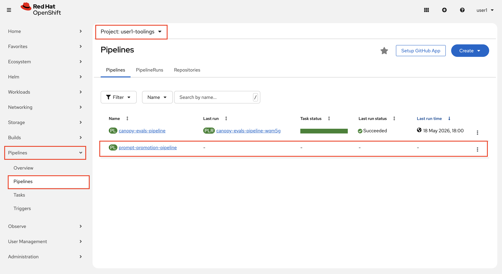

4. Go back to the notebook you were (`experiments/4-ready-to-scale-201/3-mlflow-webhook.ipynb`), just to run the last cell to add the webhook definition to MLFlow strictly to trigger when a new alias is added to the prompt versions.


5. Then let's test this out! OpenShift AI Dashboard > Gen AI studio > Prompts and select `<USER_NAME>-toolings` as project. Go to `summarization` and add `prod` alias to the latest one.

    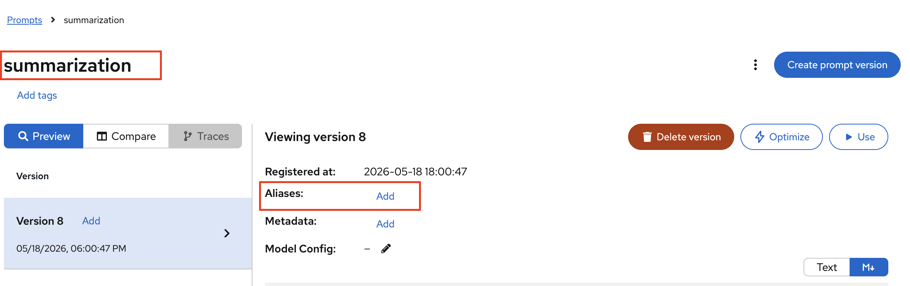

    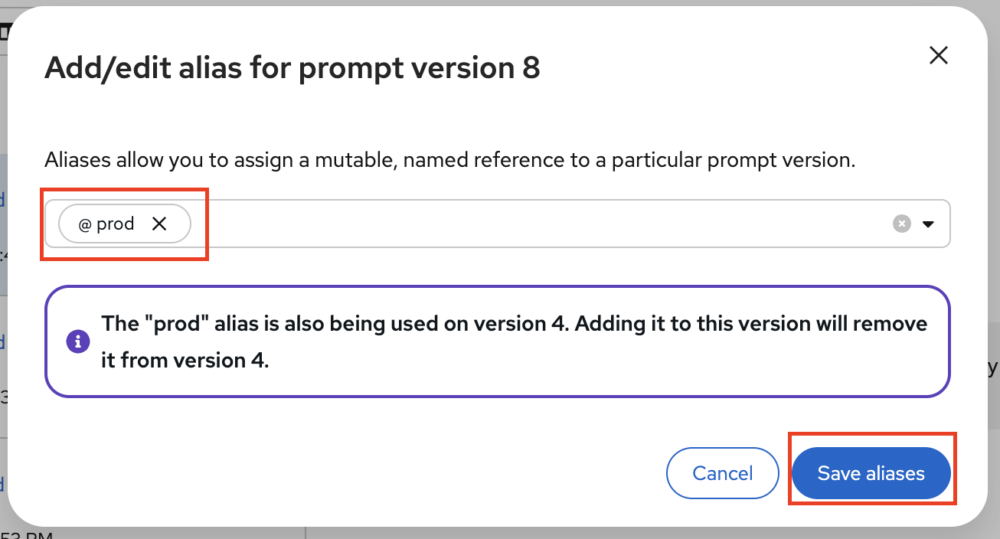

6. Watch that the pipeline is running in OpenShift console > Pipelines > under `<USER_NAME>-toolings` project.

    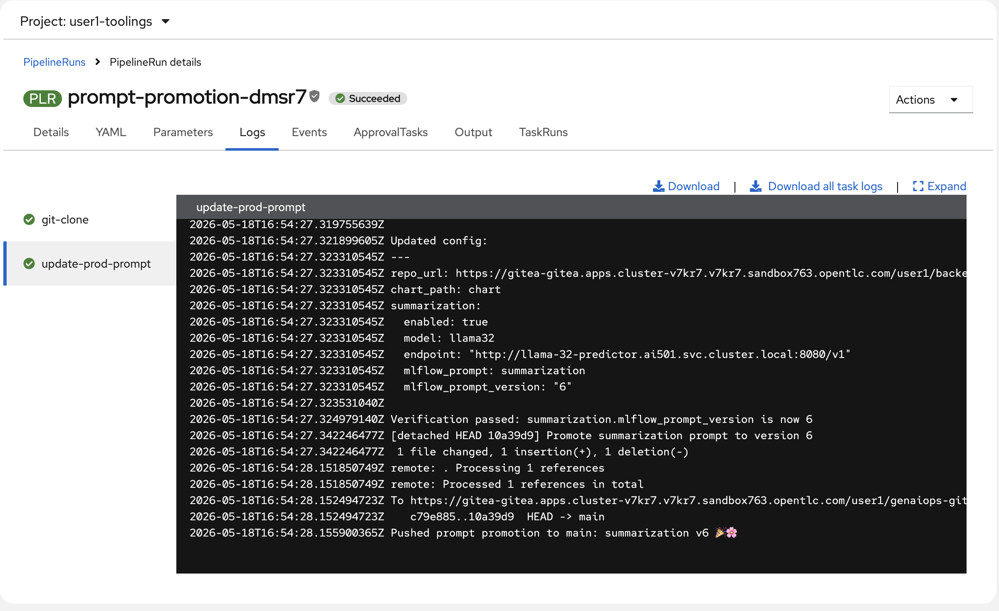

7. When the pipeline is finished, observe the GitOps repo being updated. Go to [Gitea](https://gitea-gitea.<CLUSTER_DOMAIN>/<USER_NAME>/genaiops-gitops/) > `genaiops-gitops` and see there is a new commit made by Tekton the Peaceful Cat 🐈

    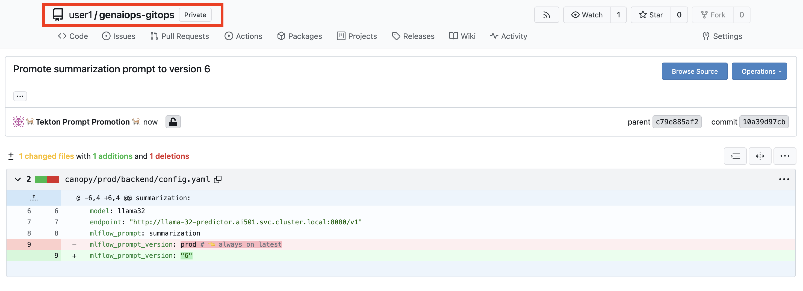

8. Lastly, verify the change by accessing to prod Canopy at [https://canopy-ui-<USER_NAME>-prod.<CLUSTER_DOMAIN>/](https://canopy-ui-<USER_NAME>-prod.<CLUSTER_DOMAIN>/) and sending some prompts.

> Alternatively, we could push this change to a branch and raise a PR for another human to approve. In this flow, though, the human review already happens when we assess the evaluation result.


## Adding more eval data

You can grow your evaluation dataset from MLflow traces, just like you did in the [Evaluating with MLflow](2-evaluate-genai-applications.md#evaluating-with-mlflow) section. Each environment stores traces in its own workspace.

To add traces from your test environment to the eval dataset:

1. Go to **OpenShift AI Dashboard** > **Experiments (MLflow)** and select `<USER_NAME>-test`.
2. Open **summarization** > **Traces** and pick a trace.
3. Click **Show assessments** > **Add expectations** (e.g., `length` = `200`).
4. Click **Add to dataset** and select the existing `eval` dataset, then **Export**.

----

And with that, we have an end-to-end automated process for changes that is traceable, observable, and ready to grow into more complex use cases. Let’s gooooo! 🚀
