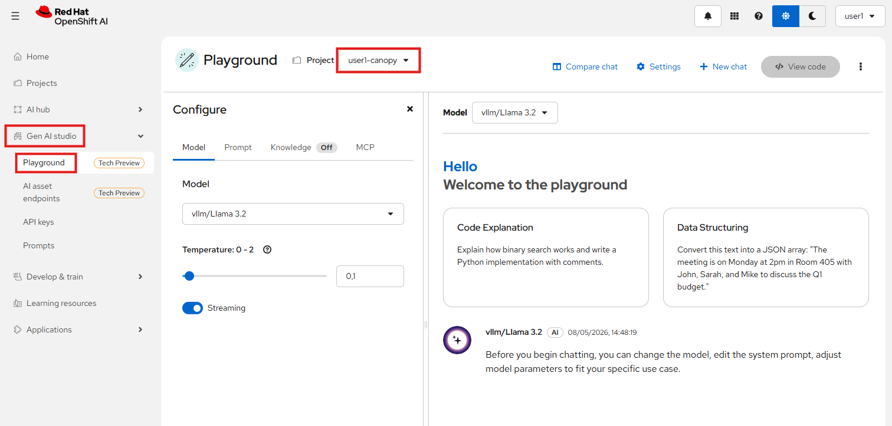
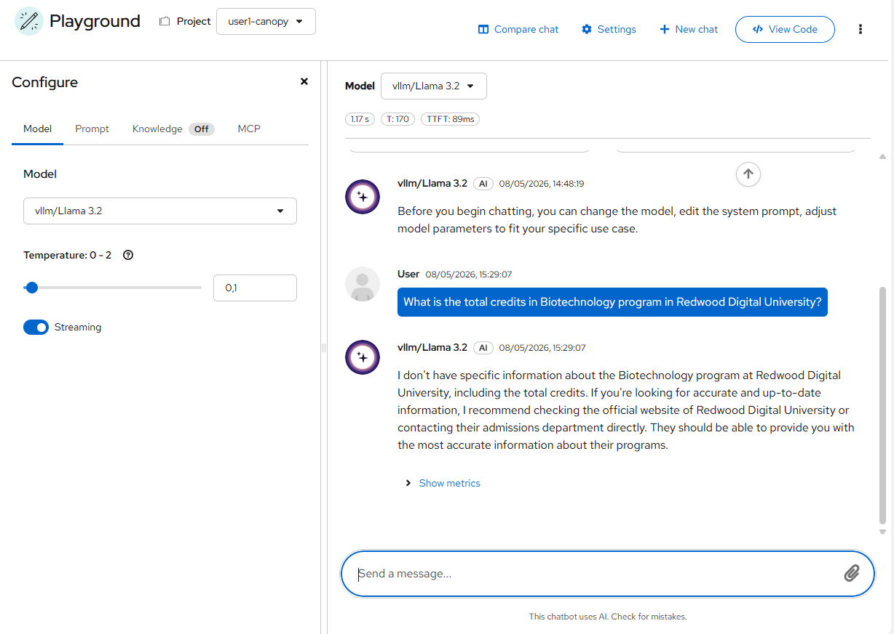
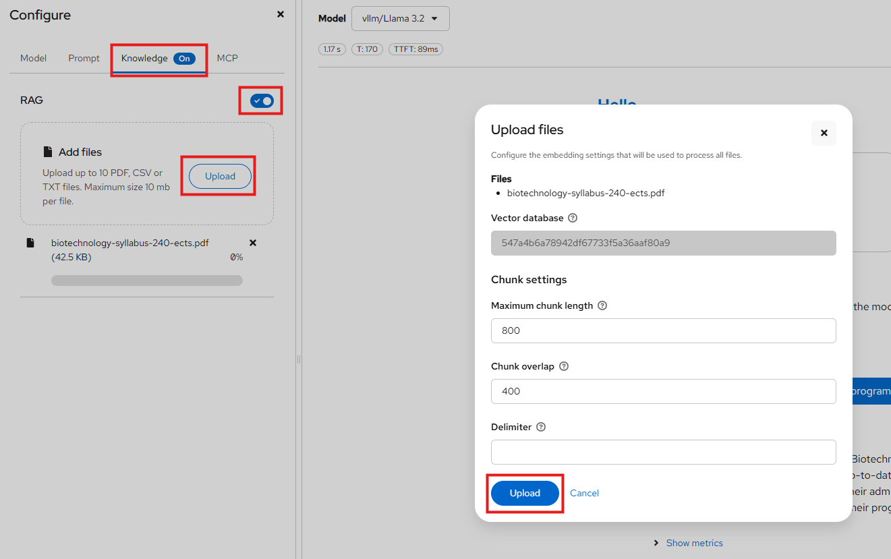

# Try the playground

RAG allows us to "ground" our answers in some information, prompting the model to answer based on that information rather than hallucinating.  
This is done by sending this extra information/context in together with the prompt, and adding extra instructions to primarily looking at that information before answering any question.  
Let's try it out!

First thing first, did you know that we (RDU) has a website? Go check it out: [https://rdu-website-ai501.<CLUSTER_DOMAIN>/](https://rdu-website-ai501.<CLUSTER_DOMAIN>/)

From there, choose a course you are interested in and download the PDF. We will be asking our LLM about it ;)

### Let's have a taste of RAG

Remember OpenShift AI provides a GenAI Playground for quick experimentation. The playground also has the capability of RAG. Without getting more details, let's just experinece it.

1. Go to OpenShift AI Dashboard > Gen AI studio > Playground > and make sure you have <USER_NAME>-canopy selected as the project.

    

2. Try asking a question, such as `What is the total credits in Biotechnology program in Redwood Digital University?` or something similar (for whatever course you picked).

    

    Doesn't give a very specific or correct answer, does it? Let's try to fix that!

3. Go over to the Knowledge tab, swap RAG to on and add the PDF you downloaded before from the RDU website.  

    You will get a modal asking you what chunk length and overlap you want. We will come back to what these are later, but keep them in mind as they are very important settings.  

    Keep the default chunk settings and press `Upload`.

    

4. Wait for the upload to finish and then try asking the same thing again. Do you get a better answer this time? You should see the response is grounded on the PDF you provided :)

Now that we have seen RAG in practice, let's try to implement it into Canopy. For that, continue to [RAG Basics](./2-rag-basics.md) to understand how `embeddings` work.