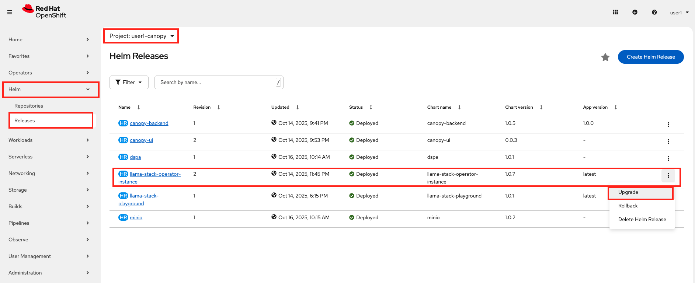
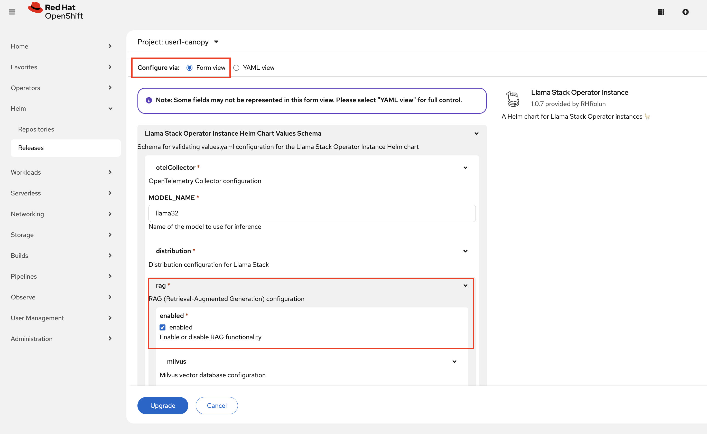

# 🧠 Understanding RAG: Memory for AI

Imagine you're helping a student with a complex research question about quantum physics, but your only reference is what you memorized in graduate school five years ago. Now imagine you could instantly access every physics textbook, research paper, and lecture note ever written. That's the difference between a standard LLM and one enhanced with **Retrieval Augmented Generation (RAG)**.

RAG transforms AI from a smart but limited conversationalist into an intelligent research assistant that can:

* **Remember** every document you've ever shared with it
* **Search** through vast libraries of content in milliseconds  
* **Reason** about information from multiple sources simultaneously
* **Update** its knowledge without retraining the entire model

For Canopy at RDU, RAG means students can ask questions about course materials, research papers, and institutional knowledge, and get answers grounded in authoritative sources.

### Let's implement RAG!

Llama Stack provides some out of the box capabilities for RAG. Let's quickly implement a simple RAG solution to see how it can improve Canopy. 

1. First, let's enable RAG capability on `<USER_NAME>-canopy` environment to experiment.
    From the OpenShift console, navigate to the Helm > Released and click the three little dots next to `llama-stack-operator-instance`

    

2. Switch to the YAML view and simply check the "enabled" checkbox under the RAG configuration to activate these capabilities.

    

    ..and click `Upgrade`.

3. Before we jump into trying out RAG, let's get a better understanding of how **embeddings** work.  

    Go back to your workbench and open up `canopy/5-rag/1-embeddings.ipynb` and get the feeling of it! 

    After you have finished with the embeddings you are now ready to try a RAG workflow.  
    Continue to `canopy/5-rag/2-intro-to-RAG.ipynb` to get your hands on the RAG.

    When you finish, come back so we can continue with making it prod ready and more automated!

## 🎯 Next Steps: Intelligent Data Processing

Next, continue to **[Docling](./2-docling.md)** to learn how to work with more complex data in your RAG system 🙌