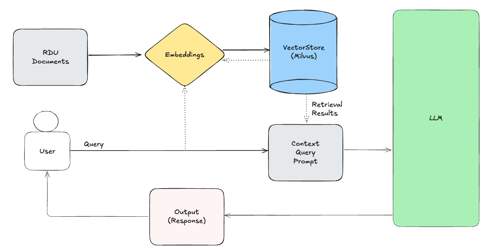

# 🧠 Understanding RAG: Memory for AI

Imagine you're helping a student with a complex research question about quantum physics, but your only reference is what you memorized in graduate school five years ago. Now imagine you could instantly access every physics textbook, research paper, and lecture note ever written. That's the difference between a standard LLM and one enhanced with **Retrieval Augmented Generation (RAG)**.

RAG transforms AI from a smart but limited conversationalist into an intelligent research assistant that can:

* **Remember** every document you've ever shared with it
* **Search** through vast libraries of content in milliseconds  
* **Reason** about information from multiple sources simultaneously
* **Update** its knowledge without retraining the entire model

For Canopy at RDU, RAG means students can ask questions about course materials, research papers, and institutional knowledge, and get answers grounded in authoritative sources.

## 🔍 What is RAG and How Does It Work?

**Retrieval Augmented Generation (RAG)** gives AI models access to external documents and knowledge bases. Think of it as giving your AI assistant a library card - now it can look up information from your specific course materials instead of just relying on what it memorized during training.

### The RAG Process: A Step-by-Step Journey

Here's how RAG transforms your documents into intelligent, searchable knowledge:

**Step 1: Document Preparation** 📄 *(Left side of diagram)*
- Your course materials and research papers are broken into smaller chunks
- Each chunk becomes an "embedding" - a mathematical representation of its meaning
- All embeddings are stored in a vectorstore (database) for lightning-fast search

**Step 2: Query Processing** 🔍 *(Bottom of diagram)*
- When a student asks a question, it goes through the same embedding process
- The system searches the vectorstore to find chunks with similar meanings
- The most relevant pieces are retrieved and ranked

**Step 3: Context Enhancement** 🧠 *(Center of diagram)*
- Retrieved document chunks are combined with the student's original question
- This creates a "Context Query Prompt" with both the question and relevant background
- Now the LLM has specific, authoritative sources to work with

**Step 4: Intelligent Response** ✨ *(Right side of diagram)*
- The LLM generates an answer using both its training and the retrieved documents
- Responses are grounded in your actual course materials
- Students get accurate, citeable answers they can trust for assignments

### Why RAG is a Game-Changer for Education

**❌ Regular LLMs:**
- Only know what they learned during training (often outdated)
- Can't access your specific course materials
- Sometimes make up information ("hallucinate")
- Can't tell you where information comes from

**✅ RAG-Enhanced LLMs:**
- Can search through your current course materials and research papers
- Provide answers with specific citations and page numbers
- Stay up-to-date as you add new materials
- Ground responses in authoritative educational sources

### RAG in Action
Llama Stack provides some out of the box capabilities for RAG. Let's quickly implement a simple RAG solution to see how it can improve Canopy. 

First, let's enable RAG capability on `<USER_NAME>-canopy` environment to experiment.

**Step 1: Navigate to Helm Charts**

From the OpenShift Developer View, navigate to the **Helm** tab in the left panel to access your deployed charts.

**Step 2: Open LlamaStack Instance**

Locate and click on the `llama-stack-operator-instance` Helm chart to open its configuration interface:

..and simply check the "enabled" checkbox under the RAG configuration to activate these capabilities.

..and click `Upgrade`.

**Step 3: Upload some documents and see how it is workign**

Go back to your workbench and open up `1-intro-to-RAG.ipynb` and get the feeling of it! 

When you finish, come back so we can continue with making it prod ready and more automated!

## 🎯 Next Steps: Setting Up a Vector Database

Now that you get your hands into RAG and understand its value, it's time to make it production ready. And first, you'll need a place to store your document embeddings: that's where Vector Databases come in.

Let's dive into the world of embeddings and vector databases!