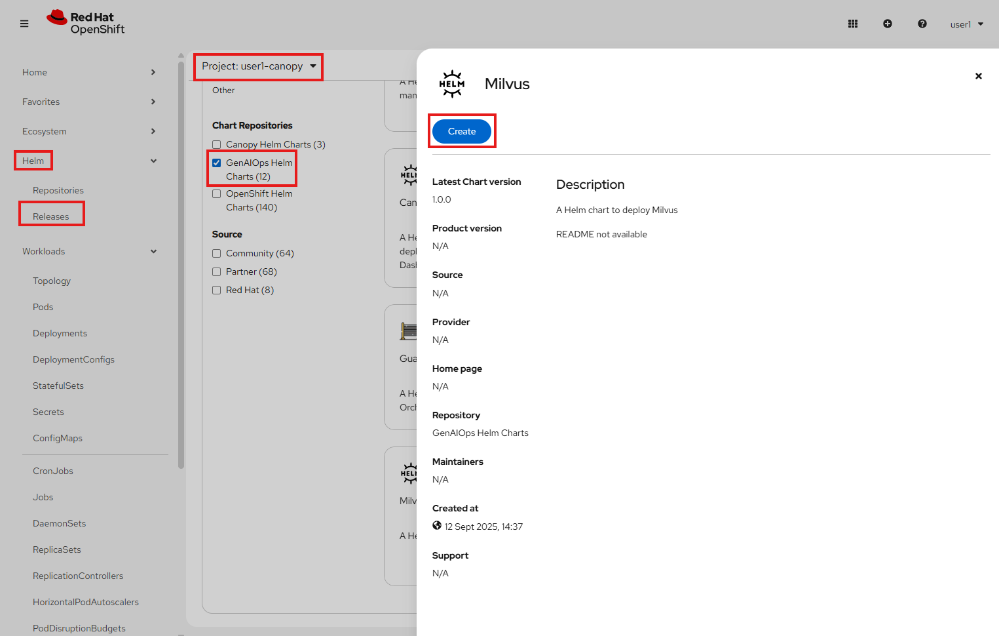
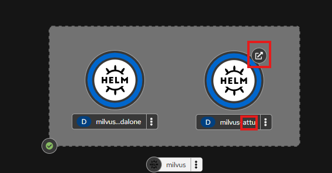
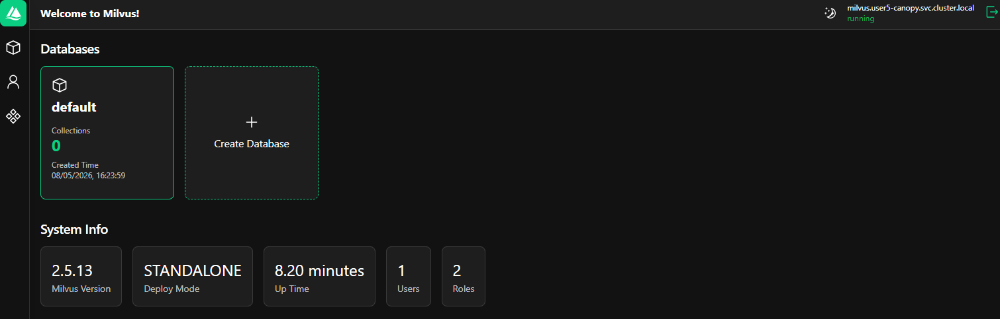

# Vector Databases - Milvus

Now that we know what embeddings are, we need to be able to store and search them somewhere, preferably that's not just local.  
For this, we will use Milvus, a high-performant opensource **Vector Database** (as we saw in the previous chapter, embeddings are vectors so they fit perfectly with a vector database).  
Vector databases are optimized to store and search across millions of vectors efficiently.

## Using Milvus

1. Before we can use Milvus, let's deploy it inside our Canopy project.  

    Start by going to the OpenShift console -> Helm -> Releases (make sure you are in `<USER_NAME>-canopy` project) -> Create Helm Release and deploy Milvus.

    Press `Create` again when you see the yaml view, no need to change any settings.

    

2. Wait for Milvus to be fully deployed.  
    You should also see something called **Attu** be deployed together with Milvus. Attu is the frontend for Milvus which we can use to browse the vectors we store in Milvus.  
    Open it and check what it looks like.

    

3. To log into Attu, use the following Address and Database:
    - Milvus Address: `milvus.<USER_NAME>-canopy.svc.cluster.local`
    - Database: `default`

    

    I promise, it will soon look more interesting!

4. Go to your workbench and run through the notebook `experiments/5-rag/2-vector-databases.ipynb`

After you are done with the notebook you can continue to learn about [Docling](5-grounded-ai/4-docling.md), which will teach you ways to process more complex document and formats.