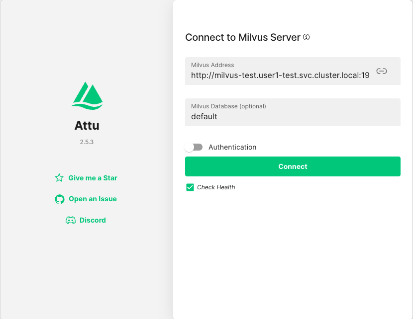

# 📊 Vector Stores: The Foundation of RAG

<div class="terminal-curl"></div>

We have seen the use of embeddings, and in the last section we used an in-line vector database to store these embeddings.

Using an in-line database of any kind is not something we would want to do in production though, so first thing we want is to deploy a dedicated vector database that we can use to store our embeddings and text.  

For this, we are going to set up Milvus. If you recognize the name it's because it's the same database that we were using in-line just in the previous notebook.

## 📊 Deploy Milvus Test & Prod

1. Go back to your workbench 🧑‍🏭

2. Under `genaiops-gitops` folder, we'll create separate configurations for test and prod environments:

    ```bash
    mkdir -p /opt/app-root/src/genaiops-gitops/canopy/test/milvus
    mkdir -p /opt/app-root/src/genaiops-gitops/canopy/prod/milvus
    touch /opt/app-root/src/genaiops-gitops/canopy/test/milvus/config.yaml
    touch /opt/app-root/src/genaiops-gitops/canopy/prod/milvus/config.yaml
    ```

3. Update both `canopy/test/milvus/config.yaml` and `canopy/prod/milvus/config.yaml` with the same configuration:

    **Both TEST and PROD:**

    ```yaml
    chart_path: charts/milvus
    ```

    For now, we're happy with the default Milvus values. We will get some exciting updates as we continue to the other chapters 🤭

4. Now let's get these configurations deployed! Commit the files to Git:

    ```bash
    cd /opt/app-root/src/genaiops-gitops
    git pull
    git add .
    git commit -m "📊 ADD - Milvus test & prod vector databases 📊"
    git push
    ```

5. Wait till you see that both Milvus pods are operational, in other words you see `1/1` under `Ready` column:

  ```bash
  oc get po -n <USER_NAME>-test -w
  ```

    <div class="highlight" style="background: #f7f7f7">
    <pre><code class="language-python">
    $ oc get po -n user2-test -w
    NAME                                      READY   STATUS    RESTARTS   AGE
    canopy-backend-6785f999cf-946fx           1/1     Running   0          15m
    canopy-ui-568d7cd989-zsqbx                1/1     Running   0          4h9m
    llama-stack-5f7778c6c-wh8hw               1/1     Running   0          22m
    milvus-test-attu-5dd559c7dd-xtgzc         1/1     Running   0          2m14s
    milvus-test-standalone-67585987cd-k72b7   1/1     Running   0          2m14s
    </code></pre>
    </div>

  _Do `Ctrl + C` to break the watch._

6. Each Milvus deployment includes Attu, a web-based administration tool for managing and visualizing your vector database.
    Let's take a look at the test one we just deployed!

    ```
    https://milvus-test-attu-<USER_NAME>-test.<CLUSTER_DOMAIN>
    ```
    Update the Milvus Address as below to connect:
    
    ```bash
    http://milvus-test.<USER_NAME>-test.svc.cluster.local:19530
    ```

    

    As you can see, it's completely empty, but we'll fix that soon 🔨  

7. Update your Llama Stack config in test and prod by opening up `genaiops-gitops/canopy/test/llama-stack/config.yaml` (test) and `genaiops-gitops/canopy/prod/llama-stack/config.yaml` (prod) and update the files as below:

    **FOR TEST:**

    ```yaml
    ---
    chart_path: charts/llama-stack-operator-instance
    models:
      - name: "llama32"
        url: "http://llama-32-predictor.ai501.svc.cluster.local:8080/v1"
    eval:
      enabled: true
    rag:                  # 👈 Add this 
      enabled: true       # 👈 Add this
      milvus:                   # 👈 Add this
        service: "milvus-test"  # 👈 Add this
    ```

    **FOR PROD:**

    ```yaml
    ---
    chart_path: charts/llama-stack-operator-instance
    models:
      - name: "llama32"
        url: "http://llama-32-predictor.ai501.svc.cluster.local:8080/v1"
    eval:
      enabled: true
    rag:                        # 👈 Add this 
      enabled: true             # 👈 Add this
      milvus:                   # 👈 Add this
        service: "milvus-prod"  # 👈 Add this
    ```
    
    This will update our Llama Stack to point to our newly deployed Milvus Vector Database, if you are curious how this looks like, you can find the `llama-stack-config` inside ConfigMaps in either your test or dev environment.

8. Let's push the changes for Argo CD to make the necessary changes.

    ```bash
    cd /opt/app-root/src/genaiops-gitops
    git pull
    git add .
    git commit -m "📚 enable RAG 📚"
    git push origin main
    ```

9.  Now that we have our Vector Database set up and connected to our Llama Stack, we can populate it with some data!

    We have two ways to do this:

    - We can either go through Llama Stack (this will look identicall to what we did in `2-intro-to-RAG.ipynb`) or

    - We can connect directly to Milvus.
    
    Let's connect directly to Milvus to see how this looks like.  

    To do that, go to your workbench and complete the hands-on exercises in `experiments/5-rag/4-vector-databases.ipynb` 

    After you have gone through the notebook, make sure to check Attu and see the new collection that has appeared here:
    ```
    https://milvus-test-attu-<USER_NAME>-test.<CLUSTER_DOMAIN>
    ```

## 🎯 Next Steps: Complete Educational Platform

Now that we learned more about how to populate Milvus database, let's actually bring the data we need in an automated fashion. And this means, yes, more pipelines 🙈

Continue to next section to automate the document ingestion with KFP pipelines for ingesting into our test and production environment.
