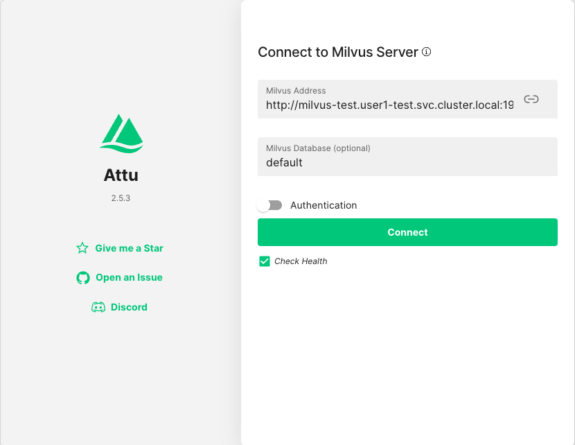
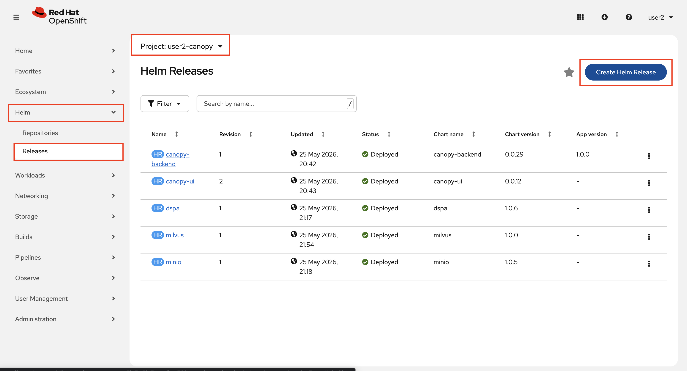
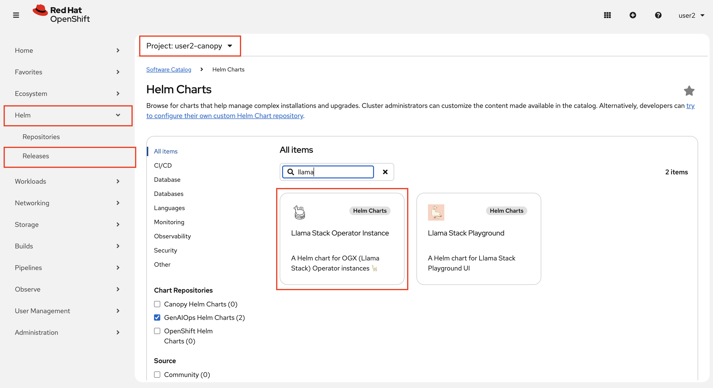
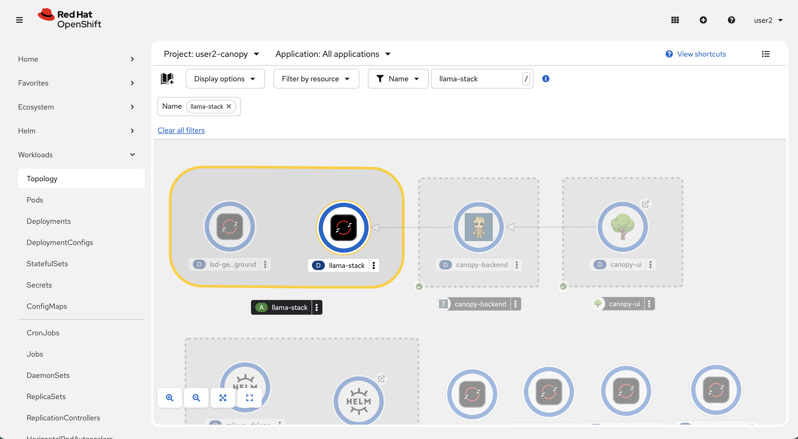

# Get prepared for prod

So far we experienced RAG pieces on our workbench or playground. We need to set things up with GitOps for the higher environments, bring more automation, and introduce an orchestration layer that will make our RAG more powerful and portable — more on that shortly!

## 📊 Deploy Milvus Test & Prod

1. Go back to your workbench 🧑‍🏭

2. Under `genaiops-gitops` folder, we'll create separate configurations for test and prod environments:

    ```bash
    mkdir -p /opt/app-root/src/genaiops-gitops/canopy/test/milvus
    mkdir -p /opt/app-root/src/genaiops-gitops/canopy/prod/milvus
    touch /opt/app-root/src/genaiops-gitops/canopy/test/milvus/config.yaml
    touch /opt/app-root/src/genaiops-gitops/canopy/prod/milvus/config.yaml
    ```

3. Update both `canopy/test/milvus/config.yaml` and `canopy/prod/milvus/config.yaml` with the same configuration:

    **Both TEST and PROD:**

    ```yaml
    chart_path: charts/milvus
    ```

    For now, we're happy with the default Milvus values.

4. Now let's get these configurations deployed! Commit the files to Git:

    ```bash
    cd /opt/app-root/src/genaiops-gitops
    git pull
    git add .
    git commit -m "📊 ADD - Milvus test & prod vector databases 📊"
    git push
    ```

5. Wait till you see that both Milvus pods are operational, in other words you see `1/1` under `Ready` column:

  ```bash
  oc get po -n <USER_NAME>-test -w
  ```

    <div class="highlight" style="background: #f7f7f7">
    <pre><code class="language-python">
    $ oc get po -n user2-test -w
    NAME                                      READY   STATUS    RESTARTS   AGE
    canopy-backend-6785f999cf-946fx           1/1     Running   0          15m
    canopy-ui-568d7cd989-zsqbx                1/1     Running   0          4h9m
    llama-stack-5f7778c6c-wh8hw               1/1     Running   0          22m
    milvus-test-attu-5dd559c7dd-xtgzc         1/1     Running   0          2m14s
    milvus-test-standalone-67585987cd-k72b7   1/1     Running   0          2m14s
    </code></pre>
    </div>

  _Do `Ctrl + C` to break the watch._

1. Each Milvus deployment includes Attu like we experienced before. If you'd like to take a look at the test one we just deployed 👇

    ```
    https://milvus-test-attu-<USER_NAME>-test.<CLUSTER_DOMAIN>
    ```
    Update the Milvus Address as below to connect:
    
    ```bash
    http://milvus-test.<USER_NAME>-test.svc.cluster.local:19530
    ```

    

    As you can see, it's completely empty, but we'll fix that soon in an automated way 🔨  

# 🦙 OGX (Open GenAI Stack) - A unifying framework

Until now, Canopy has always talked to the model directly — a single hardcoded endpoint. That was enough when all we needed was to send a prompt and get a response.

RAG adds a second component: the vector database. Different teams use different ones and we might want to swap ours out as our requirements evolve. Your application shouldn't need to know or care which one it's talking to.

**OGX (Open GenAI Stack, formerly Llama Stack)** sits between your application and your RAG infrastructure. It provides a unified API for vector store operations, so swapping the database backend becomes a config change in OGX rather than a code change in your application. It supports 16 vector store providers out of the box — Milvus, Chroma, pgvector, Qdrant, Weaviate, and more.

Beyond provider portability, OGX also unlocks RAG capabilities that are hard to build yourself:

- **Hybrid search** — combine vector similarity with keyword search in a single query, which significantly improves retrieval quality for real-world content
- **Contextual chunking** — instead of splitting documents by token count, an LLM enriches each chunk with its surrounding context before it's stored, making retrieval much more accurate
- **Multiple embedding models** — switch between nomic-embed, BGE, MiniLM, or any sentence-transformers model without changing your application code

We won't use all of these today, but they're there when you need them. You can read more at: [https://ogx-ai.github.io/docs/concepts/file_operations_vector_stores#search-capabilities](https://ogx-ai.github.io/docs/concepts/file_operations_vector_stores#search-capabilities)

Let's deploy some OGX (Llama Stack) for Canopy! 

(a little hint: your Gen AI Playground has been using OGX from the start 🥳)

1. Let's quickly deploy it to our experimentation environment the same way we deployed other tools. In Openshift console, again expand `Helm` section from the left menu, click `Releases` and make sure you are on `<USER_NAME>-canopy` project. Then from the top right select `Create Helm Release`. 

    

2. Select `GenAIOps Helm Charts` from the Chart Repositories list and choose `Llama Stack Operator Instance`

    

3. We need to provide our LLM endpoint to Llama Stack, the same way we did to Canopy frontend. The helm chart already comes with good default values. Check if the below values are set correctly under `models`, and RAG is enabled:

    - name: `llama32`
    - url: `http://llama-32-predictor.ai501.svc.cluster.local:8080/v1`
    - rag: `enabled:true`

..and click `Create`.

4. Observe that the Llama Stack is running in your environment:

    

5. From an enduser point of view, there shouldn't be any change. Now OGX (Llama Stack) is accessing the model (and soon to Milvus DB) instead of backend accessing them directly. You can check it by connecting to Canopy UI in the `<USER_NAME>-canopy` environment.

6. For `test` and `prod`, let's setup Llama Stack to deploy via Argo CD. Create `test/ogx/config.yaml` and `prod/ogx/config.yaml`:

    ```bash
    mkdir -p /opt/app-root/src/genaiops-gitops/canopy/test/ogx
    mkdir -p /opt/app-root/src/genaiops-gitops/canopy/prod/ogx
    touch /opt/app-root/src/genaiops-gitops/canopy/test/ogx/config.yaml
    touch /opt/app-root/src/genaiops-gitops/canopy/prod/ogx/config.yaml
    ```

    And paste the below config to the respective `config.yaml`:

    **FOR TEST**:

    ```yaml
    ---
    chart_path: charts/llama-stack-operator-instance
    models:
      - name: "llama32"
        url: "http://llama-32-predictor.ai501.svc.cluster.local:8080/v1"
    rag:
      enabled: true
      milvus:
        service: "milvus-test"
    ``` 

    **FOR PROD**:

    ```yaml
    ---
    chart_path: charts/llama-stack-operator-instance
    models:
      - name: "llama32"
        url: "http://llama-32-predictor.ai501.svc.cluster.local:8080/v1"
    rag:
      enabled: true
      milvus:
        service: "milvus-prod"
    ``` 

7. Let's get them deployed! Of course - they are not real unless they are in git!

    ```bash
    cd /opt/app-root/src/genaiops-gitops
    git pull
    git add .
    git commit -m  "🦙 ADD - Open GenAI Stack instances 🦙"
    git push 
    ```

    And now, let's get our hands to it!

# Send a request to Milvus through OGX

There is one more Notebook we'd like to go through and it is to get you hands on with OGX before we update our backend to use it.

Head over to you workbench and follow `experiments/5-rag/4-using-ogx.ipynb` notebook.

When you are done, let's enable some automation for RDU students 🌳📚