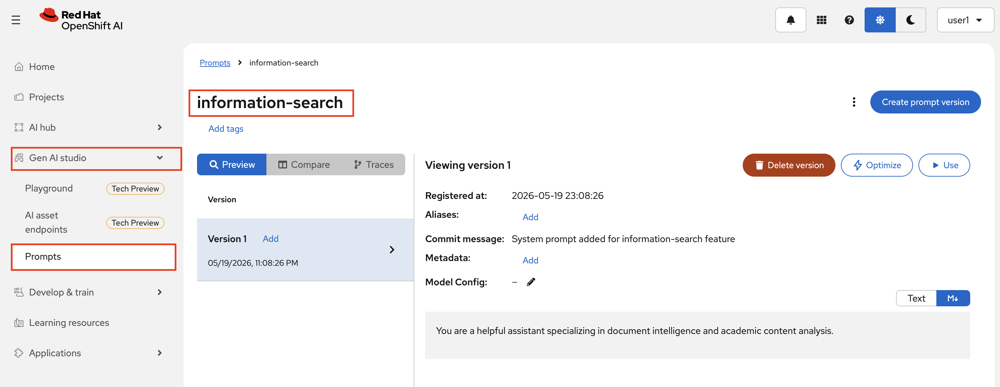
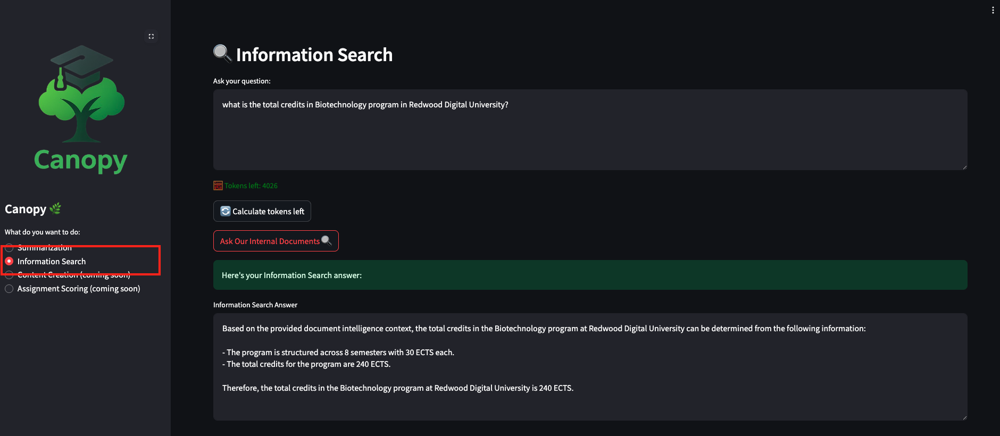

# 🌐 Powering Canopy with RAG Capabilities

## Integrate RAG into Canopy

The Canopy backend already has a RAG setup behind a feature flag, we just need to have a good system prompt to tell the system what is this feature about and enable the feature flag.


1. Go to OpenShift AI Dashboard > Gen AI Studio > Prompts under **`<USER_NAME>-toolings`** project.

2. Create a new prompt called `information-search` and use below prompt:

    ```bash
    You are a helpful assistant specializing in document intelligence and academic content analysis.
    ```
    

    We will be using the latest prompt for test, so we are always up-to-date, and then we will have an alias (tag) for the prompts which are in prod. We call this alias prod. Go ahead and add that alias to your new prompt.

2. Then please go to your workbench and open both files `genaiops-gitops/canopy/test/backend/config.yaml` and `genaiops-gitops/canopy/prod/backend/config.yaml`

3. Edit the file to contain the `information-search` feature flag. Feel free to change the prompt, this is a system prompt just like before.

TEST(`genaiops-gitops/canopy/test/backend/config.yaml`)

    ```yaml
    ---
    repo_url: https://gitea-gitea.<CLUSTER_DOMAIN>/<USER_NAME>/backend
    chart_path: chart
    summarization:
      enabled: true
      model: llama32
      endpoint: "http://llama-32-predictor.ai501.svc.cluster.local:8080/v1"
      mlflow_prompt: summarization
      mlflow_prompt_version: latest
    information-search:          # 👈 add this block 📚❗︎❗︎❗︎❗︎❗︎
      enabled: true
      endpoint: "http://llama-stack-service:8321/v1"
      model: vllm-llama32/llama32
      vector_db_id: latest
      mlflow_prompt: information-search
      mlflow_prompt_version: latest
    ```

PROD(`genaiops-gitops/canopy/test/backend/config.yaml`)

    ```yaml
    ---
    repo_url: https://gitea-gitea.<CLUSTER_DOMAIN>/<USER_NAME>/backend
    chart_path: chart
    summarization:
      enabled: true
      model: llama32
      endpoint: "http://llama-32-predictor.ai501.svc.cluster.local:8080/v1"
      mlflow_prompt: summarization
      mlflow_prompt_version: prod
    information-search:          # 👈 add this block 📚❗︎❗︎❗︎❗︎❗︎
      enabled: true
      endpoint: "http://llama-stack-service:8321/v1"
      model: vllm-llama32/llama32
      vector_db_id: latest
      mlflow_prompt: information-search
      mlflow_prompt_version: prod
    ```

4. Push the change to git:

    ```bash
    cd /opt/app-root/src/genaiops-gitops
    git pull
    git add .
    git commit -m "🔨 RAG feature added 🔨"
    git push
    ```

5. Open the Canopy UI (https://canopy-ui-<USER_NAME>-test.<CLUSTER_DOMAIN> if you have closed it since last time), select the *Information Search* feature in the left menu and ask something like `what is the total credits in Biotechnology program in Redwood Digital University?`

Replace "Biotechnology" in the prompt with the program syllabus you've uploaded to Minio. For example, if you uploaded the "Computer Science" syllabus only, update the prompt to say "Computer Science" instead of "Biotechnology."

  

Congratulations! 🎉  
You now have a fully functioning RAG system where you can ingest complex documents as needed.

Now the question is, are we going to run the pipeline manually every time or do we have a better way to do this? And what about production? Are we going to push without any testing?!

But before that, some evals!

Let's advance to the next section!
