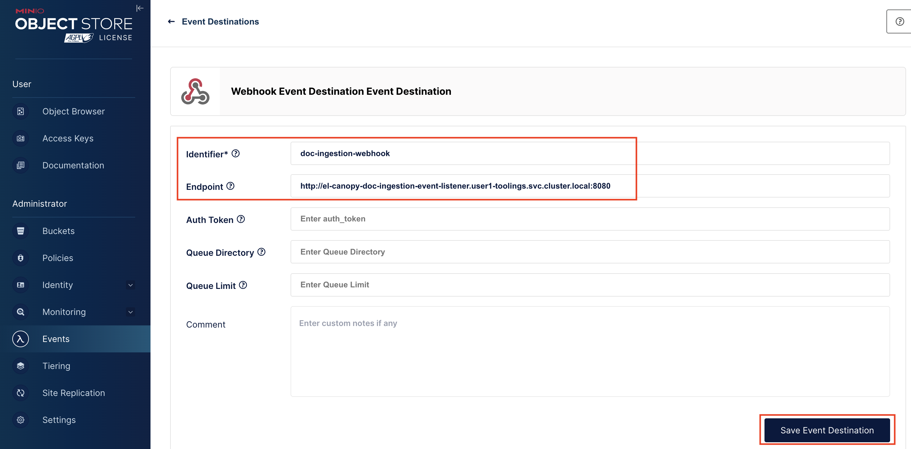
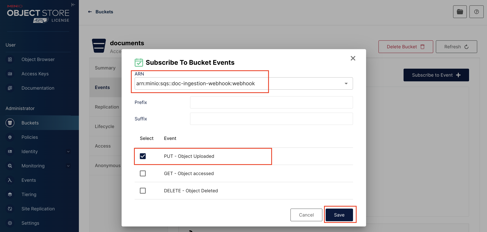
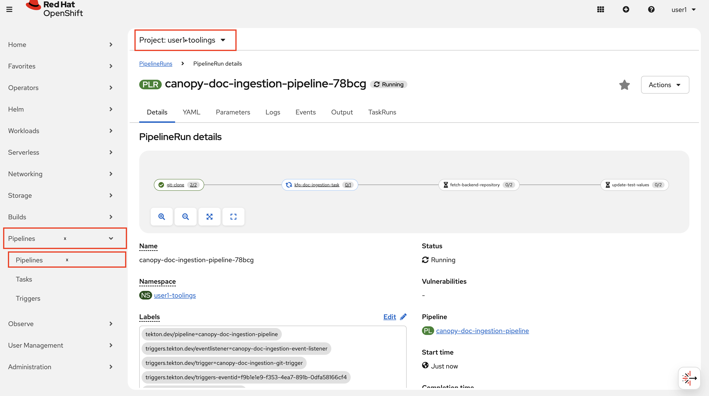
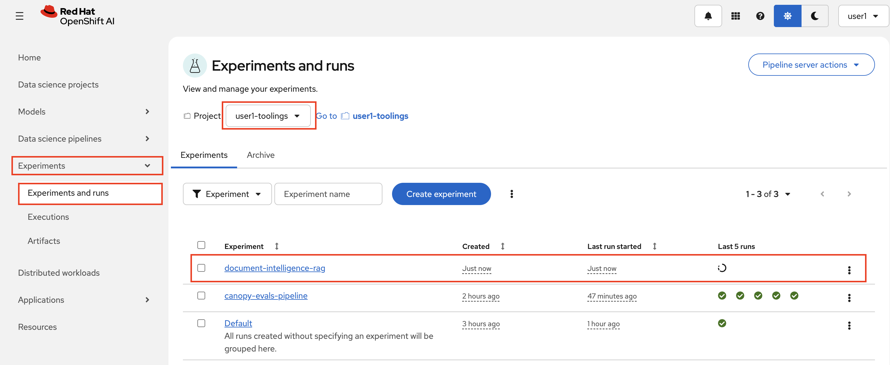

## Automate the Flow with Tekton

1. Let's automate this whole flow when there is a new document uplaoded to MonIO! For that we need to deploy a Tekton pipeline and in the end the whole flow will look like this:

    


  Let's deploy the Tekton pipeline by creating a folger under `genaiops-gitops/toolings` as below:

  ```bash
  mkdir -p /opt/app-root/src/genaiops-gitops/toolings/doc-ingestion-pipeline
  touch /opt/app-root/src/genaiops-gitops/toolings/doc-ingestion-pipeline/config.yaml
  ```

2. Update the `config.yaml` file:

```yaml
chart_path: charts/canopy-doc-ingestion-pipeline
username: <USER_NAME>
cluster_domain: <CLUSTER_DOMAIN>
```

3. Commit and push changes as always.
    ```bash
    cd /opt/app-root/src/genaiops-gitops
    git add .
    git commit -m "🦁 RAG doc ingestion pipeline added 🦁"
    git push
    ```

4. This pipeline will give you a webhook to add to MinIO so when we upload a file, MinIO can trigger the Tekton pipeline. So go to MinIO > Events and click on `Add Event Destination` on the right top. Select `Webhook`:

    

5. Fill out the form with these two information:

    Identifier: `doc-ingestion-webhook`

    Endpoint: `http://el-canopy-doc-ingestion-event-listener.<USER_NAME>-toolings.svc.cluster.local:8080`

    ..and hit `Save Event Destination`.

    

6. Strangely on top, MinIO will ask you to restart it to make the configuration takes effec. Click `Restart` and just refresh the page 🤷

    

7. Now, let's associate this webhook with `documents` bucket. Go to Buckets > `documents` > Events and click `Subscribe to Event`. Select your nwly created webhook from the dropdown menu of ARN, and check `PUT - Object Uploaded` as the event. `Save` your changes. You don't have to restart it again :)

    

8. Now, you can download yet another syllabus that your choice from [RDU website](https://rdu-website-ai501.<CLUSTER_DOMAIN>) and upload it to `documents` bucket. You need to go to Object Browser > documents for it.

    

9. After you upload the PDF, go to OpenShift console > Pipelines and observe that a pipeline is triggered.

    

10. And if you go nack to OpenShift AI console, you'll see that doc-ingestion Kubeflow Pipeline is running:

    

11. After the pipeline finish, you'll see a automated push happened in `canopy-be` repository. 

    

    And this push triggers, YES, the evals pipeline! 

    

    After the eval pipeline finishes, you can find a PR in `canopy-be` repository to update vector DB ID in production. And in the description, you'll see a link to evaluation results. You need to check the results and decide whether to accept this change or go back and do some more test, more data ingestions etc. You are the human in the loop here :)

    !


    And your evals doesn't cover anything related to the last PDF you uploaded? Feel free to update your evals, add more prompt & expected result pairs. 
