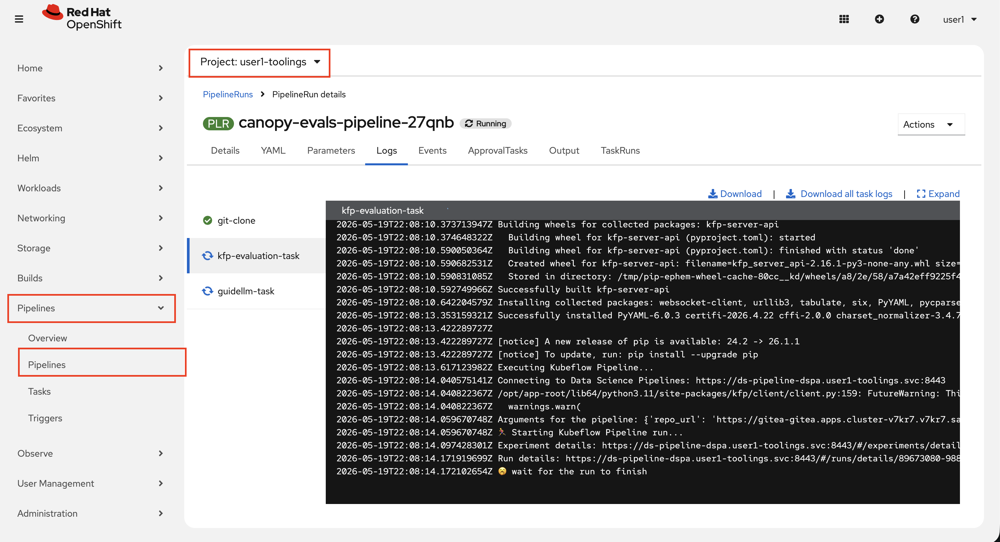
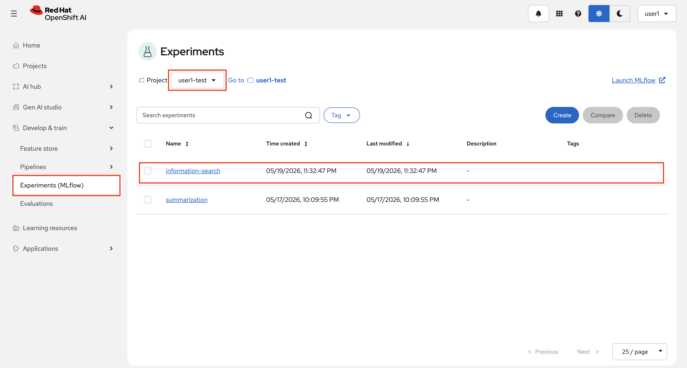
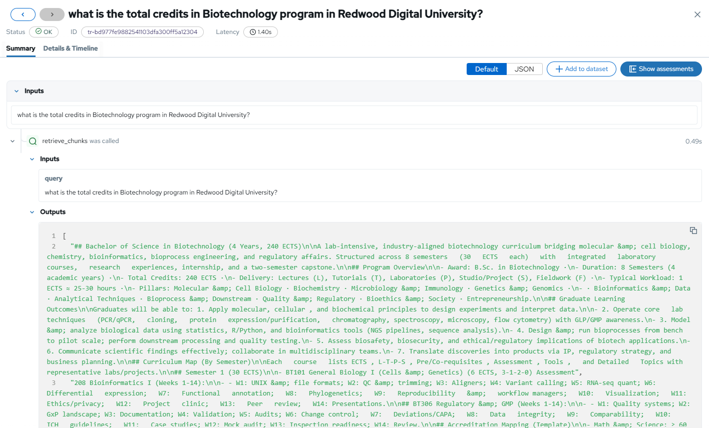
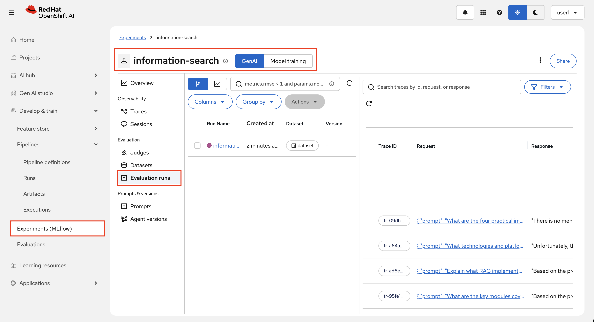

# Evaluate RAG

After we now have built a RAG system, I know what you all are thinking...


And I agree, so that's the end of this section!

...

However, since we already have an evaluation framework, it would be a shame not to use it, so let's add some evaluations to make sure our RAG performs as expected after all.  

For RAG we also have the retreived text chunks, so we can build tests for those too. Here we specifically test if the retrieved chunks are relevant to the user question, and if the LLM use them to ground the answer.  
MLflow have built-in tests for this that we will use, you can read more about them here: https://mlflow.org/docs/latest/genai/eval-monitor/scorers/llm-judge/rag/

To add our new RAG evaluations, we simply need to add a new eval folder with some tests in it.

1. Go to your workbench and navigate to `evals` folder.

2. Then start by creating a `information-search`, and `judge_prompt.txt` and `information_search_tests.yaml` files under it. Here are the commands if you don't want to do it manually:

    ```bash
    mkdir /opt/app-root/src/evals/information-search
    touch /opt/app-root/src/evals/information-search/information_search_tests.yaml
    touch /opt/app-root/src/evals/information-search/judge_prompt.txt
    ```

3. Add below text to the `judge_prompt.txt` in the `information-search` folder. The summarization's judge prompt penalises answers that introduce facts not present in the user's question, which would incorrectly fail valid RAG responses that draw from retrieved documents. That's why we need a RAG specific one:

    ```bash
    You are an expert evaluator judging the quality of a generated answer to a question.

    Your task is to decide whether the GENERATED_ANSWER correctly and faithfully answers the QUESTION, compared against the EXPECTED_ANSWER.

    A high-quality answer must satisfy ALL of the following criteria:
    - It correctly addresses the QUESTION
    - Its key facts and claims are consistent with the EXPECTED_ANSWER
    - It does not contradict or misrepresent information present in the EXPECTED_ANSWER
    - It is coherent and directly useful as a standalone answer

    INPUT:
    {{ inputs }}

    GENERATED_ANSWER:
    {{ outputs }}

    EXPECTED_ANSWER:
    {{ expectations }}

    Answer "yes" if the GENERATED_ANSWER meets all of the criteria above.
    Answer "no" if it gives incorrect information, contradicts the expected answer, or fails to address the question.

    Respond with only "yes" or "no".
    ```

4. Open up `evals/information-search/information_search_tests.yaml` and paste this to have a good baseline:


```yaml
name: information_search_tests
description: Tests for the information-search prompts of the Llama 3.2 3B model.
usecase: information-search
endpoint: /information-search
scorers:
  - answer_quality
  - retrieval_relevance
  - retrieval_groundedness
judge_prompt: judge_prompt.txt
tests:
  - inputs:
      prompt: "Describe the main learning outcomes for students completing the Advanced Generative AI Systems course."
    expectations:
      expected_result: "Students will learn to design GenAI applications, engineer prompts with evaluation, build production systems with CI/CD, implement RAG pipelines, secure LLM apps with guardrails, integrate multi-modal models, optimize models via quantization, instrument monitoring systems, orchestrate agents with tool-calling, and operate MaaS with APIs and governance."
  - inputs:
      prompt: "What are the key modules covered in weeks 5-8 of the AI501 curriculum?"
    expectations:
      expected_result: "Week 5 covers RAG Foundations (embeddings, chunking, ingestion pipelines), Week 6 covers Guardrails (safety taxonomies, filters, jailbreak defense), Week 7 covers Observability (tracing, metrics, logs, SLI/SLO), and Week 8 covers Tool-Calling & Agents (function calling, MCP, planner/critic loops)."
  - inputs:
      prompt: "What assessment components make up the AI501 course evaluation and what are their weightings?"
    expectations:
      expected_result: "Assessment includes Prompting & Eval Harness (10%), RAG Mini-System (15%), Guardrails & Red-Team (10%), Observability Pack (10%), Optimization Lab (10%), Agent with Tools (10%), Capstone (30%), and Participation (5%)."
  - inputs:
      prompt: "Explain what RAG implementation involves according to the course syllabus."
    expectations:
      expected_result: "RAG implementation involves building pipelines for ingestion, indexing, and retrieval with citations and provenance. Students learn embeddings, chunking strategies, ingestion pipelines, and create ETL→vector DB→retrieval→generation systems with citations."
  - inputs:
      prompt: "What technologies and platforms are used in the AI501 course infrastructure?"
    expectations:
      expected_result: "The course uses AI/ML platforms like Llama Stack and Hugging Face; development tools including Python, PyTorch, LangChain, Docker, and Kubernetes; infrastructure with GPU clusters and vector databases like Pinecone and Weaviate; plus security and monitoring tools for guardrails and observability."
  - inputs:
      prompt: "What are the four practical implementation tracks available in AI501?"
    expectations:
      expected_result: "The four tracks are: Production AI Systems (Llama Stack, GitOps, CI/CD), Knowledge Grounding (RAG design, vector DBs, doc pipelines), AI Safety & Security (Guardrails, red-teaming, observability), and Advanced Applications (Agents/tool-calling, multi-modal, model optimization)."
```
    

  **Note:** These prompts are for the course AI501, depending on what course you ingested before you may need to change them to match your content. To find good prompts and expected responses you can try running a few through the **Canopy UI** or **Gen AI Playground**.

5. After you are happy with the evaluation, make sure to commit it to git:

    ```bash
    cd /opt/app-root/src/evals
    git add .
    git commit -m "🥼 RAG eval added 🥼"
    git push
    ```

6. Remeber, our eval pipeline should trigger off of this git push! 🥳 Just like in the `Ready to Scale 201` section, you can go to OpenShift Pipelines to see how it's progressing.

  

7. While the pipeline is running, feel free to explore the traces from your RAG system by going `Develop & train` > `Experiments (MLflow)` > under **<USER_NAME>-test** project, check `information-search`'s Traces and see the document content being added to your prompt.

  
  

8. And after the pipeline is done, you can again see the evaluation results under `Experiments (MLflow)` > under **<USER_NAME>-toolings** project.

  

