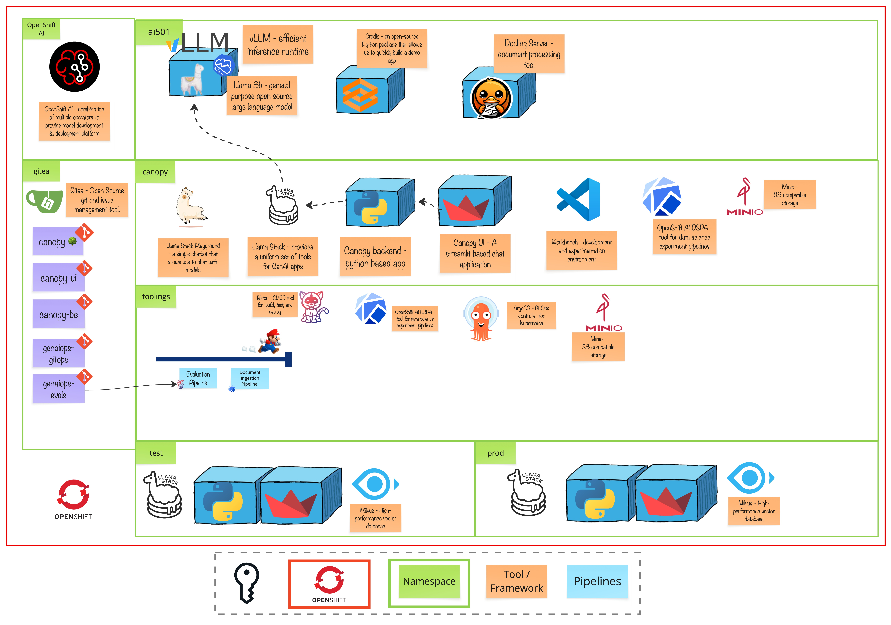

# Module 6 - Grounded AI

> Teaching an AI to remember is like giving it a library card. Without access to external knowledge, even the smartest model is limited to what it learned during training. With RAG, your AI can look up, learn from, and reason about any document you provide 📚

# 🧑‍🍳 Module Intro

This module bridges the gap between basic AI interactions and intelligent systems that can learn and recall from your specific documents and knowledge bases. You'll discover how Retrieval Augmented Generation (RAG) transforms static AI models into dynamic assistants that can reference course materials, institutional documents, and student submissions.

At RDU, we're building Canopy to help educators and students interact with vast amounts of academic content. RAG is the technology that makes this possible, turning your documents into searchable, queryable knowledge that enhances every AI interaction.

# 🖼️ Big Picture

# 🔮 Learning Outcomes

* Understand RAG and how it gives AI access to your course materials
* Deploy vector databases and build RAG systems with LlamaStack
* Process complex PDFs and documents using Docling
* Create intelligent educational assistants that cite their sources
* Deploy production-ready knowledge systems using GitOps

# 🔨 Tools used in this module

* **LlamaStack RAG APIs**: Three-layer architecture for building retrieval-augmented applications
* **Milvus Vector Database**: High-performance vector database for semantic search and retrieval
* **Docling**: Advanced document processing pipeline for PDF analysis and content extraction
* **RAG Tools**: Document ingestion, chunking, and querying capabilities
* **Vector IO & KeyValue IO**: Low-level storage interfaces for different data types
* **OpenShift & Helm Charts**: To deploy RAG infrastructure in development and production environments
* **Enhanced Canopy**: Your educational AI assistant, now with memory and document awareness