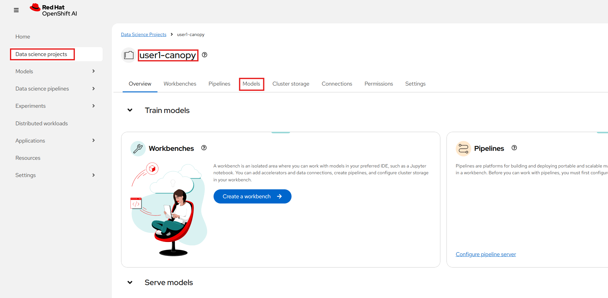
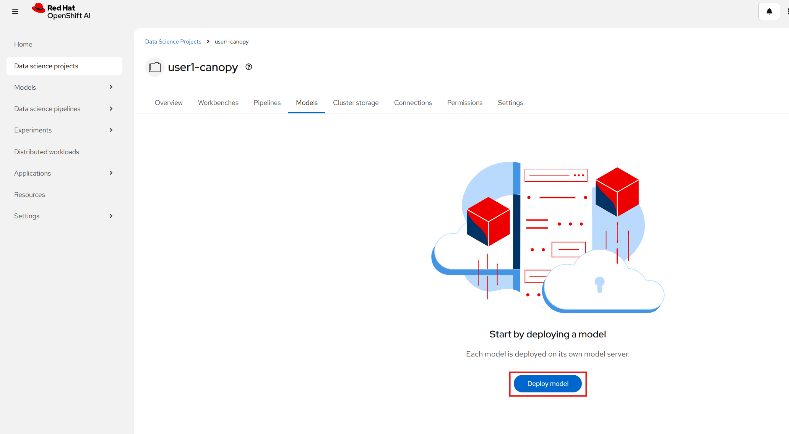
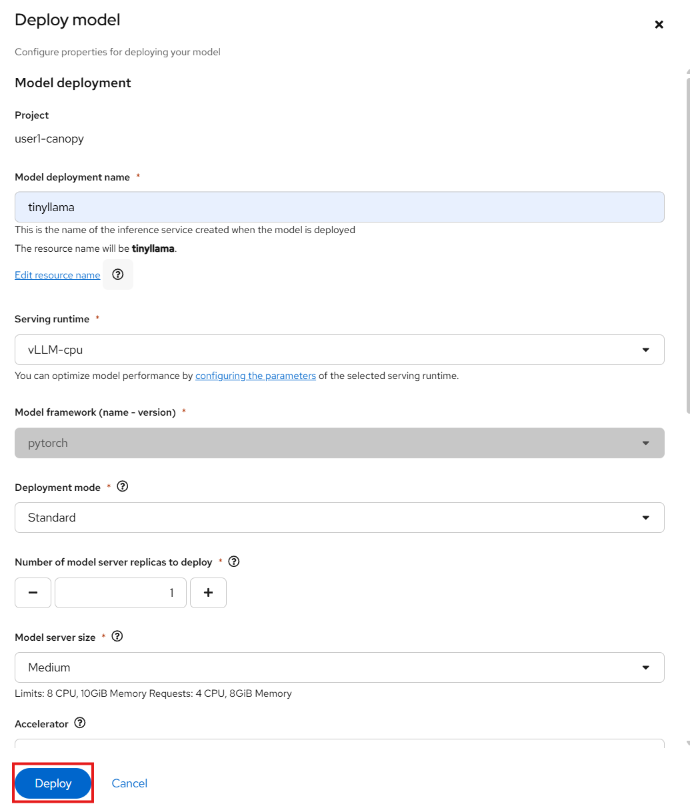

<!-- ## 📘 LLM 101: Understanding and Deploying Language Models

Before we start building adaptive, student-centered learning tools with Canopy AI, we need to understand the foundational technology behind it: **Large Language Models (LLMs)**.

This chapter will help you:

* Understand what LLMs are
* Learn how to evaluate which model fits your use case
* Deploy your first LLM on OpenShift AI


## 🧠 What is a Large Language Model?

A **Large Language Model (LLM)** is a type of AI model trained on vast amounts of text to understand, generate, and manipulate human language. These models are built using **transformer architectures** and learn patterns in text, allowing them to answer questions, generate content, and provide useful responses in natural language.

LLMs power many educational tools—from tutoring chatbots to automatic feedback systems—because they can adapt responses based on input and context.

--- -->

## What models are available to me to run on prem? 
QQ: should we address local development?

### 📄 How to Read a Model Card

Every well-documented LLM (on platforms like [Hugging Face](https://huggingface.co/models)) comes with a **model card**. This is like a fact sheet for the model. When evaluating models for Canopy AI, here’s what to look for:

| Section                   | What to Look For                                                          |
| ------------------------- | ------------------------------------------------------------------------- |
| **Model Architecture**    | Is it based on LLaMA, Mistral, GPT, etc.?                                 |
| **Size (parameters)**     | More parameters often = more capability, but also more resource-intensive |
| **Intended Use**          | Is it optimized for instruction-following, general chat, code, etc.?      |
| **Training Data**         | Does it align with educational use? Was any filtering done?               |
| **Limitations**           | Any known biases or weaknesses?                                           |
| **License**               | Is it open for commercial/educational use?                                |
| **Hardware Requirements** | CPU-only, GPU-required, or specific memory constraints?                   |

Example: Phi-2 is a small (\~2.7B) model trained for reasoning and aligned with safety for education-friendly use. Mistral 7B is larger but more performant if you have the resources.

## 💻 What Are the Infrastructure Requirements?

Not every model needs a high-end GPU, but some certainly do. Here's a rough rule of thumb:

* **<3B models**: Run comfortably on a single modern GPU (\~8–12GB VRAM).
* **7B–13B models**: Require ≥24GB GPU memory, or offloading with quantization (e.g., 4-bit).
* **>30B models**: Need multi-GPU setups or high-memory accelerators like A100s.

🧮 A helpful reference:
👉 [How to calculate GPU memory needs for LLMs (Substratus.ai)](https://www.substratus.ai/blog/calculating-gpu-memory-for-llm)

Example:

> A 7B parameter model in 16-bit precision needs roughly **14GB of GPU memory**. Using 4-bit quantization can bring it down to \~4–5GB.
_and don't worry if you are not familiar with quantization concept. We'll tackle that as well 😌_ 

**Don’t have a GPU?**
You can use:

* **CPU-only runtimes** (slow, but OK for demos or small models)
* **Shared GPU workloads** on OpenShift AI
* Pre-deployed endpoints (if your environment has them)


## 🚀 How Do I Deploy and Serve a Model?

Serving a model means making it accessible via an endpoint that applications (like our prompt playground) can call.

In OpenShift AI, we can use **KServe** to deploy models as containerized workloads.

You get to choose between and try a few different models, to pick the one you think fits best.

Here's how to deploy the model(s):

#TODO: Go through Model Catalog instead

1. Go to OpenShift AI -> Data Science Projects -> <USER_NAME>-canopy -> Models

2. Click Deploy model

3. Fill in the form with the following settings (depending on what model you want to deploy):
- Model deployment name: `tinyllama`, `llama3.2-3b` or `granite-2b`
- Serving runtime: `vLLM-CPU`
- Deployment Mode: `Standard`
- Number of model server replicas to deploy: `1`
- Model server size: `Medium`
- Accelerator: `None`
- Model route:
  -  **Uncheck** `Make deployed models available through an external route`
  -  **Uncheck** `Require token authentication`
- Source model location: `Existing connection` -> `tinyllama`, `llama3.2-3b` or `granite-2b`


    ..leave the rest as it is and hit `Deploy`



You should now see a model start deploying, wait until it turns green.


Feel free to deploy the other models as well, so that you can compare them and choose which one you like the most.


## 🌐 How Do I Access the Model?

Once deployed, your model gets a REST endpoint like:

```
https://canopy-llm-modelmesh-serving.apps.YOUR_CLUSTER_DOMAIN/v2/models/canopy-llm/infer
```

This endpoint accepts **standardized inference requests** and responds with generated text or predictions.

You’ll use this endpoint in the next chapter’s playground app to test prompts and observe model behavior.
