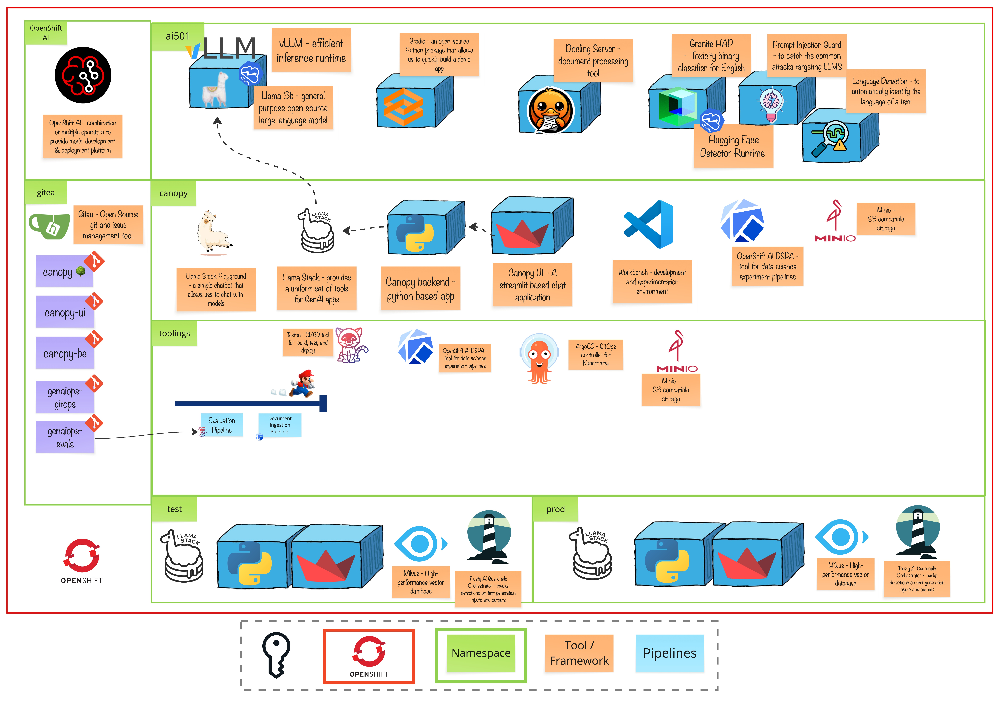

# Module 6 - The Honor Code

> Building AI you can trust means setting boundaries. Just like a good teacher establishes classroom rules, guardrails ensure your AI stays helpful, harmless, and honest 🛡️

# 🧑‍🍳 Module Intro

This module introduces the critical practice of implementing safety guardrails for AI applications. You'll learn how to protect your educational AI assistant from misuse, ensure responsible interactions, and build layered security that goes beyond simple prompt engineering. From basic system prompts to sophisticated detection systems, you'll discover how to balance AI capabilities with safety and compliance.

At RDU, we're committed to building Canopy as a trustworthy educational tool. Guardrails are what transform a powerful language model into a responsible assistant that students and educators can rely on without concerns about academic integrity, bias, or harmful content.

# 🖼️ Big Picture

# 🔮 Learning Outcomes

* Understand what guardrails are and why they're essential for production AI applications
* Learn the limitations of prompt-level guardrails and why they need external enforcement
* Deploy and configure Trusty AI Guardrails Orchestrator for multi-layered safety
* Integrate detection systems including regex filters, HAP (Hate, Abuse, Profanity), prompt injection detection, and language detection
* Combine system prompts with detector-based guardrails for robust safety policies
* Test and harden your AI application against creative attempts to bypass safety measures

# 🔨 Tools used in this module

* **Trusty AI Guardrails Orchestrator**: External policy layer that coordinates multiple safety detectors before content reaches the LLM or user
* **Llama Stack Safety APIs**: Integration layer for guardrails providers and safety shields
* **Regex Detectors**: Pattern-based filters for blocking or flagging specific content patterns
* **HAP Detector**: Classifier for detecting hate speech, abuse, and profanity
* **Prompt Injection Detector**: Security layer to identify attempts to manipulate the AI's behavior
* **Language Detector**: Multilingual safety to ensure compliance across different languages
* **Llama Stack Playground**: Interactive environment for testing security shields and system prompts
* **OpenShift & Helm Charts**: To deploy guardrails infrastructure in development environments
