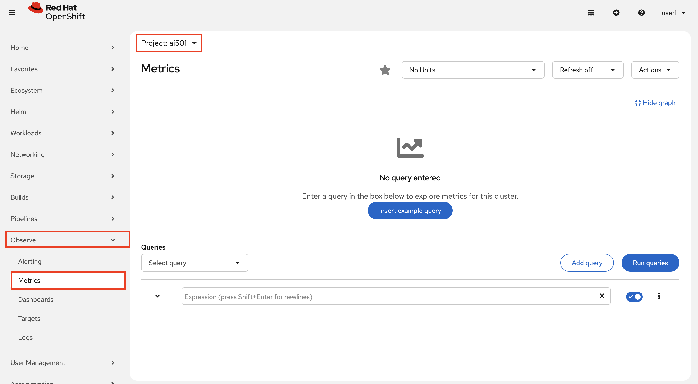
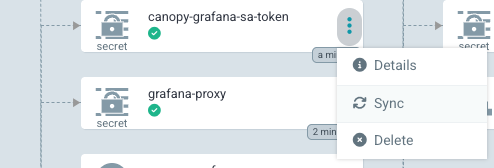
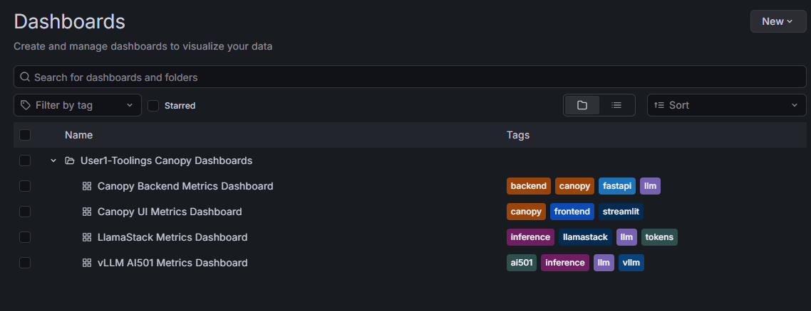

# 📊 Metrics: Measuring What Matters

## Exploring vLLM Metrics in RHOAI Observability Stack

Before deploying visualization tools, it's valuable to query metrics directly in Prometheus. This helps you understand the raw data before abstracting it into dashboards.

Here you all **share a single llama-3.2 model** deployed in the `ai501` namespace. This shared model serves as the LLM backend for everyone's CanopyUI applications.

<!-- Why share a model? Running large language models requires significant GPU resources. By deploying one shared inference service, the lab environment can support many students simultaneously without requiring dedicated GPUs for each user. Your Canopy application sends requests to this shared vLLM endpoint, which processes them and returns generated text. -->

The vLLM inference engine powering this shared model automatically exports metrics about token generation, request processing, and model performance. These metrics flow into Prometheus automatically as the model is part of OpenShift AI's managed infrastructure.

> If you're curious about the technical details, you can see the InferenceService configuration [here](https://github.com/rhoai-genaiops/deploy-lab/blob/main/student-content/templates/cloud-model/inferenceservice.yaml#L33) - this defines how the llama-3.2 model is deployed and exposed.

### Exploring vLLM Metrics in RHOAI Prometheus

Prometheus has been collecting metrics from the shared vLLM model since it was deployed. Let's query them directly to understand what raw metrics look like before we visualize them in Grafana.

1. Open the OpenShift Metrics Dashboard for the `ai501` namespace by going `Observe` > `Metrics`. 

   

2. In the query box, enter this PromQL query and hit Enter (or click "Run Queries") to see the total tokens generated by the shared model:

   ```promql
   vllm:generation_tokens_total{namespace="ai501"}
   ```

   

   This shows cumulative tokens the shared llama-3.2 model has generated across all users - a proxy for how much AI assistance the entire lab is providing.

   _Note: You may see an "Access restricted" warning - this is cosmetic and doesn't affect the metric query._

3. Check the shared model's request success rate with this query:

   ```promql
   rate(vllm:request_success_total{namespace="ai501"}[5m])
   ```

   

   This shows successful requests per second for the shared inference service. A sudden drop indicates something's wrong with the model or infrastructure affecting all users.

## Visualizing Metrics in Grafana

While Prometheus queries are powerful for investigation, Grafana dashboards make metrics accessible to everyone on your team. No one wants to write PromQL just to check if the system is healthy!

The RHOAI Observability stack collects platform-wide metrics, but these are generic infrastructure signals that don't reveal application-specific insights about your Canopy deployment. To visualize what matters for your AI assistant - token usage patterns, LLM latency, backend API performance - you need custom Grafana dashboards that query Prometheus with filters specific to your namespace and components.

### Deploy Grafana

Let's deploy a Grafana instance in your toolings namespace to support the end-to-end observability journey for Canopy. Install it through your GitOps workflow in `genaiops-gitops/toolings/`:

1. Create `grafana` folder under `toolings`. And then create a file called `config.yaml` under `grafana` folder. Or simply run the below commands:

    ```bash
    mkdir /opt/app-root/src/genaiops-gitops/toolings/grafana
    touch /opt/app-root/src/genaiops-gitops/toolings/grafana/config.yaml
    ```

2. Open up the `grafana/config.yaml` file and paste the below line to let Argo CD know which chart we want to deploy.

    ```yaml
    chart_path: charts/grafana
    ```

3. Commit the changes to the repo as you've done before.

    ```bash
    cd /opt/app-root/src/genaiops-gitops
    git pull
    git add .
    git commit -m "📈 Grafana added 📈"
    git push
    ```

4. Once this change has been sync'd (you can check this in Argo CD), let's login to Grafana by clicking [here](https://canopy-grafana-route-<USER_NAME>-toolings.<CLUSTER_DOMAIN>) and view the predefined dashboards for canopy. Alternatively, you can use the run the below command in your code-server workbench terminal:

    ```bash
    # get the route and open it in your browser
    echo https://$(oc get route canopy-grafana-route --template='{{ .spec.host }}' -n <USER_NAME>-toolings)
    ```

    Use your OpenShift credentials and click `Allow selected permissions` to log in.

> If ArgoCD gets stuck while syncing, click on Synching, Terminate the sync, and then manually sync the `canopy-grafana-sa-token` object by clicking the 3 dots and triggering a sync for that CR object.

   

5. Create a connection to the Prometheus data source: navigate to **Connections** → **Data sources** then choose **UWM Prometheus** scroll down and click **Save & test**.

   

   

   _If you don't see the data sources, that means they haven't synced yet. Just refresh the page a couple of times :)_


6. To view the dashboards, navigate to **Dashboards** → **Browse** and look for the `<USER_NAME>-toolings Canopy Dashboards` folder.

   

   _If you don't see all the dashboards, that means they haven't synced yet. Just refresh the page a couple of times :)_


If you want to explore the dashboards more in depth, please check the [Extra Credits](6-observability/6-extra-credit-metrics-dashboard) section 🤓


## 🎯 Next Steps: Understanding Behavior with Logs

Metrics tell you **how much** and **how fast**, but not **what's happening** inside your application. When metrics show a problem (success rate dropping, latency spiking), you need details about what went wrong.

For that, we need logs - detailed records of every event in Canopy's operation. Continue to **[Logging](6-observability/3-logging.md)** to learn how to collect and query Canopy's logs 📝
