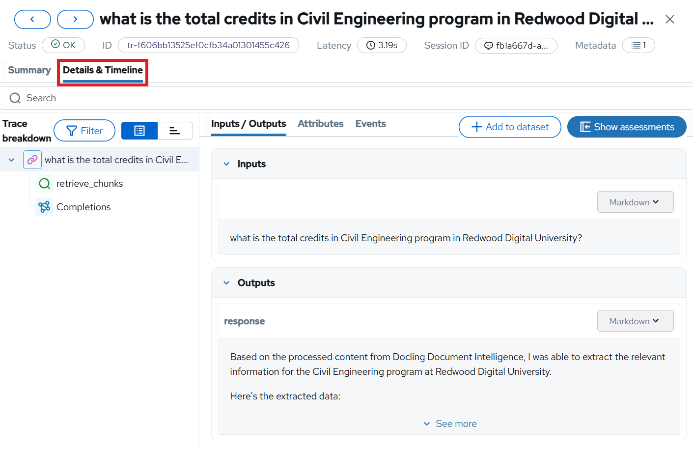
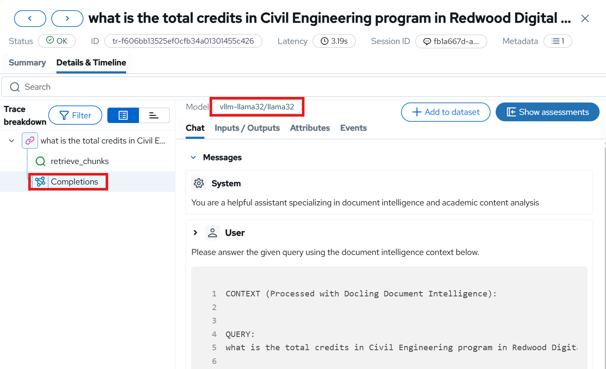
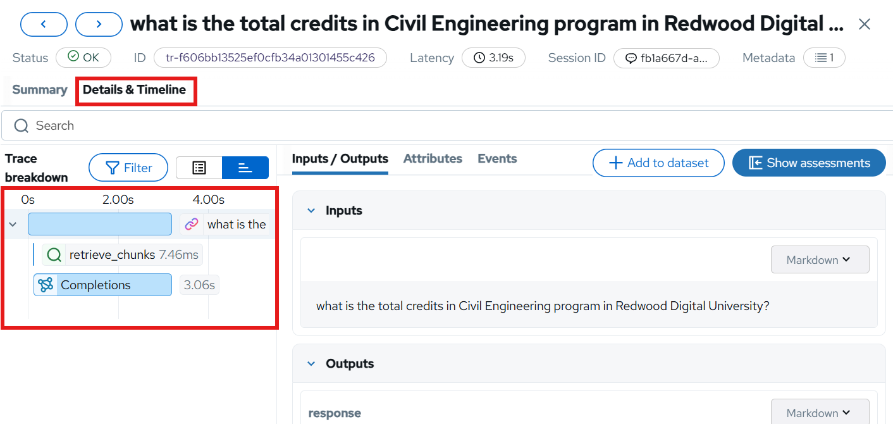

# 🔍 Tracing: Following the Journey

When a student asks Canopy "Explain quantum entanglement," that simple question triggers a complex dance across multiple services. 

How do you know where time is spent? Which service is the bottleneck? Where errors actually originate? **Distributed tracing** answers these questions by connecting the dots across your entire system, showing you the complete journey of each request.

## Understanding Distributed Tracing

Imagine following a student through their day on campus - from the library to the lab to office hours. You'd see where they spend the most time, where they get stuck, and what path they take (in a totally non-creepy, hypothetical way of course). Distributed tracing does this for requests traveling through Canopy's microservices.

Each service instruments its code to emit **spans** - records of work done. These spans include:
- **Operation name**: What work was performed (e.g., "RAG query", "LLM inference")
- **Duration**: How long it took (critical for finding bottlenecks)
- **Parent span**: What triggered this operation (builds the request tree)
- **Attributes**: Metadata like user ID, query text, documents retrieved, tokens generated

When spans are connected by parent-child relationships, they form a **trace** - the complete story of a single request from the student's question to Canopy's answer.

In this trace visualization, you can see the waterfall view showing:
- Total request time and each service's contribution
- Which operations run sequentially vs. in parallel
- Where the most time is spent (the longest bars)
- Parent-child relationships (the tree structure)

## Auto Tracing with MLflow

MLflow has something called autologging which automatically captures any relevant requests whenever enabled.  
We will use it here to capture all our OpenAI calls, which is what we use to communicate with the model from the backend.  
You have already seen the traces in MLFlow, but let's also inspect the timeline data it captures.  
For now it will be fairly simple tracing, but you will se it more complex tracing as soon as we get to agents 🤖

1. Go to OpenShift AI -> Develop & train -> Experiments (MLflow) -> <USER_NAME>-test project

2. Choose either the summarization or information-search experiment. Information Search will have a bit more tracing but both are fine

3. Go into Traces and choose the latest trace you sent and go to `Details & Timelines`

   

4. In here you can see the full breakdown of the trace, including all spans and relevant metadata.  
   Click around a bit and see what's described in each span. You will even find information about which model was used if you look under `Completions`

   

5. You can also press the `Timeline` buttton to get a full breakdown of how long each span took

   

Note that this trace only captures spans that MLflow directly sees, so we don't have OGX or the frontend in here for example.  
To add more information about parts of the stack outside MLflow we can `instrument` those pieces, either automatically or manually.  
Since MLflow gives us all the information relevant for us right now though, we will not be doing any instrumentation here.

You now have the three pillars of observability in place: metrics, logs, and traces. But there's one more signal that matters for AI systems -- **user feedback**. How do you know if your customers are happy with the AI's responses?
