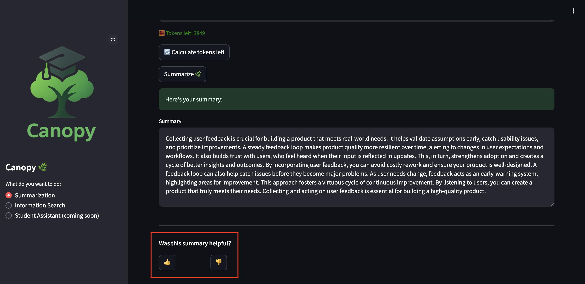
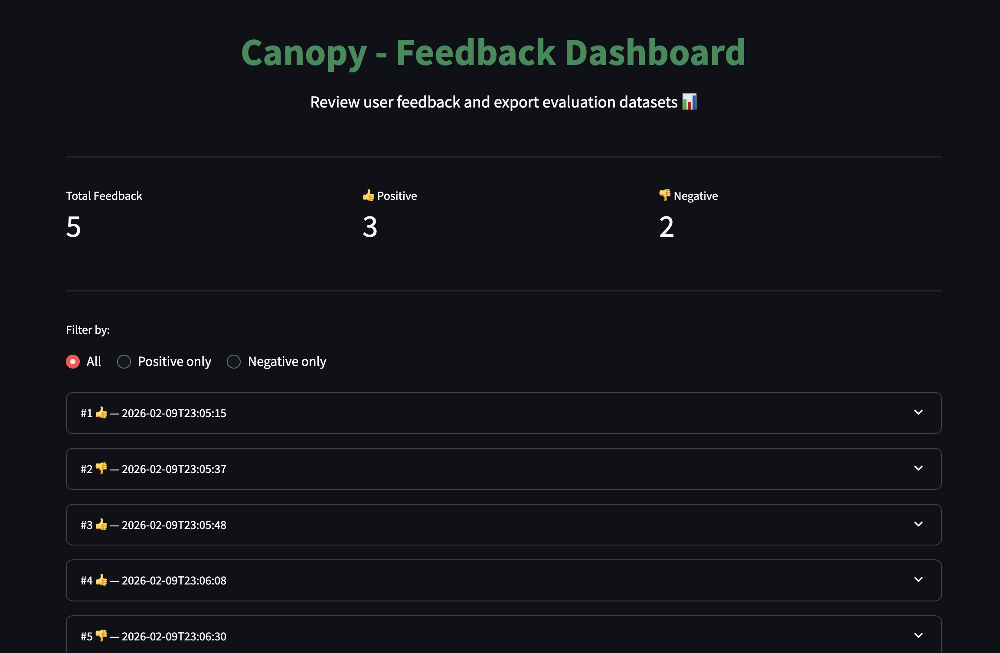
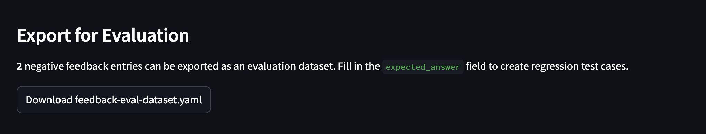
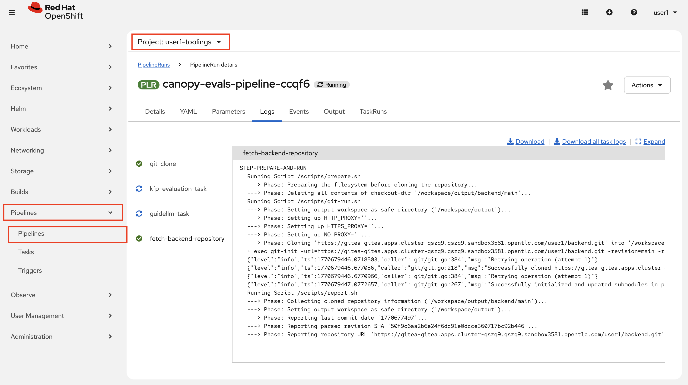
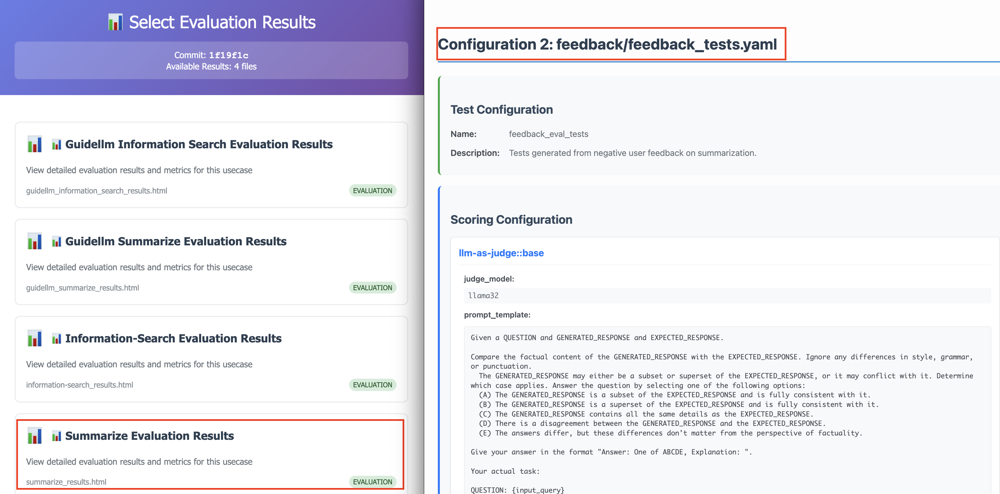
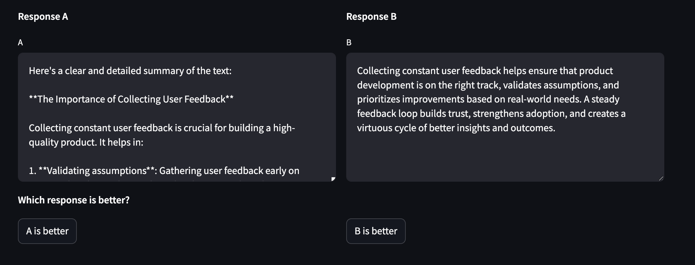
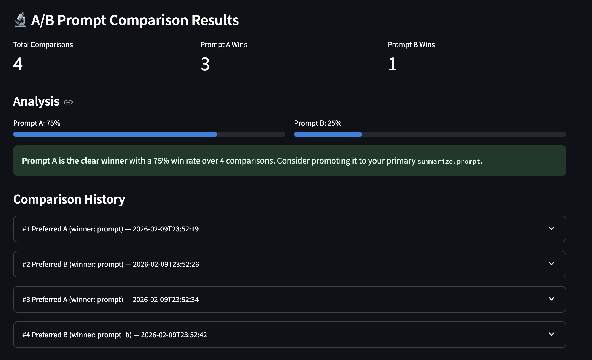

# 🔄 Feedback Loops

Metrics tell you *how fast* your system runs. Logs tell you *what happened*. Traces tell you *where time was spent*. But none of them answer the most important question: **are your users actually satisfied with the AI's responses?**

User feedback is the missing piece that closes the GenAIOps loop. By collecting thumbs up/down signals from users, you get direct evidence of where your AI succeeds and where it fails -- and you can feed that evidence back into your evaluation pipeline to systematically improve your system.

## Why Feedback Matters

Consider this scenario: your Canopy summarization feature has great latency (metrics look healthy), no errors in the logs, and clean traces through LlamaStack. Everything *looks* fine from an infrastructure perspective. But users are consistently getting poor summaries for some prompts because the system prompt isn't well-tuned for certain types of input, and you are not capturing this use case in the evals and you are not aware of it!

Without user feedback, you'd never know. The observability pillars you've learned (metrics, logs, traces) monitor **system health**. Feedback monitors **output quality** -- and that's what ultimately matters for AI applications.

The feedback loop connects observability to action:

1. **Deploy** your AI application
2. **Observe** its behavior (metrics, logs, traces)
3. **Collect feedback** from users
4. **Evaluate** using negative feedback as test cases
5. **Improve** prompts or models based on evaluation results
6. **Redeploy** and repeat

## Enable the Feedback Feature

The feedback feature is behind a feature flag, just like the other Canopy capabilities you've enabled throughout this course.

Let's directly do this in `test` environment for simplicity.

1. In your workbench, go to your `backend` repo and update `chart/values-test.yaml` to enable feedback. Let's first pull the changes though:

    ```bash
    cd /opt/app-root/src/backend
    git pull
    ```

   And update `chart/values-test.yaml` by adding the below block:

   ```yaml
   feedback:
     enabled: true
   ```

2. Commit and push your changes. Wait for ArgoCD to sync the deployment.

    ```bash
    cd /opt/app-root/src/backend
    git add .
    git commit -m  "🫶 Enable feedback collection 🫶"
    git push origin main
    ```

3. Open your Canopy UI in test environment and pick **Summarization**:

   ```bash
   https://canopy-ui-<USER_NAME>-test.<CLUSTER_DOMAIN>/
   ```
4. Paste some text and click **Summarize**

   ```bash
   Collecting constant user feedback is one of the most reliable ways to make sure you’re building the right thing—and building it well. It helps you validate assumptions early, catch usability issues before they turn into costly rework, and prioritize improvements based on real-world needs instead of internal guesses. A steady feedback loop also makes product quality more resilient over time: as user expectations, workflows, and constraints change, feedback acts like an early-warning system that surfaces friction, confusion, and missing capabilities. Just as importantly, it builds trust—when users see their input reflected in updates, they feel heard and become more willing to engage, which strengthens adoption and creates a virtuous cycle of better insights and better outcomes.
   ```

5. After the summary appears, you should see a **"Was this summary helpful?"** prompt with thumbs up and thumbs down buttons 👍👎

   Click thumbs down on a summary you find unsatisfactory 🥺 👎 

   Click thumbs up on a summary that works well 🥹 👍

6. Try a few more to generate some data, give some thumbs up and downs, then we'll review the result!

   

## Review Feedback in the Dashboard

We created a dedicated Feedback Dashboard accessible at `/feedback`. Think this like a "admin view" page. The purpose is to give you a product-level view of how users are responding to the AI.

1. In your browser, navigate to your Canopy UI URL and append `/feedback` to the path.

   ```bash
   https://canopy-ui-<USER_NAME>-test.<CLUSTER_DOMAIN>/feedback
   ```

2. You should see:
   
   - **Metrics** at the top: total feedback count, positive count, negative count

   - **Filter controls** to view all, positive only, or negative only

   - **Collapsible entries** for each feedback submission -- click to expand and see the full prompt and response

   

3. Expand a few entries and review the full text. Notice how the dashboard gives you immediate visibility into which prompts produced unsatisfactory results.

4. At the bottom, you'll find an **Export for Evaluation** section (if there are any negative feedback entries). We'll use this in the next steps. Because what good does collecting feedback do if you are not act on them? 🙃

## From Feedback to Evaluations

Collecting feedback is only half the story. The real value comes from using negative feedback to improve your AI system. Let's export the thumbs-down feedback as an evaluation dataset.

1. The very first thing you need to do is to improve your system prompts to turn these frowns into happy faces. There are several approaches to prompt optimization -- from manual iteration (which we're performing now) to automated techniques like [DSPy](https://dspy.ai/) (which programmatically optimizes prompts using training examples) or [MLflow's prompt engineering tools](https://mlflow.org/docs/latest/llms/prompt-engineering/index.html) (which we can discuss further). Even simple manual changes (being more specific, adding examples, adjusting tone) can make a big difference.

    But here's the catch: how do you know your improved prompt doesn't *regress* on the cases that were already working? That's exactly why we turn negative feedback into evaluation test cases. The thumbs-down entries become regression tests -- so when you tweak your prompt, you can verify it fixes the bad cases without breaking the good ones.

2. In the Feedback Dashboard (`/feedback`), scroll to the **Export for Evaluation** section and click **Download feedback-eval-dataset.yaml**.

   

   You can also export from the terminal. Actually let's do that for the simplicity. First create a folder specific for the feedback evals and set up the judge prompt:

   ```bash
   mkdir /opt/app-root/src/evals/
   cd /opt/app-root/src/evals/
   cp Summary/judge_prompt.txt feedback/
   ```

   Then export the dataset:

   ```bash
   cd /opt/app-root/src/evals/feedback
   curl -s http://canopy-backend.<USER_NAME>-test.svc.cluster.local:8000/feedback/export -o feedback_tests.yaml
   ```

3. The output matches the same `summary_tests.yaml` format used by the Canopy evaluation suite:

   ```yaml
   name: feedback_eval_tests
   description: Tests generated from negative user feedback on summarization.
   endpoint: /summarize
   scoring_params:
     llm-as-judge::base:
       judge_model: llama32
       prompt_template: judge_prompt.txt
       type: llm_as_judge
       judge_score_regexes:
       - 'Answer: (A|B|C|D|E)'
     basic::subset_of: null
   tests:
   - prompt: "the text that got a thumbs down"
     expected_result: ""
   ```

4. As the human in the loop needs to check what is the response that user is not happy with and fill in the `expected_result` field with what a good summary should look like for each case. This turns real user dissatisfaction into concrete test cases.

   So feel free to do that! 😌

5. After that, let's push the changes and trigger the evals pipeline once again!

    ```bash
    cd /opt/app-root/src/evals/
    git add .
    git commit -m "👍 Evals based on feedback added 👍"
    git push
    ```

6. And change your summarization prompt under `backend/chart/values-test.yaml` file to see the effect:

   ```yaml
   summarize:
     enabled: true
     model: vllm-llama32/llama32
     temperature: 0.9
     max_tokens: 4096
     prompt: | # 👈 Update this ❗︎
       Summarize the following text in a clear and detailed manner:
   ```

   ..and push the changes:

    ```bash
    cd /opt/app-root/src/backend
    git add .
    git commit -m  "🏃 kick off the evals pipeline 🏃"
    git push origin main
    ```

7. Observe that evals pipeline kicked off after your push:

   

   After it is complete, you can check the results in [Prompt Tracker](https://prompt-tracker-ai501.<CLUSTER_DOMAIN>/<USER_NAME>/<CLUSTER_DOMAIN>) and see how well your system did. 

   The feedback tests have endpoint: `/summarize`, same as your Summary tests. The pipeline groups HTML results by endpoint, so the feedback test results would be merged into the same `Summarize Evaluation Results`.

   


## A/B Testing: Data-Driven Prompt Engineering

Collecting thumbs up/down feedback tells you *whether* users are satisfied -- but it doesn't tell you *which system prompt is better*. A/B testing solves this by running the same user input through two different system prompts simultaneously and letting the user pick the better response.

Instead of guessing which prompt produces better summaries, you let real users decide -- just like how production ML systems compare model variants.

### Configure Prompt B

1. In your workbench, go to your `backend` repo and open up `chart/values-test.yaml`. First, let's disable thumbs up/downs:

   ```yaml
   feedback:
     enabled: false # 👈 DISABLE IT ❗︎
   ```


2. In the same file, for `summarize`,  add an alternative prompt with `prompt_b` key. Also enable A/B testing:

   ```yaml
   summarize:
     enabled: true
     model: llama32
     prompt: |
      Summarize the following text in a clear and detailed manner:
     prompt_b: |                         # 👈 ADD under your current prompt. Feel free to get creative 🤸
       Provide a brief, concise summary:  # 👈 ADD under your current prompt. Feel free to get creative

   ab_testing: # 👈 AND ADD THIS ❗︎
     enabled: true  # 👈 AND ADD THIS ❗︎
   ```

   Make sure `feedback: enabled: true` is also set -- A/B testing builds on the feedback infrastructure.

3. Commit and push your changes. Wait for ArgoCD to sync the deployment.

    ```bash
    cd /opt/app-root/src/backend
    git add .
    git commit -m  "💙 A/B Testing enabled 💚"
    git push origin main
    ```

4. Open your Canopy UI again and pick **Summarization**:

   ```bash
   https://canopy-ui-<USER_NAME>-test.<CLUSTER_DOMAIN>/
   ```

5. Paste the same text if you wish and click **Summarize**

   ```bash
   Collecting constant user feedback is one of the most reliable ways to make sure you’re building the right thing—and building it well. It helps you validate assumptions early, catch usability issues before they turn into costly rework, and prioritize improvements based on real-world needs instead of internal guesses. A steady feedback loop also makes product quality more resilient over time: as user expectations, workflows, and constraints change, feedback acts like an early-warning system that surfaces friction, confusion, and missing capabilities. Just as importantly, it builds trust—when users see their input reflected in updates, they feel heard and become more willing to engage, which strengthens adoption and creates a virtuous cycle of better insights and better outcomes.
   ```

6. When you click `Summarize`, two columns should appear: **Response A** and **Response B** -- both stream simultaneously from different prompts

   

   After both responses complete, two buttons appear: **A is better** and **B is better**

7. Pick your preference and try a couple of more to generate some data. The system records which actual prompt won.

8. Let's navigate to the Feedback Dashboard again. You'll see win-rate metrics: how many times Prompt A won, Prompt B won. Expand individual entries to see both responses side-by-side along with the user's preference.

   


### Act on the Data

When one prompt consistently wins across multiple comparisons:

1. Let's promote the winning prompt to `summarize.prompt` in your GitOps config. Copy the prompt your users liked the most, and paste it for `prompt:` key. Andemove `prompt_b`.

2. Disable `feedback` and `ab_testing` by setting the `enabled` value to `false`.

   So your `backend/chart/values-test.yaml` file should look like below:

    <div class="highlight" style="background: #f7f7f7">
    <pre><code class="language-yaml">
      LLAMA_STACK_URL: "http://llama-stack-service:8321"
      summarize:
        enabled: true
        model: vllm-llama32/llama32
        temperature: 0.9
        max_tokens: 4096
        prompt: |
          Provide a brief, concise summary: 
      information-search: 
        enabled: true
        vector_db_id: genaiops_2026_02_09_22_26
        model: llama32
        prompt: |-
          You are a helpful assistant specializing in document intelligence and academic content analysis.
      feedback:
        enabled: false
      ab_testing: 
        enabled: false 
    </code></pre></div>

3. Commit, push, and let ArgoCD redeploy:

    ```bash
    cd /opt/app-root/src/backend
    git add .
    git commit -m  "🦋 System prompt updated based on feedback 🦋"
    git push origin main
    ```


This creates a continuous improvement cycle driven by real user preferences rather than subjective judgment.

## The GenAIOps Lifecycle

What you've built in this section completes the GenAIOps lifecycle:

```
  Deploy AI App
       |
       v
  Observe (Metrics, Logs, Traces)    <-- Module 6.1-6.4
       |
       v
  Collect User Feedback              <-- This section
       |
       v
  Export as Eval Dataset
       |
       v
  Run Evaluations (Module 4)
       |
       v
  Improve Prompts / Models
       |
       v
  Redeploy (GitOps)                  <-- Module 3
       |
       '-------> back to Observe
```

This is the fundamental difference between a demo AI project and a production AI system: production systems **learn from their users** and **improve systematically**. Observability gives you the infrastructure to make that possible.

In this section, we collected user feedback with thumbs up/down, turned negative feedback into evaluation test cases, used A/B testing to compare prompts side-by-side, and promoted the winning prompt -- all through GitOps. Next, we'll look at how to protect your AI application from harmful inputs and outputs with **guardrails**.

--


<!-- 

## See Feedback in Logs (LokiStack)

Every feedback submission is logged as structured JSON on STDOUT -- which means LokiStack automatically collects it. Let's find the feedback events.

1. Navigate to **OpenShift Console -> Observe -> Logs**

2. Click **Show Query** and paste this LogQL query to find all feedback events:

   ```logql
   { log_type="application", kubernetes_pod_name=~"canopy-backend.*", kubernetes_namespace_name="<USER_NAME>-canopy" } |= `feedback_submitted` | json
   ```

3. You should see structured JSON entries for each feedback submission with fields like:
   - `rating`: `"thumbs_up"` or `"thumbs_down"`
   - `feature`: `"summarize"`
   - `input_length` and `response_length`: size of the text
   - `timestamp`: when the feedback was submitted

4. Filter for only negative feedback to find problem areas:

   ```logql
   { log_type="application", kubernetes_pod_name=~"canopy-backend.*", kubernetes_namespace_name="<USER_NAME>-canopy" } |= `feedback_submitted` | json | rating="thumbs_down"
   ```

   This is the query an operations team would use to monitor user satisfaction in real-time.

## See Feedback in Traces (Tempo)

Since Canopy Backend has OpenTelemetry auto-instrumentation enabled (via the `instrumentation.opentelemetry.io/inject-python` annotation), every `POST /feedback` request automatically generates a trace span.

1. Open the **Canopy Distributed Traces** dashboard in Grafana
2. Look for traces containing `POST /feedback` operations
3. Click a trace to see the span details including timing and HTTP status

No extra code was needed for this -- the auto-instrumentation you configured in the earlier tracing section handles it automatically. This demonstrates the power of the OpenTelemetry approach: new endpoints get observability for free.

## See Feedback in Metrics (Prometheus)

The auto-instrumented OpenTelemetry SDK also emits HTTP server metrics for every FastAPI endpoint. You can track feedback submission volume in Prometheus.

1. Navigate to **OpenShift Console -> Observe -> Metrics**

2. Query for feedback request count:

   ```promql
   http_server_request_count{http_route="/feedback", namespace="<USER_NAME>-canopy"}
   ```

   This shows the total number of feedback submissions over time. -->