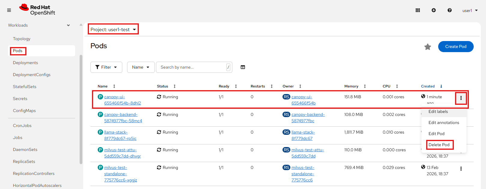
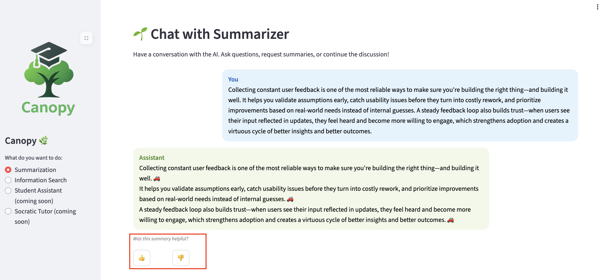
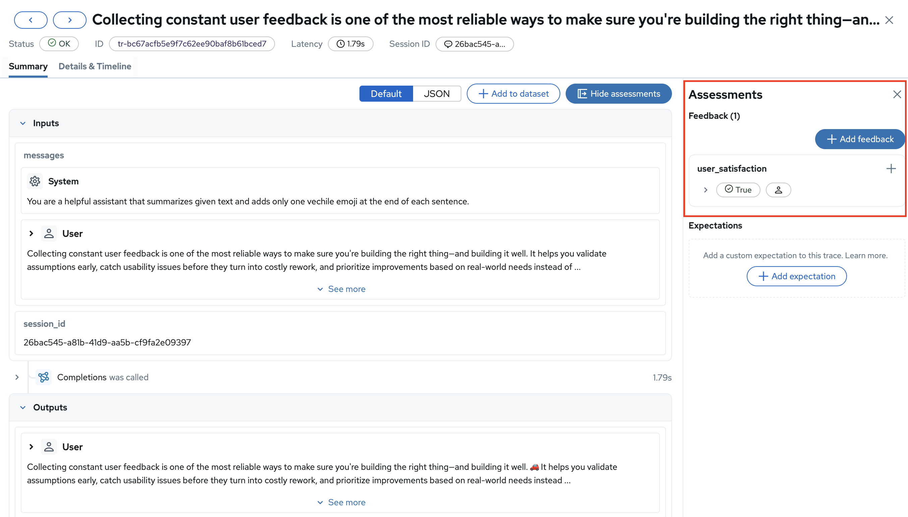
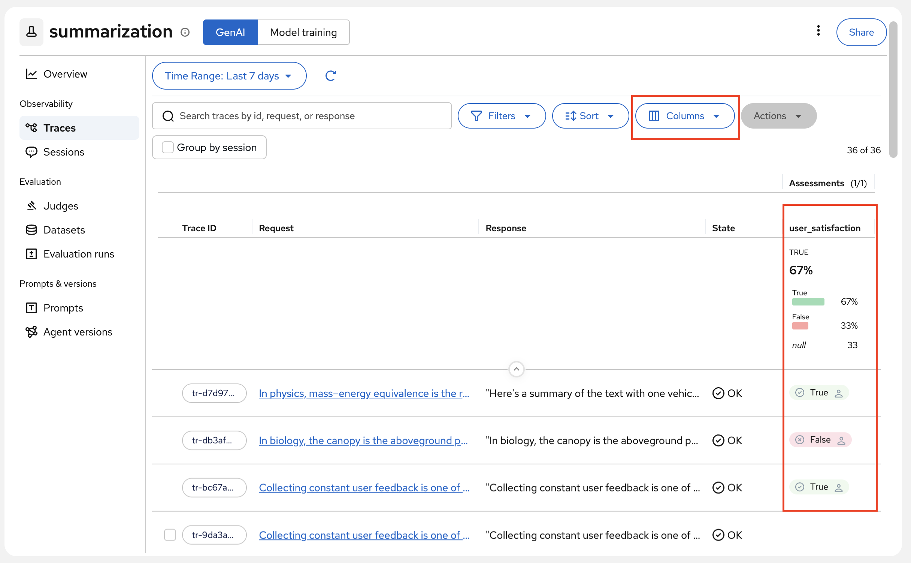
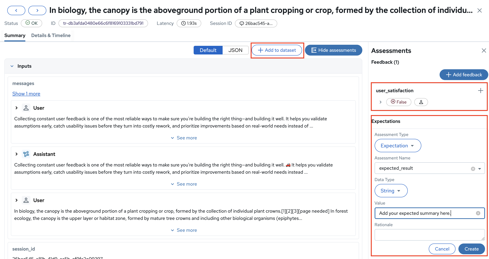
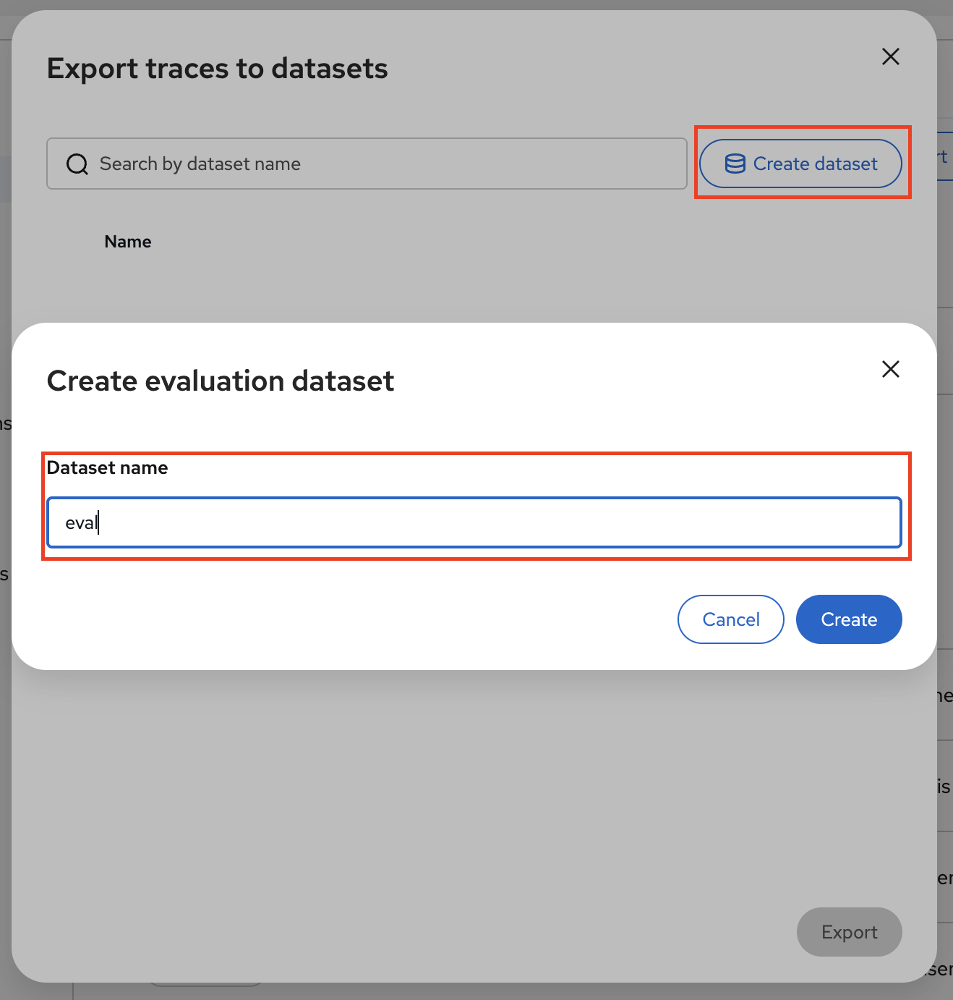
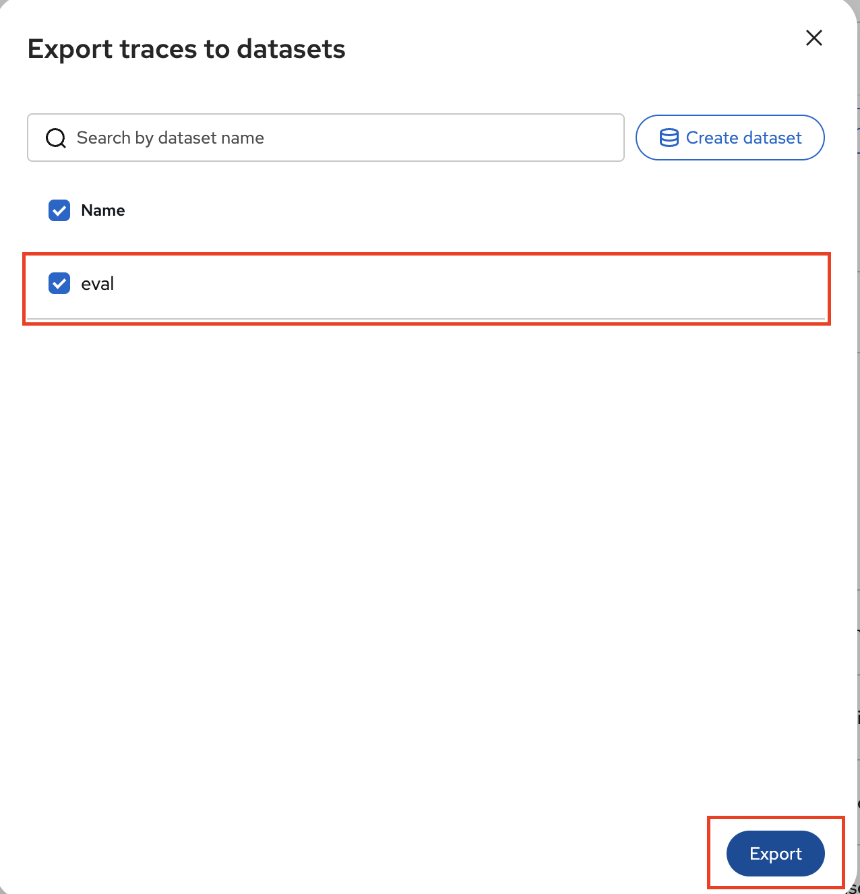
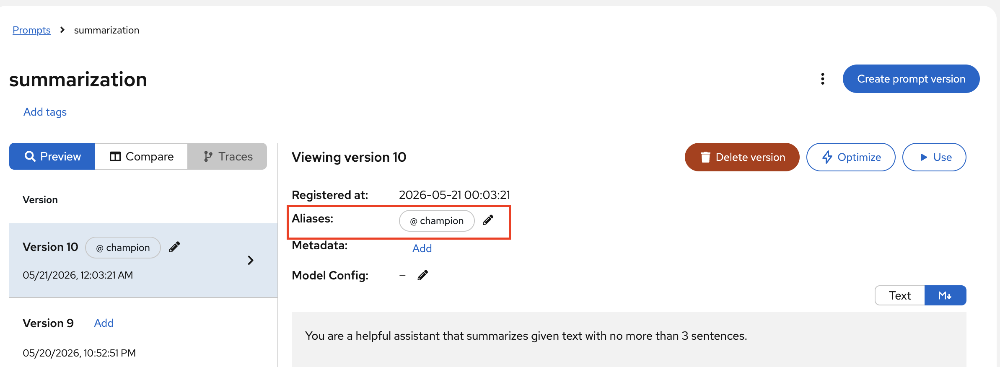
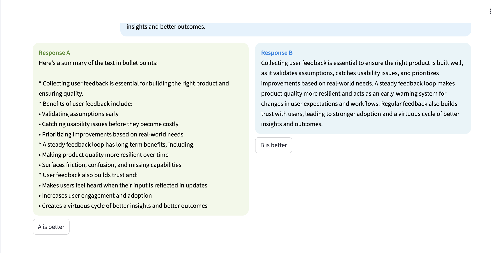
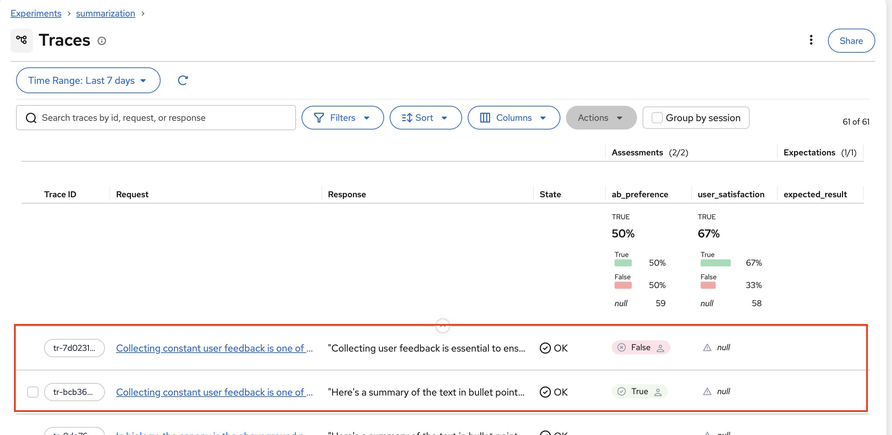

# 🔄 Feedback Loops

Metrics tell you *how fast* your system runs. Logs tell you *what happened*. Traces tell you *where time was spent*. But none of them answer the most important question: **are your users actually satisfied with the AI's responses?**

User feedback is the missing piece that closes the GenAIOps loop. By collecting thumbs up/down signals from users, you get direct evidence of where your AI succeeds and where it fails -- and you can feed that evidence back into your evaluation pipeline to systematically improve your system.

## Why Feedback Matters

Consider this scenario: your Canopy summarization feature has great latency (metrics look healthy), no errors in the logs, and clean traces through MLFlow. Everything *looks* fine from an infrastructure perspective. But users are consistently getting poor summaries for some prompts because the system prompt isn't well-tuned for certain types of input, and you are not capturing this use case in the evals and you are not aware of it!

Without user feedback, you'd never know. The observability pillars you've learned (metrics, logs, traces) monitor **system health**. Feedback monitors **output quality** -- and that's what ultimately matters for AI applications.

The feedback loop connects observability to action:

1. **Deploy** your AI application
2. **Observe** its behavior (metrics, logs, traces)
3. **Collect feedback** from users
4. **Evaluate** using negative feedback as test cases
5. **Improve** prompts or models based on evaluation results
6. **Redeploy** and repeat

## Enable the Feedback Feature

The feedback feature is behind a feature flag, just like the other Canopy capabilities you've enabled throughout this course.

Let's directly do this in `test` environment for simplicity.

1. In your workbench, go to your `genaiops-gitos` repo and update `canopy/test/backend/config.yaml` to enable feedback. Let's first pull the changes though:

    ```bash
    cd /opt/app-root/src/genaiops-gitops
    git pull
    ```

   And update `canopy/test/backend/config.yaml` by adding the below block at the end:

   ```yaml
   feedback:
     enabled: true
   ```

   It should look like this:

      ```yaml
      ---
      repo_url: https://gitea-gitea.<CLUSTER_DOMAIN>/<USER_NAME>/backend
      chart_path: chart
      summarization:
        enabled: true
        model: llama32
        endpoint: "http://llama-32-predictor.ai501.svc.cluster.local:8080/v1"
        mlflow_prompt: summarization
        mlflow_prompt_version: latest
      information-search:         
        enabled: true
        endpoint: "http://llama-stack-service:8321/v1"
        model: vllm-llama32/llama32
        vector_db_id: genaiops_2026_05_25_21_39
        mlflow_prompt: information-search
        mlflow_prompt_version: latest
      feedback:  # 👈 add this block 📚❗︎❗︎❗︎❗︎❗︎
        enabled: true
      ```

   
2. Commit and push your changes. Wait for ArgoCD to sync the deployment.

    ```bash
    cd /opt/app-root/src/genaiops-gitops
    git add .
    git commit -m  "🫶 Enable feedback collection 🫶"
    git push origin main
    ```

3. Open your Canopy UI in test environment and pick **Summarization**:

   ```bash
   https://canopy-ui-<USER_NAME>-test.<CLUSTER_DOMAIN>/
   ```
4. Paste some text and click **Summarize**

   ```bash
   Collecting constant user feedback is one of the most reliable ways to make sure you're building the right thing—and building it well. It helps you validate assumptions early, catch usability issues before they turn into costly rework, and prioritize improvements based on real-world needs instead of internal guesses. A steady feedback loop also builds trust—when users see their input reflected in updates, they feel heard and become more willing to engage, which strengthens adoption and creates a virtuous cycle of better insights and better outcomes.
   ```

5. After the summary appears, you should see a **"Was this summary helpful?"** prompt with thumbs up and thumbs down buttons 👍👎

   Click thumbs down on a summary you find unsatisfactory 🥺 👎 

   Click thumbs up on a summary that works well 🥹 👍

   _It might take a second for the UI to report as "Thanks for the feedback!", as it might take time for the trace to be registered in MLflow._

   > ⚠️ **Note:** If you don't see this or see an error, restart the `canopy-ui` pod inside of the `<USER_NAME>-test` namespace in OpenShift. Easiest way to do this is just to delete the pod
   

6. Try a few more to generate some data, give some thumbs up and downs, then we'll review the result!

   

## Review Feedback in MLflow

Because Canopy already uses MLflow for tracing, feedback is stored **directly on the trace** that produced the response — no separate system needed. Each 👍 or 👎 becomes a `user_satisfaction` assessment attached to the exact span.

1. Go to OpenShift AI Dashboard. Navigate to Develop & train > Experiments (MLflow) > choose **<USER_NAME>-test** as the project and  **summarization** as the experiment > **Traces**

2. You'll see each conversation as a trace. Click on any trace to open it.

3. In the trace detail view, look for the **Assessments** panel. You'll see the `user_satisfaction` feedback as `True` (for thumbs up) or `False` (for thumbs down).

   

4. You can also get a more general feeling by adding the `user_satisfaction` Column on the `Traces` view. 

This is quite powerful because the feedback sits right next to the full prompt, response, latency, and model metadata.

   

## From Feedback to Evaluations

Collecting feedback is only half the story. The real value comes from using negative feedback to improve your AI system. Now that thumbs-down responses are visible as traces in MLflow, you can turn them directly into an evaluation dataset.

1. The very first thing you need to do is to improve your system prompts to turn these frowns into happy faces. There are several approaches to prompt optimization -- from manual iteration (which we're performing now) to automated techniques like [DSPy](https://dspy.ai/) or [MLflow's prompt engineering tools](https://mlflow.org/docs/latest/llms/prompt-engineering/index.html). Even simple manual changes (being more specific, adding examples, adjusting tone) can make a big difference.

But here's the catch: how do you know your improved prompt doesn't *regress* on the cases that were already working? That's exactly why we turn negative feedback into evaluation test cases. The thumbs-down entries become regression tests -- so when you tweak your prompt, you can verify it fixes the bad cases without breaking the good ones.

2. In MLflow, filter your traces for negative feedback (Assessment `user_satisfaction = false`). These are your problem cases.

3. Build an evaluation dataset from those traces like we did before. Select one of those traces and create an `expectation` with the assessment of `expected_result` as in like a better summary, Then add it to evaluation dataset.

   

4. Then `Create dataset`, and name it as `eval`. Then select the this `eval` dataset and `Export` the traces there.

   

   

   _We could build an evaluation dataset from those traces using `mlflow.genai.create_dataset()` by running below steps in our workbench. This is useful when we want to bring feedback. But we're only sharing this as a reference for now, just as a FYI 😊:_

   ```python
   # In your notebook or evaluation script
   negative_traces = mlflow.search_traces(
      experiment_names=["summarization"],
      filter_string="assessments.user_satisfaction.value = 'false'",
   )

   eval_dataset = mlflow.genai.create_dataset(
      name="eval",
      experiment_id=experiment.experiment_id,
      tags={"source": "negative-user-feedback"},
   )
   eval_dataset.merge_records(negative_traces)
   ```

4. As the human in the loop, review what responses the user was not happy with and add expectations to the traces -- what a good summary should look like for each case. This turns real user dissatisfaction into concrete test cases.

5. Now iterate on your system prompt. Change your summarization prompt from OpenShift AI Dashboard > Gen AI studio > Prompts > **<USER_NAME>-toolings** > summarization and create a new one. 

6. And do you remember what happens when we create a new prompt here? YES! The evaluation pipeline kicks off and runs against all the evaluation dataset we have, including the one we just created! 

7. After the pipeline finishes succesfully, you can go to MLflow Evaluation runs under **<USER_NAME>-toolings** and see the results.

## A/B Testing: Data-Driven Prompt Engineering

Collecting thumbs up/down feedback tells you *whether* users are satisfied -- but it doesn't tell you *which system prompt is better*. A/B testing solves this by running the same user input through two different system prompts simultaneously and letting the user pick the better response.

Instead of guessing which prompt produces better summaries, you let real users decide -- just like how production ML systems compare model variants.

This uses a **champion/challenger** pattern: your current prompt is the **champion** (what users are getting today), and the new one you want to test is the **challenger**. Both prompts live in the MLflow Prompt Registry.

### Set Up the Champion/Challenger Prompts

1. First, let's mark your current prompt as the **champion** in MLflow. Add `champion` alias to your current prompt version in **<USER_NAME>-toolings** project for `summarization`. 

   

2. Now create your challenger prompt and register it as a new version. The new version automatically gets the `latest` alias. Your `champion` alias is untouched.

3. Update `genaiops-gitops/canopy/test/backend/config.yaml` to enable A/B testing. Point Prompt A at `champion` and tell the A/B config to use `latest` as the challenger:

   ```yaml
   summarization:
     enabled: true
     model: llama32
     endpoint: "http://llama-32-predictor.ai501.svc.cluster.local:8080/v1"
     mlflow_prompt: summarization
     mlflow_prompt_version: champion  # 👈 ❗︎❗︎❗︎ pin to champion for A/B ❗︎❗︎❗︎❗︎❗︎❗︎

   information-search:         
     enabled: true
     endpoint: "http://llama-stack-service:8321/v1"
     model: vllm-llama32/llama32
     vector_db_id: genaiops_2026_05_25_21_39
     mlflow_prompt: information-search
     mlflow_prompt_version: latest

   feedback:
     enabled: true

   ab_testing:               # 👈 ADD THIS ❗︎
     enabled: true           # 👈 ADD THIS ❗︎
     mlflow_prompt_b_version: latest  # 👈 the challenger ❗︎
   ```

4. Commit and push your changes. Wait for ArgoCD to sync the deployment.

    ```bash
    cd /opt/app-root/src/genaiops-gitops
    git pull
    git add .
    git commit -m  "💙 A/B Testing enabled: champion vs challenger 💚"
    git push origin main
    ```

5. Open your Canopy UI again and pick **Summarization**:

   ```bash
   https://canopy-ui-<USER_NAME>-test.<CLUSTER_DOMAIN>/
   ```

6. Paste some text and click **Summarize**

   ```bash
   Collecting constant user feedback is one of the most reliable ways to make sure you're building the right thing—and building it well. It helps you validate assumptions early, catch usability issues before they turn into costly rework, and prioritize improvements based on real-world needs instead of internal guesses. A steady feedback loop also makes product quality more resilient over time: as user expectations, workflows, and constraints change, feedback acts like an early-warning system that surfaces friction, confusion, and missing capabilities. Just as importantly, it builds trust—when users see their input reflected in updates, they feel heard and become more willing to engage, which strengthens adoption and creates a virtuous cycle of better insights and better outcomes.
   ```

7. When you click `Summarize`, two columns should appear: **Response A** and **Response B** -- both stream simultaneously from different prompts

   

   After both responses complete, two buttons appear: **A is better** and **B is better**

   _Again, it might take a second for the UI to respond, as it might take time for the trace to be registered in MLflow._

   > ⚠️ **Note:** If you don't see this or see an error, restart the `canopy-ui` pod inside of the `<USER_NAME>-test` namespace in OpenShift. Easiest way to do this is just to delete the pod
   

8. Pick your preference and try a couple more to generate some data. The system records which actual prompt won as an `ab_preference` assessment on each trace in MLflow. (You can select the `ab_preference` from the Columns list.)

9. Go back to **MLflow → Traces**. Each A/B response generates its own trace with an `ab_preference` assessment: `true` for the winner, `false` for the loser. You can filter traces by this to see which prompt consistently wins.

   > ⚠️ **Note:** We randomize which prompt is displayed as A or B in the frontend to avoid positioning bias, but then map it to the correct `champion` or `challenger` when logging feedback. This means if you press "A is better" you might see that the challenger gets the win in MLflow -- because it was really the challenger underneath disguising as A for the user 🥷

   

### Act on the Data

When one prompt consistently wins across multiple comparisons:

1. If the **challenger wins**, promote it to `champion` in MLflow -- no config file change needed for the prompt text itself.

   Your running app will pick up the new champion on the next request.

2. Update `genaiops-gitops/canopy/test/backend/config.yaml` to restore normal operation -- point back to `latest` and disable A/B:

    ```yaml
    summarization:
      enabled: true
      mlflow_prompt: summarization
      mlflow_prompt_version: latest  # back to normal iteration ❗︎

    feedback:
      enabled: false                 # 👈 UPDATE THIS ❗︎

    ab_testing:
      enabled: false                  # 👈 UPDATE THIS ❗︎
    ```

3. Commit, push, and let Argo CD redeploy:

    ```bash
    cd /opt/app-root/src/genaiops-gitops
    git add .
    git commit -m  "🦋 Challenger promoted to champion 🦋"
    git push origin main
    ```

This creates a continuous improvement cycle driven by real user preferences rather than subjective judgment.

## The GenAIOps Lifecycle

What you've built in this section completes the GenAIOps lifecycle:

```
  Deploy AI App
       |
       v
  Observe (Metrics, Logs, Traces)    <-- Module 6.1-6.4
       |
       v
  Collect User Feedback              <-- This section
       |
       v
  MLflow Traces with Assessments
       |
       v
  Build Eval Dataset (Module 4)
       |
       v
  Improve Prompts / Models
       |
       v
  Redeploy (GitOps)                  <-- Module 3
       |
       '-------> back to Observe
```

This is the fundamental difference between a demo AI project and a production AI system: production systems **learn from their users** and **improve systematically**. By attaching feedback directly to MLflow traces, you get a single place to see what was said, how fast it was, and whether users were satisfied -- and a direct path from that signal to your evaluation pipeline.

In this section, we collected user feedback with thumbs up/down, surfaced it in MLflow traces, turned negative feedback into evaluation test cases, used A/B testing to compare prompts side-by-side, and promoted the winning prompt -- all through GitOps. Next, we'll look at how to protect your AI application from harmful inputs and outputs with **guardrails**.
