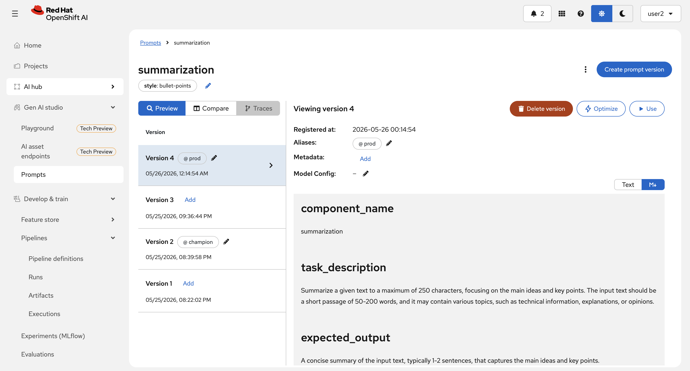
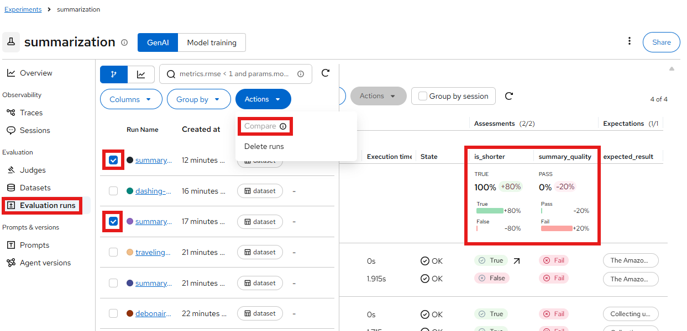
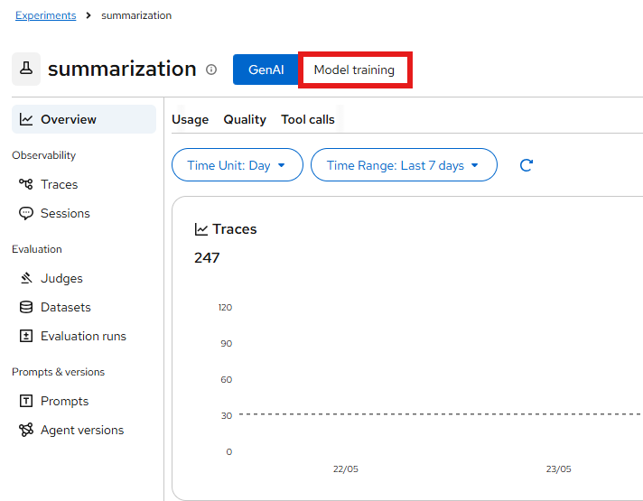
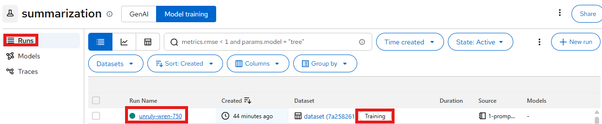
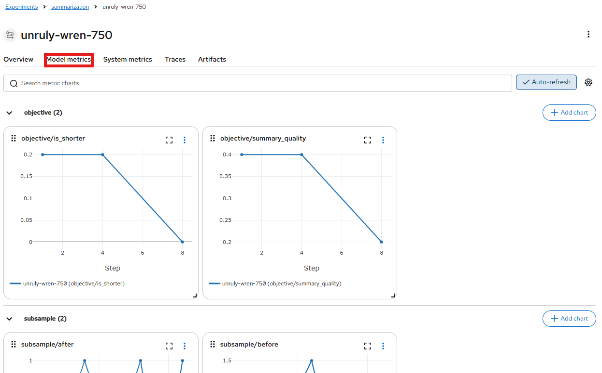

# 🧪 Extra Credit: Prompt Optimization

You've closed the observability loop — metrics, logs, traces, and user feedback all flowing into MLflow. Now let's put that data to work. Instead of manually tweaking your summarization prompt and hoping for the best, you'll use **automated prompt optimization** to systematically improve it based on real evaluation results.

This is fully optional, but if you're curious about where GenAIOps meets automated ML, this is it.

## What is GEPA?

GEPA (Generate, Evaluate, Predict, Adapt) is MLflow's automated prompt optimization algorithm. You give it:

- A prompt to improve
- An evaluation dataset with expectations
- A set of scorers that define "good"

It runs your dataset through the model, analyses which cases failed and why, generates a rewritten prompt that addresses those weaknesses, and registers the result as a new version in the Prompt Registry. All automatically.

So instead of guessing what makes a better prompt, you let the failure cases tell you.

## Prerequisites

Before running this notebook you should have:

- Completed the [Feedback Loops](5-feedback-loops.md) section — ideally with a few 👍 and 👎 collected
- Access to your MLflow dashboard
- Your workbench running (the notebook runs there)

Thumbs-down traces from Canopy are the ideal input. If you don't have enough yet, the notebook includes simulated feedback as a fallback — you'll still see the full optimization loop in action.

## The Notebook

Open your workbench and navigate to:

```
experiments/6-observability/1-prompt-optimization.ipynb
```

The notebook walks through five steps:

| Step | What happens |
|------|-------------|
| 0. Setup | Connect to MLflow and load the latest summarization prompt from the Prompt Registry |
| 2. Build Dataset | Load the MLflow `eval` dataset from your test workspace and test cases from `summary_tests.yaml`, then combine them into a training set |
| 3. Define Scorers | Define `summary_quality` (an LLM judge loaded from `judge_prompt.txt`) and `is_shorter` scorers |
| 4. Baseline Evaluation | Score the current prompt against the combined dataset to establish a before score |
| 5. Optimize | GEPA rewrites the prompt to fix the failing cases and registers it as a new version |

Now go through the notebook and come back here to 

## What You Got

By the end of the notebook you have:

- A versioned prompt history in MLflow showing exactly what changed and why
- Quantified before/after scores — not just a feeling that it's better
- An evaluation dataset you can reuse every time you want to improve the prompt
- A concrete path to promoting the winning prompt back to Canopy (via config or the Prompt Registry)

The loop that started with a user clicking 👎 ends with a measurably better AI application.



Since we create a new test prompt, we will also start a new eval pipeline (automation magic ✨).  
You can go to OpenShift Pipelines, OpenShift AI Pipeline Runs, and MLflow in **<USER_NAME>-toolings** namespace just like before to keep track of this evaluation run.  
After it finishes, you can also compare the baseline evaluation run we did in the notebook against the one that ran with the pipeline. Or against a previous pipeline run (it's the eval runs called `summary_tests_...`):  



If you are interested in the GEPA run, you can also get plenty more details from MLflow.  
Simply:

1. Go to to OpenShift AI -> Experiments (MLflow) -> select **<USER_NAME>-toolings** Project -> Summarization and click on the `Model Training` tab at the top

    

2. Select the latest Run with the tag `Training` (this is the GEPA run).

    

3. Explore the run, `Model metrics` gives some nice visualizations.

    


Just a few note, we took some shortcuts here for simplicity:  

- We don't go through the backend but rather directly to the model.  
- We also don't load the `summary_test.yaml` from git but rather just refer to the local folder.  
- We use the same dataset to "train" the prompt that we use to "validate" the prompt. This is not a good practice and we should ideally have had a separate dataset for training and for validating/evaluating.

All of these are easy fixes (it's what we already do in the evaluation pipeline) but are kept simple here.