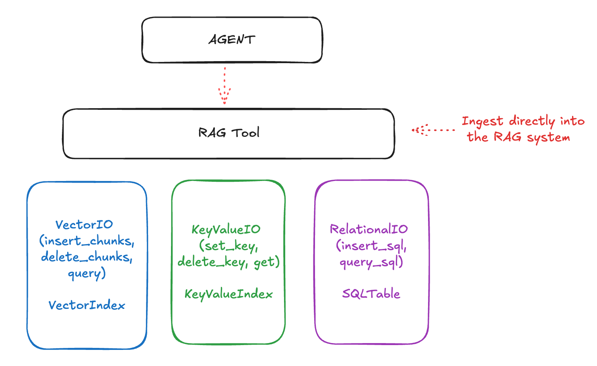

# 🦙 LlamaStack & RAG: Building Intelligent Agents

With your vector store up and running, you're ready to build the intelligent layer that makes RAG truly powerful. LlamaStack provides the tools and APIs to create systems that can automatically search your Milvus database, retrieve relevant information, and generate informed responses.

Think of this as adding a brilliant research assistant to your educational platform - one that knows exactly where to find information and how to synthesize it into helpful answers.

## 🏗️ The LlamaStack RAG Architecture

LlamaStack organizes RAG capabilities into three elegant layers that work together:

### 1. 🗄️ Storage Layer (The Foundation)
The bottom layer handles raw data storage and retrieval:
- **Vector IO**: Stores document embeddings for semantic search
- **KeyValue IO**: Manages structured metadata and simple lookups  
- **Relational IO**: Handles complex queries across structured data

### 2. 🔧 RAG Tool Layer (The Intelligence)
The middle layer provides smart document processing:
- **Document Ingestion**: Automatically chunks and processes files, URLs, and content
- **Intelligent Chunking**: Splits documents optimally for retrieval
- **Semantic Search**: Finds relevant content based on meaning, not just keywords

### 3. 🤖 Agents Layer (The Interface)
The top layer creates intelligent assistants:
- **Context-Aware Agents**: LLMs that can use RAG tools automatically
- **Multi-Document Reasoning**: Agents that synthesize information from multiple sources
- **Conversational Memory**: Maintains context across interactions while accessing external knowledge



## 🔗 Connecting to Your Vector Store

Before building intelligent agents, LlamaStack needs to connect to the Milvus vector database you deployed in the previous section. This connection enables the RAG tools to store and retrieve document embeddings.

## 🔧 Configure LlamaStack with Vector Database Integration

Now we'll connect your existing LlamaStack deployment to the Milvus vector database, enabling RAG capabilities.

1. **Update LlamaStack Configuration**

   We need to register our Milvus instance as a vector database provider in LlamaStack. This involves:
   - Connecting to your LlamaStack instance
   - Registering the Milvus vector database with appropriate embedding models
   - Configuring the connection parameters for your environment

   **📓 Hands-On**: The detailed configuration steps and code examples are provided in the `1-rag.ipynb` notebook in your workbench.

## 📚 Document Ingestion and Retrieval

Once your vector database is configured, you can start teaching Canopy about your documents! The RAG system supports multiple approaches:

### Document Processing Methods
- **Direct Insertion**: Pre-chunked educational content with metadata
- **Smart Processing**: Using LlamaStack's RAG Tool for automatic chunking and processing
- **Bulk Ingestion**: Processing multiple documents with course-specific metadata

### Educational Content Examples
You'll work with real educational scenarios like:
- AI ethics course materials
- Computer science research papers  
- Course syllabi and reading lists
- Assignment guidelines and rubrics

**📓 Hands-On**: Complete document ingestion examples and retrieval testing are available in the `1-rag.ipynb` notebook.

## 🤖 Building RAG-Enhanced Agents

The power of RAG comes alive when you create AI agents that can automatically search and use your document knowledge base. These agents can:

- **Answer questions** using course materials and academic resources
- **Provide citations** and references to specific documents
- **Synthesize information** from multiple sources
- **Maintain context** across conversations while accessing external knowledge

**📓 Hands-On**: Step-by-step agent creation and testing is covered in the `1-rag.ipynb` notebook.

## 🎮 LlamaStack Playground: RAG in Action

The LlamaStack Playground provides an intuitive interface for experimenting with RAG workflows before integrating them into Canopy.

### Access the Playground

1. **Deploy the Playground** (if not already done in Module 3):
   ```bash
   # In your workbench terminal
   oc get route llama-stack-playground -n <USER_NAME>-canopy
   ```

2. **Open the Playground Interface**:
   Navigate to `https://llama-stack-playground-<USER_NAME>-canopy.<CLUSTER_DOMAIN>`

### Playground RAG Experiments

Try these educational scenarios in the Playground:

1. **📖 Course Content Q&A**
   - Upload a course syllabus or reading list
   - Ask: "What are the learning objectives for week 3?"
   - Observe how RAG finds and cites specific sections

2. **🔬 Research Paper Analysis**
   - Ingest an academic paper about machine learning
   - Ask: "What methodology did the researchers use?"
   - Watch RAG extract and synthesize methodology sections

3. **📝 Assignment Assistance**
   - Upload assignment guidelines and rubrics
   - Ask: "How should I structure my essay to meet the requirements?"
   - See RAG provide detailed, requirement-based guidance

## 🎯 Next Steps: Complex Document Processing

Your RAG system can now handle simple text documents, but what about research papers with tables, mathematical formulas, and complex layouts? That's where advanced document processing comes in.

Continue to **[🐣 Document Intelligence with Docling](4-docling.md)** to learn how to handle the full complexity of real-world academic materials.