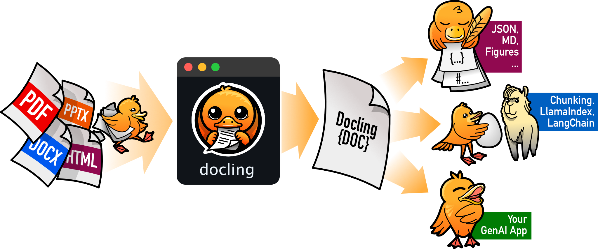

# 🐣 Document Intelligence with Docling

Imagine trying to teach a student using only textbooks written in a foreign language with strange formatting. That's what happens when RAG systems encounter complex documents like PDFs with tables, images, and intricate layouts. **Docling** is like having a brilliant translator who not only reads every language but also understands the meaning behind charts, diagrams, and document structure.

While basic RAG can work with simple text files, real educational institutions deal with:

* 📄 **Complex PDFs**: Research papers with multi-column layouts, mathematical formulas, and embedded figures
* 📊 **Rich Documents**: Course materials with tables, charts, and mixed media content  
* 🏛️ **Legacy Materials**: Scanned documents and documents with inconsistent formatting
* 📚 **Structured Content**: Syllabi, textbooks, and academic papers that need intelligent parsing

Docling transforms these challenging documents into clean, structured content that RAG systems can understand and process effectively.

## 🔍 What is Docling?

**Docling** is an advanced document processing toolkit that simplifies the handling of diverse document formats with a focus on intelligent PDF understanding. Think of it as a universal translator for documents - it can read, understand, and convert complex academic materials into formats that AI systems can work with effectively.

### Key Features & Capabilities

**📄 Multi-Format Support**
- **Documents**: PDF, DOCX, PPTX, XLSX, HTML
- **Media**: WAV, MP3 audio files with speech recognition
- **Images**: PNG, TIFF, JPEG with OCR capabilities
- **Advanced Processing**: Tables, formulas, code blocks, and mathematical content

**🧠 Intelligent PDF Understanding**
- **Layout Analysis**: Understands page structure, reading order, and multi-column layouts
- **Table Structure**: Preserves complex table relationships and formatting
- **Formula Recognition**: Handles mathematical equations and scientific notation
- **Image Classification**: Identifies and categorizes figures, charts, and diagrams

**🔒 Enterprise-Ready Features**
- **Local Execution**: Process sensitive documents without cloud dependencies
- **Air-Gapped Support**: Works in secure, isolated environments
- **Extensive OCR**: Handles scanned PDFs and image-based documents
- **Visual Language Models**: Advanced understanding with SmolDocling integration



### LlamaStack Integration Pipeline

You can transform your source documents with a Docling-enabled data science pipeline and ingest the output into a LlamaStack vector store using the LlamaStack SDK. This modular approach separates document preparation from ingestion, yet still delivers an end-to-end RAG workflow.

**The Complete Workflow:**
1. **Document Preparation**: Docling downloads and processes source PDFs
2. **Parallel Processing**: Documents are split into batches for efficient handling  
3. **Intelligent Conversion**: Each batch is converted to structured Markdown
4. **Embedding Generation**: Sentence-transformer models create vector representations
5. **Vector Storage**: Embeddings are stored in your Milvus database
6. **Instant Search**: Documents become searchable in LlamaStack RAG workflows

This pipeline makes complex academic documents instantly searchable and queryable, enabling sophisticated educational AI applications.


## 🔧 The Docling-LlamaStack Pipeline

Docling integrates with LlamaStack to create an intelligent document processing pipeline:

### Phase 1: Intelligent Document Analysis
```
📄 PDF Input → 🔍 Layout Detection → 📋 Structure Analysis → 🧠 Content Extraction
```

### Phase 2: Content Enhancement  
```
📝 Raw Text → 🏷️ Semantic Tagging → 📊 Table Extraction → 🖼️ Figure Processing
```

### Phase 3: RAG Integration
```
🔧 Intelligent Chunking → 🎯 Embedding Generation → 🗄️ Vector Storage → 🔍 LlamaStack RAG
```

This modular approach separates document preparation from ingestion while delivering a complete, end-to-end RAG workflow.

## 🧠 Why Docling Matters for Educational RAG

Traditional document processing often fails when dealing with academic content. [Docling](https://github.com/docling-project/docling) addresses these challenges with advanced document understanding capabilities. Consider a typical computer science research paper:

- **Complex layouts** with multiple columns and sections
- **Mathematical equations** that need special handling
- **Figures and tables** that provide crucial context
- **Reference lists** that need to be preserved and linked
- **Metadata** like authors, institutions, and publication dates

Without intelligent processing, a RAG system might:
- Miss important information trapped in tables
- Lose context from figures and captions
- Struggle with multi-column layouts
- Fail to properly chunk mathematical content

Docling solves these problems by understanding document structure and extracting content intelligently.

## 🚀 Setting Up the Docling Pipeline

Let's build a document processing pipeline that can handle the complex academic materials your students and educators need.

### 1. Prepare Your Workbench Environment

TODO

**📓 Hands-On**: Complete installation instructions and environment setup are provided in the `2-docling.ipynb` notebook in your workbench.

### 2. Document Processing Pipeline Components

The Docling pipeline includes several key components:

#### Core Processing Classes
- **DocumentConverter**: Handles PDF parsing and content extraction
- **EducationalDocumentProcessor**: Manages batch processing with course metadata  
- **LlamaStack Integration**: Connects processed content to your RAG system

#### Processing Capabilities
- **Batch Processing**: Handle multiple documents simultaneously
- **Metadata Enrichment**: Add course, instructor, and assignment context
- **Format Conversion**: Transform PDFs to structured Markdown
- **Content Analysis**: Extract tables, figures, and mathematical content

**📓 Hands-On**: Complete pipeline implementation with working code examples is available in the `2-docling.ipynb` notebook.

**📓 Ready to Build?** Open the `2-docling.ipynb` notebook in your workbench to start processing real academic documents and creating intelligent educational assistants! 🚀

Your AI now has both memory and the intelligence to understand complex documents - ready to transform how your institution handles knowledge and learning! 🎓📚✨