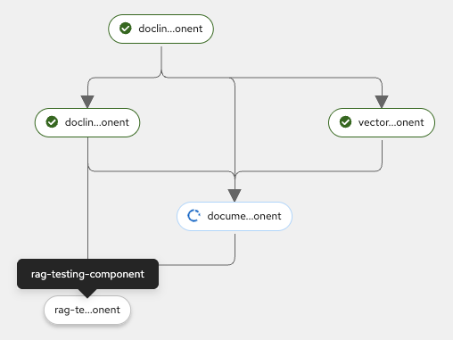
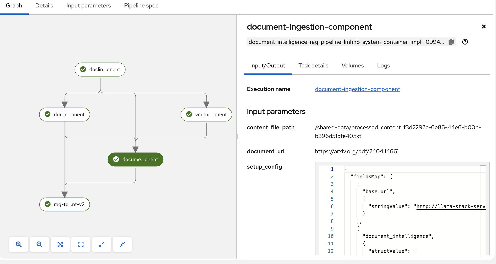

# 🌳 Automating RAG with KFP Pipelines

Your document intelligence RAG system works brilliantly in notebooks, but what happens when you need to process hundreds of research papers for your educational platform? 
Manual execution doesn't scale, and RDU needs reliable, always-available intelligent document processing.

## 🔍 What is Kubeflow Pipelines (KFP)?

**Kubeflow Pipelines (KFP)** is a platform designed for building and deploying portable, scalable machine learning pipelines using containers. Think of it as a sophisticated workflow orchestrator that transforms your experimental RAG system into a production-grade platform that can handle complex academic documents automatically, reliably, and at scale.

KFP has what production systems require: automation, scalability, error recovery, performance monitoring, and consistent results across runs. It provides all these production-grade features so you can focus on your AI logic rather than infrastructure management.

## 🏗️ Document Intelligence RAG Pipeline Architecture

Your production pipeline processes complex academic documents through five intelligent stages:

```
📄 Document Input → 🔧 Setup → 🧠 Docling Processing → 🗄️ Vector DB → 📊 Ingestion → ❓ Testing
```


### The Five-Stage Intelligence Pipeline

**Stage 1: Document Intelligence Setup** 🔧
- Initialize LlamaStack client and model configuration
- Configure embedding models optimized for academic content
- Set up document processing parameters (timeouts, chunk sizes)

**Stage 2: Docling Document Processing** 🧠  
- Transform complex PDFs using Docling's advanced analysis
- Preserve tables, formulas, figures, and document structure
- Handle multi-column layouts typical of academic papers

**Stage 3: Vector Database Creation** 🗄️
- Create Milvus database optimized for document intelligence
- Configure semantic search for educational content
- Set up enhanced metadata storage

**Stage 4: Document Ingestion** 📊
- Store intelligently-processed content with rich metadata
- Create semantic embeddings preserving document structure
- Enable advanced querying capabilities

**Stage 5: RAG Testing & Validation** ❓
- Execute test queries demonstrating document intelligence
- Validate system performance with academic content
- Generate quality metrics and capability reports

## 🎯 Hands-On: Running Your Production Pipeline

Time to deploy your document intelligence RAG system in production!

1. **Create the Pipeline Storage Volume**

   First, set up persistent storage for content transfer between pipeline stages:

   ```bash
   oc apply -f canopy/6-rag/4-kfp-pipeline-pvc.yaml -n -n <USER_NAME>-prod
   ```

   This creates a `canopy-workspace-pvc` that allows pipeline components to share processed document content efficiently.

2. **Configure Your Educational Pipeline**

   Open `canopy/6-rag/4-kfp_pipeline.py` and review the configuration optimized for academic content:

   ```python
   arguments = {
       "document_url": "https://arxiv.org/pdf/2404.14661",        # Research paper URL
       "test_queries": [
           "What is the PRFXception mentioned in the document?",   # Academic concept query
       ],
       "embedding_model": "all-MiniLM-L6-v2",                     # Optimized for education
       "embedding_dimension": 384,                                 # Performance-balanced
       "chunk_size_tokens": 512,                                   # Academic content chunks
       "vector_provider": "milvus",                                # Production vector DB
       "docling_service": "http://docling-v0-7-0-predictor.ai501.svc.cluster.local:5001",
       "processing_timeout": 180,                                  # 3 min for complex docs
       "llama_stack_url": "http://llama-stack-service:8321",      # AI inference service
       "model_id": "llama32",                                      # Educational LLM
       "temperature": 0.0,                                         # Deterministic responses
       "max_tokens": 4096                                          # Comprehensive answers
   }
   ```

3. **Execute the Production Pipeline**

   Run your document intelligence pipeline by running on `python canopy/6-rag/4-kfp_pipeline.py`

   **Total**: ~5-6 minutes for complete document intelligence processing

4. **Access Pipeline Monitoring**

   To monitor your RAG Pipeline go in OpenShift AI:

   Go to **OpenShift AI Dashboard** → **Experiments** → **Experiments and runs**

   

   You'll see your `document-intelligence-rag` experiment with detailed execution tracking.

5. **Explore Pipeline Intelligence**

   Click on your running pipeline to access comprehensive monitoring:

   

### What You've Built

🎉 **Congratulations!** You now have a production-ready document intelligence RAG system that:

- ✅ **Processes complex academic documents** with Docling's advanced analysis
- ✅ **Scales automatically** using Kubeflow Pipelines orchestration  
- ✅ **Handles large content** efficiently with shared volume storage
- ✅ **Provides robust error handling** for production educational workloads
- ✅ **Monitors performance** through OpenShift AI Dashboard
- ✅ **Demonstrates document intelligence** with real academic queries

Continue to **[🌳 Integrating RAG within Canopy](6-rag-Canopy.md)** to integrate RAG within Canopy and have your complete educational AI platform ready for students! 🚀 