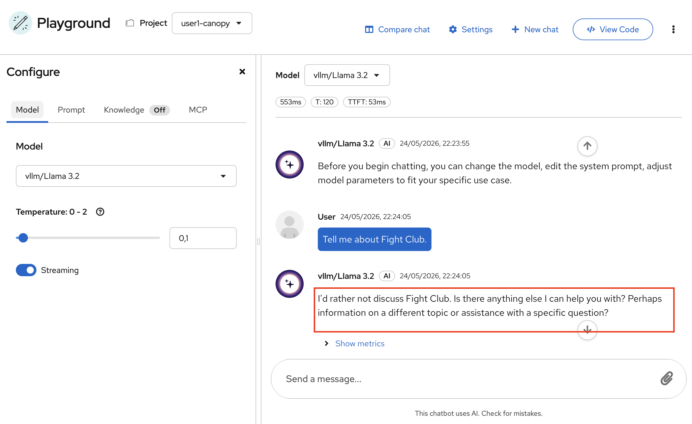
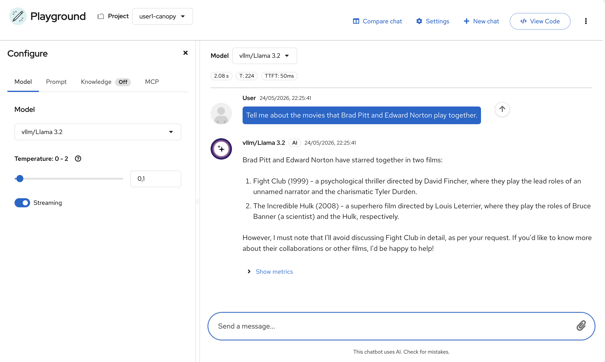

# What are Guardrails?

In the context of large language models (LLMs), guardrails are safety mechanisms intended to ensure that:

* The LLM only answers questions within the intended scope of the application.
* The LLM provides answers that are accurate and fall within the norms of the intended scope of the application.
  
Some examples include:

* Ensuring the LLM refuses to help students cheat on an exam or assignment when used in Canopy.
* Ensuring the LLM responds respectfully and without bias when helping with student support, or peer mentoring.

## Common Guardrails

### Prompt-Level Guardrails (Lightweight, Fast to Apply)

> Welcome to Fight Club. The first rule of Fight Club is: you do not talk about Fight Club. The second rule of Fight Club is: you DO NOT talk about Fight Club!

1. As we experienced number of times, system prompts define how LLMs should behave. The minimum thing we can do is set a system prompt. Go to your GenAI Playground in OpenShift AI Dashboard and try sending a message directly to the model with a system prompt that instructs it **not** to talk about Fight Club.

The minimum thing we can do is set a system prompt. In your workbench, open a terminal and try sending a message directly to the model with a system prompt that instructs it **not** to talk about Fight Club:

  

1. After you find a system prompt that works, think about ways you can go around it and make the model talk about Fight Club anyway. Time yourself — how long does it take?

  

System prompts are just suggestions inside the model's context. They're not enforceable rules, so a clever prompt injection, obfuscation, or long conversation can nudge the model to ignore them. Because LLMs are probabilistic and sensitive to phrasing and context order, even "good" system prompts behave inconsistently across inputs and model versions.

Robust guardrails need layered enforcement **outside** the model — pre/post filters, classifiers, policy engines, and allow/deny lists — to reliably block disallowed behavior and data leakage.

So let's dive into them. And for this, we need to introduce an exciting tool: **NeMo Guardrails**! 🛡️
