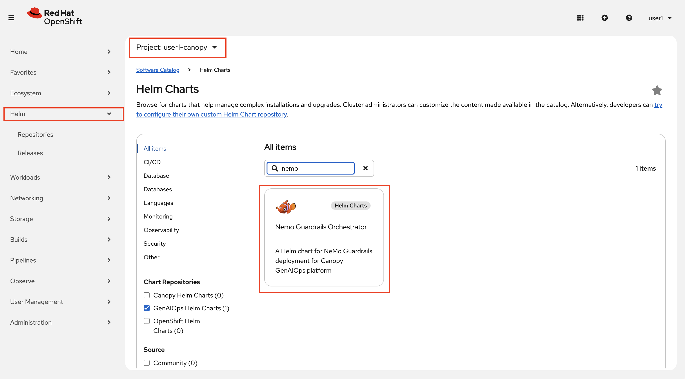

# NeMo Guardrails

NeMo Guardrails gives you an external policy layer that wraps around your models. Instead of hoping the LLM follows the rules, NeMo **enforces** them. It intercepts every request before it reaches the LLM, and every response before it reaches the user, running it through configurable rails.

The rails we've configured for Canopy:

| Rail | What it catches |
|------|----------------|
| **Regex** | Known forbidden patterns (Fight Club 🥊, and more) |
| **HAP Detector** | Hate speech, abuse, and profanity |
| **Prompt Injection Detector** | Attempts to hijack or manipulate the model |
| **Language Detector** | Non-English input |
| **PII Detection** | Emails, phone numbers, credit cards, SSNs |
| **LLM-as-Judge** | Anything ambiguous that slips past the others |

The rules themselves are written in **Colang** — a simple domain-specific language that defines input and output flows. You don't need to know Colang in depth for this module, but it's good to know it lives in the Helm chart you're about to deploy.

## Deploy NeMo Guardrails

1. In your `<USER_NAME>-canopy` environment, go to **Helm > Releases > Create Helm Release** and select `GenAIOps Helm Charts` to find the `NeMo Guardrails Orchestrator` chart.

    

    You don't need to change any values — just hit **Create**!

2. Wait for the NeMo service  to come up. The HAP detector (Granite Guardian), the prompt injection detector (DeBERTa), and the Lingua language detector are already deployed for you. Check the Topology view — everything should be green 💚

## Experience the Guardrails

Now let's see the rails in action. Go to your workbench and open:

```
experiments/7-guardrails/1-intro-to-guardrails.ipynb
```

The notebook will walk you through sending different types of prompts to the NeMo endpoint and watching different rails fire. When you're done, come back here and we'll wire it to Canopy!
