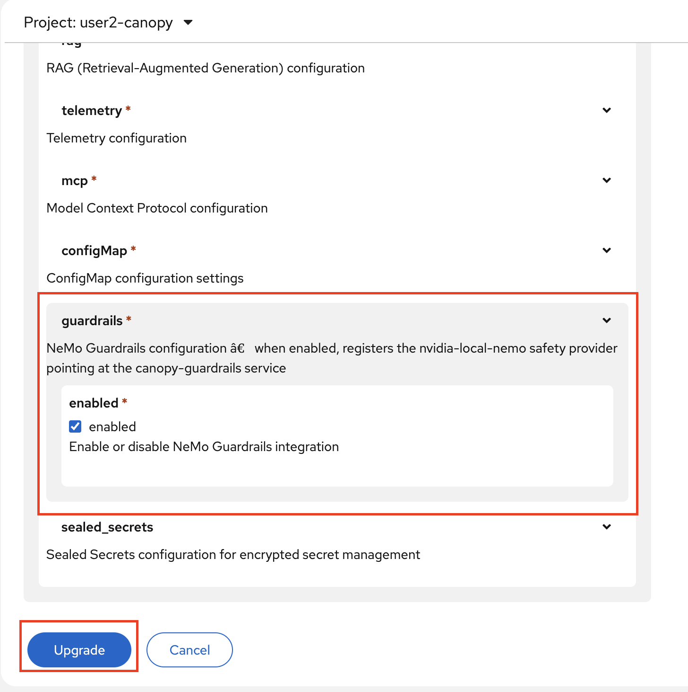
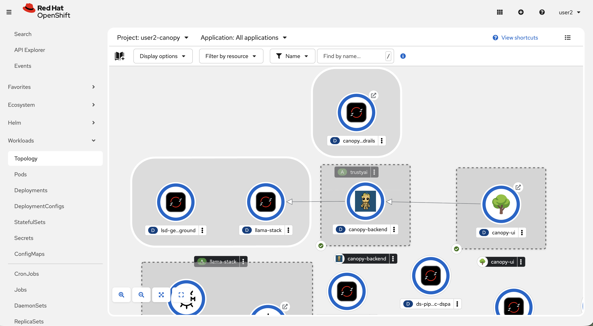

# Integrate NeMo Guardrails with Open GenAI Stack (Llama Stack)

In the notebook, we talked directly to NeMo Guardrails. But in Chapter 5 we introduced Llama Stack as our abstraction layer — it's what routes requests from Canopy's backend to the model. We can also plug NeMo in as a **safety provider** in Llama Stack, so every request that flows through Llama Stack automatically goes through the guardrails.

The integration looks like this:

```
Canopy Backend → Llama Stack → NeMo Guardrails → LLM
                                     ↕
                           (blocks if unsafe)
```

## Update the Llama Stack

1. In your `<USER_NAME>-canopy` environment, go to **Helm > Releases > llama-stack-operator-instance > Upgrade**.

    

2. In the Form view, find the **Guardrails** section and enable it by checking the box. 

    

    This registers a Llama Stack **shield** called `nemo-guardrail` backed by your NeMo service. The Canopy backend already knows to use it — when shields are enabled, it passes `guardrails: ["nemo-guardrail"]` with every request.

3. We haven't moved `summarization` feature to use OGX, we did that only for RAG. Let's move `summarization` feature to use the orchestration feature as well. Again go to **Helm > Releases > canopy-backend > Upgrade**. In the YAML view, find `summarization` block and update the `model` and `endpoint` value:

    ```yaml
    summarization:
      enabled: true
      model: vllm-llama32/llama32  # 👈 UPDATE THIS ‼️‼️‼️‼️
      endpoint: 'http://llama-stack-service:8321/v1' # 👈 UPDATE THIS ‼️‼️‼️‼️
      mlflow_prompt: summarization
    mlflow_prompt_version: latest
  ```

4. Check the Topology view to make sure everything is healthy ❤️

    

Now every request from Canopy flows through NeMo before reaching the model. The backend doesn't have to know anything about the individual detectors — it just passes the shield name and NeMo handles the rest.

Once you're satisfied with how things look, let's increase our confidence in the system even further before shipping it to higher environments!
