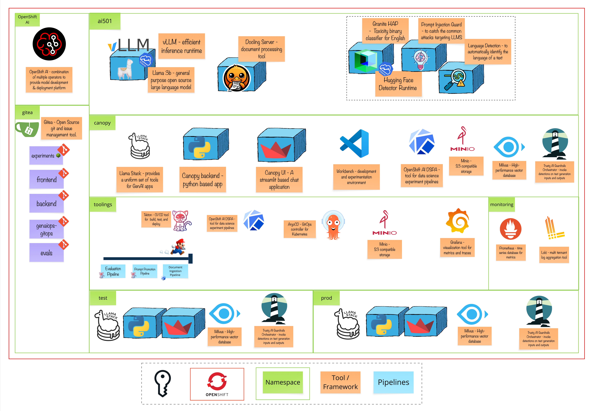

# Module 7 - The Honor Code

> Building AI you can trust means setting boundaries. Just like a good teacher establishes classroom rules, guardrails ensure your AI stays helpful, harmless, and honest 🛡️

# 🧑‍🍳 Module Intro

This module introduces the critical practice of implementing safety guardrails for AI applications. You'll learn how to protect your educational AI assistant from misuse, ensure responsible interactions, and build layered security that goes beyond simple prompt engineering. From basic system prompts to sophisticated detection systems, you'll discover how to balance AI capabilities with safety and compliance.

At RDU, we're committed to building Canopy as a trustworthy educational tool. Guardrails are what transform a powerful language model into a responsible assistant that students and educators can rely on without concerns about academic integrity, bias, or harmful content.

# 🖼️ Big Picture

# 🔮 Learning Outcomes

* Understand what guardrails are and why they're essential for production AI applications
* Learn the limitations of prompt-level guardrails and why they need external enforcement
* Deploy and configure NeMo Guardrails for multi-layered safety using a Helm chart
* Experience how different detectors catch different types of problematic content
* Test and harden your AI application against creative attempts to bypass safety measures

# 🔨 Tools used in this module

* **NeMo Guardrails**: External policy layer that applies Colang-defined safety rails
* **Regex Rules**: Pattern-based filters for blocking or flagging specific content patterns
* **HAP Detector**: Classifier for detecting hate speech, abuse, and profanity (Granite Guardian)
* **Prompt Injection Detector**: Security layer to identify attempts to manipulate the AI's behavior (DeBERTa)
* **Language Detector**: Ensures responses stay in English (Lingua)
* **Spikee**: Open Source automated prompt injection testing toolkit to benchmark your guardrails
* **OpenShift & Helm Charts**: To deploy NeMo Guardrails infrastructure in development and production environments
