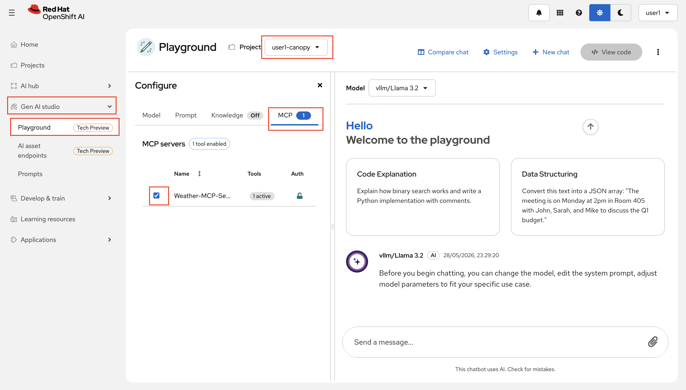

# Try Agents at the playground

LLMs are powerful, but on their own they're stuck in the past — they only know what they were trained on.
Give them **tools**, and suddenly they can reach out to the real world: check live data, call APIs, run calculations, and more.

Let's see this in action before diving into the code!

1. We've connected a **weather MCP server** to the playground, so the model can fetch real-time weather data instead of guessing.
   
   You can see that it is available for you to use at OpenShift AI Dashboard > Gen AI studio > AI asset endpoints > `MCP Servers`

2. Go to OpenShift AI Dashboard > Gen AI studio > Playground > and make sure you have <USER_NAME>-canopy selected as the project.


2. Try asking the model something it normally couldn't answer accurately:

    ```
    What is the weather like in Raleigh right now?
    ```

    Without any tools, the model would either refuse or make something up.

3. Now at the `MCP` section, enable `Weather MCP Server` by checking the box.

    

4. You should see the model **pause and think**. At that moment a call to the weather tool is happening, then you'll get a respond with actual current data — not a hallucination.

    Try a few more cities if you like. Notice how the model decides *when* to use the tool and *how* to phrase the response.

    (unfortunately the MCP server is only able to fetch data for the US cities 🙈)

The core idea: the LLM decides *what* to do and *when* — but it's the backend that actually executes the tool call and hands the result back. The model itself never makes any external calls; it just knows how to ask.

Now let's look at how this actually works under the hood — continue to **What are tools?**
